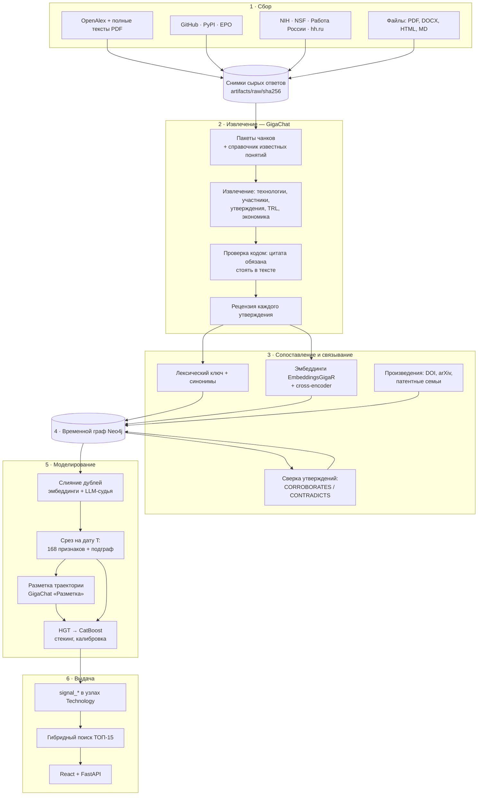

# LCTrendSearch — радар слабых технологических сигналов

Хакатон «Газпромбанк.Тех» 2026, задача Т1 «Анализ научно-технологических
трендов» ([ТЗ](research/Справочный%20материал/Т1%20ТЗ.pdf)).

LCTrendSearch находит технологии до того, как о них заговорят все. Система
читает научные статьи, патенты, код, пакеты, гранты и вакансии. GigaChat
извлекает из них технологии, участников и утверждения с дословными
цитатами, и всё складывается во временной граф знаний Neo4j. Обученная
модель (стекинг графовой нейросети HGT и CatBoost) даёт каждой технологии
вероятность того, что сейчас она — слабый сигнал: ранняя, ещё не
мейнстрим, но уже с признаками роста. Пользователь вводит направление и
получает ТОП-15 с вероятностью, объяснением, цитатами и источниками.

<!-- ВИДЕО: как работает система — вставить сюда -->

| | |
|---|---|
| Источники | 8 открытых API + локальные файлы (PDF, DOCX, HTML, Markdown) |
| Граф | более 20 типов узлов и 30 типов связей, у каждой связи есть дата |
| Технологии | 2 991 после слияния дублей (1 056 понятий слито), 62 153 среза «технология × дата» |
| Признаки | 168 в 11 группах, в модели 94 |
| Модель | стекинг HGT → CatBoost, PR-AUC на test 0,262 при случайной 0,108 (×2,4) |
| Поиск | гибридная релевантность (BM25 + эмбеддинги GigaChat) + вероятность модели |
| Код | 36 400 строк Python в 85 модулях, 1 246 автотестов |

## Как мы пришли к идее

**1. От таблиц к связям.** Первый вывод команды при разборе задачи
([research/Метрики.ipynb](research/Метрики.ipynb)): таблица фиксирует
значения, а слабый сигнал виден в *связях*: кто, с кем, в какой области и
на каком основании пишет о технологии. Цель сервиса — не просто найти
технологию, а показать, что она реализуема, а не хайп. Отсюда три
метрики-фильтра «шум против реализуемости»:

- **воспроизводимость сигнала** — доля независимых подтверждений среди всех
  упоминаний;
- **переход от теории к артефакту** — патенты и код относительно статей;
- **плотность производственных связей** — доля компаний среди участников.

**2. Фронтир рождается на стыке областей.** Новое появляется там, где
встречаются ранее изолированные области знаний. Мы исследовали перевод
таблиц, рядов и текстов в граф и метрики на графах
([research/Справочный материал/TDA.ipynb](research/Справочный%20материал/TDA.ipynb))
и выбрали граф знаний как основное представление.

**3. Технология в момент времени.** «Federated Learning» в 2016 году —
слабый сигнал, в 2023-м — мейнстрим. Единица анализа — *технология на дату
T*, и для любой T система знает только то, что было известно к ней.

**4. Метка — по тому, что случилось потом.** Модель видит только прошлое на
дату T, а метка говорит, чем всё кончилось: стала трендом, нашла нишу,
угасла или уже была мейнстримом. Исход по траектории технологии год за
годом оценивает LLM и пишет обоснование
([docs/hgt-pipeline-2026-09-29.md](docs/hgt-pipeline-2026-09-29.md)).

**5. Честная проверка.** Похожие технологии объединены в семейства и не
разрываются между обучением и проверкой (иначе LoRA в обучении подсказала
бы QLoRA в проверке). Проверка идёт на технологиях, появившихся позже.

**Итог.** Метрики команды стали признаками модели, и модель их
подтвердила. Её главные признаки — **число областей знаний**,
**неожиданность рекомбинации тем** и **структурная дыра** (технология
связывает несвязанные области), рядом **независимые семейства
доказательств** и **доля подтверждённых утверждений**. Портрет слабого
сигнала, который выучила модель: новая комбинация областей, подтверждённая
несколькими независимыми группами.

## Архитектура



| Слой | Код | Реализация |
|---|---|---|
| Сбор | [ingest/](src/lctrend/ingest/) | 8 коннекторов (`connectors`, `discovery`, `economic`), тематический обход, возобновляемые обходы с аудитом `CrawlRun`; сырые ответы сохраняются по SHA-256, поэтому всё перечитывается без повторной загрузки; полные тексты PDF разбираются Docling с ролью раздела |
| Извлечение | [extraction/](src/lctrend/extraction/), [llm/](src/lctrend/llm/) | документ режется на пакеты по 10 чанков, до 5 вызовов на пакет; GigaChat возвращает технологии, участников, утверждения, стадию и TRL, экономику по строгой JSON-схеме; код отбраковывает всё, у чего нет дословной цитаты; второй проход рецензирует каждое утверждение: supported / unsupported / unclear |
| Сопоставление | [extraction/resolver.py](src/lctrend/extraction/resolver.py) | три слоя: лексический ключ (нормализация + Snowball) и 14 групп синонимов; смысловой (эмбеддинг «название: определение», косинус ≥ 0,78 и cross-encoder ≥ 0,80 → `POSSIBLY_SAME_AS`); тип понятия выбирается голосованием упоминаний |
| Связывание | [linking/](src/lctrend/linking/) | одна работа из разных источников (журнал, препринт, PDF, патент A1/B1) — один `Work`; гранты и вакансии с известной технологией пишутся без LLM; служебные разделы не уходят в модель; `SIMILAR_TO` между взаимными 8 ближайшими понятиями; сверка утверждений разных работ |
| Граф | [graph/](src/lctrend/graph/) | `GraphStore` — запись документа и результата в одной транзакции; `TemporalCorpus.view(T)` отрезает всё, что опубликовано или наблюдено после T; признаки, подграфы, слияние узлов с пересадкой связей ([graph/merge.py](src/lctrend/graph/merge.py)) |
| Таксономия | [taxonomy/](src/lctrend/taxonomy/) | дерево тем на дату среза: рекурсивный сферический k-means по эмбеддингам (4 ветви, глубина 4), общие термины остаются у родителя, как в TaxoGen; из дерева — семантическая новизна и рост ветки |
| Экономика | [ingest/economic.py](src/lctrend/ingest/economic.py) | гранты и вакансии → `EconomicFact`; суммы приводятся к реальным долларам базового года по курсу Всемирного банка и CPI США, плюс перцентиль внутри среза |
| Моделирование | [modeling/](src/lctrend/modeling/) | слияние дублей, разметка траектории, выборка, CatBoost, HGT, стекинг, исследование, запись оценок в граф |
| Поиск | [ranking/](src/lctrend/ranking/) | ТОП-15 по запросу: гибридная релевантность + вероятность модели, шум отсеян |
| Интерфейс | [frontend/](frontend/README.md) | React + FastAPI: поиск, карточка технологии, сбор материалов, очередь заданий |

Подробнее по каждому этапу — [docs/architecture.md](docs/architecture.md).

### Граф знаний

| Узлы | Связи |
|---|---|
| Source → Document → DocumentVersion | версия несёт дату, тип, страны, организации, области |
| Work, WorkKey | копии одного произведения: DOI, arXiv, PMID, патентная семья, репозиторий, пакет |
| DocumentVersion → Chunk | фрагменты текста с ролью раздела |
| Chunk → Technology | MENTIONS — датированное упоминание |
| Assertion | утверждение о технологии; SUPPORTED_BY — цитата во фрагменте; CORROBORATES, CONTRADICTS между работами |
| Technology ↔ Technology | SUBTECHNOLOGY_OF, SIMILAR_TO, POSSIBLY_SAME_AS, SHARES_CONTEXT_WITH |
| Technology → Task, Domain, TaxonomyNode | SOLVES, BELONGS_TO_DOMAIN, IN_TAXONOMY |
| Technology → Chunk | HAS_MATURITY_EVIDENCE (стадия, TRL), HAS_ECONOMIC_EVIDENCE |
| Organization, University, Company → Technology | DEVELOPED_BY, USED_BY, FUNDED_BY |
| EconomicFact | гранты NIH и NSF, вакансии; RECEIVED_BY, PAID_BY |
| ProcessingRun | какой прогон, какой моделью и из каких чанков создал утверждение |

Прямая связь технологии (SOLVES, DEVELOPED_BY и другие) создаётся только из
утверждения, которое рецензент подтвердил, которое утвердительное и
сообщает факт, а не план. На связи хранятся цитата, её позиция, прогон и
дата.

После обучения у узлов Technology появляются `signal_probability`,
`signal_flag`, `signal_model` и разметка траектории (`llm_verdict`,
`llm_is_technology`, `llm_rationale`, перегретость, сформированность). Их
читает поиск.

### Моделирование: три уровня над хранилищем

```
src/lctrend/modeling/
├── storage.py, config.py        запуск: artifacts/modeling/<run>/{dataset,models,labeling}
├── dataset/                     1. выборка
│   ├── deduplication.py         слияние дублей в Neo4j: эмбеддинги + LLM-судья, связи пересаживаются
│   ├── llm_outcomes.py          разметка траектории GigaChat (выделенный ключ «Разметка»)
│   ├── neighbors.py             агрегаты соседей по подграфу
│   ├── builder.py               семейства, метки, разбиение по времени, отбор признаков
│   └── annotation_batch.py      пакет для экспертов с подсказками LLM
├── training/                    2. модели
│   ├── catboost_model.py        CatBoost, калибровка Платта, SHAP
│   ├── hgt_model.py             HGT (PyG HGTConv), фолды для стекинга
│   ├── pipeline.py              CatBoost → HGT → стекинг, отчёт, выбор победителя
│   └── research.py              граф против таблицы, контрольные эксперименты
└── labeling/                    3. итоговая разметка
    ├── graph_labels.py          запись signal_* и llm_* в узлы Technology
    ├── new_points.py            новые технологии: дубли → признаки → модель → граф
    └── benchmark.py             сверка со «Списком 100»
```

**Уровень 1 — выборка.**

- *Слияние дублей* ([deduplication.py](src/lctrend/modeling/dataset/deduplication.py)).
  `ConceptDeduplicator` строит звёзды вокруг самого связанного понятия.
  При косинусе ≥ 0,95 пара сливается по правилам, при 0,90–0,95 решает
  LLM-судья. Версии не сливаются: GPT3-13B и GPT3-175B, разные числа,
  непересекающиеся аббревиатуры, отрицание. Слияние пересаживает все связи
  на основное понятие, затем пересобираются SIMILAR_TO и сверка
  утверждений. Итог: 1 056 понятий слито, у основных на 32 % больше связей.
- *Срезы.* Сетка дат: до 2005 года — ежегодно, 2005–2014 — раз в полгода,
  с 2015 — поквартально. Для каждого среза считаются 168 признаков и
  подграф окружения: 2 шага только через технологии и документы. Компании,
  страны, области и задачи — тупики. Обзоры (≥ 30 технологий) не
  пересекаются.
- *Разметка траектории* ([llm_outcomes.py](src/lctrend/modeling/dataset/llm_outcomes.py)).
  GigaChat видит ряд технологии по годам и для каждого года ставит оценку
  от 0 (слабый сигнал) до 1 (точно не слабый), вердикт, перегретость и
  сформированность. Не-технологии помечаются как шум.
- *Выборка* ([builder.py](src/lctrend/modeling/dataset/builder.py)).
  Добавляются агрегаты соседей (`nb_*`), похожие технологии объединяются в
  семейства, разбиение идёт по дате появления семейства, признаки
  отбираются только на train.

**Уровень 2 — модели** ([pipeline.py](src/lctrend/modeling/training/pipeline.py)).
CatBoost по признакам среза, HGT по подграфу, затем стекинг: вероятность
HGT, полученная out-of-fold на 5 фолдах, становится признаком CatBoost.
Калибровка Платта и порог по лучшему F1 подбираются на valid, test нужен
только для отчёта. Победитель выбирается заранее зафиксированным правилом:
лучший PR-AUC на valid.

**Уровень 3 — итоговая разметка.** Оценки всех технологий записываются в
граф ([graph_labels.py](src/lctrend/modeling/labeling/graph_labels.py)).
Технологии, появившиеся после обучения, оцениваются без повторной выгрузки
([new_points.py](src/lctrend/modeling/labeling/new_points.py)): недостающие
эмбеддинги → проверка на дубли (новое название известной технологии
вливается в неё) → признаки и подграф на сегодня → модель-победитель с той
же калибровкой и порогом → `signal_*` в узле.

### Поиск

[ranking/search.py](src/lctrend/ranking/search.py):

```
релевантность = 0,65 · косинус(запрос, технология) + 0,35 · BM25(названия, области)
итог          = 0,75 · релевантность + 0,25 · вероятность слабого сигнала
```

- Эмбеддинг запроса — GigaChat `EmbeddingsGigaR`. Технология с косинусом
  ниже 0,4 без совпадения по словам в выдачу не попадает: вероятность
  модели влияет на порядок, но не делает релевантной постороннюю
  технологию.
- Вероятность берётся из узла (`signal_probability`). У технологии без
  оценки модели используется прозрачный скор правила: взвешенные z-оценки
  роста упоминаний, ускорения, разнообразия и независимости источников,
  новизны, прогресса зрелости и штраф за компании-пользователи.
- То, что разметка признала «не технологией», уходит в блок «Отсеяно
  фильтром» с причиной.
- Без ключа GigaChat поиск работает по BM25 и сообщает об этом.
- Веса лежат в [ranking.json](src/lctrend/resources/ranking.json) → `search`.

### Серверы

| Сервер | Что делает | Образ |
|---|---|---|
| Лёгкий поиск [frontend/server/search_api.py](frontend/server/search_api.py) | только `GET /api/search` и `/api/health`; читает Neo4j и ничего не пишет; без torch и PDF-моделей | [docker/search](docker/search/Dockerfile), `compose.search.yaml` |
| Полный [frontend/server/app.py](frontend/server/app.py) | тот же поиск + сбор материалов, загрузка файлов, очередь заданий, статистика пула ключей (`/api/llm/stats`) | `compose.yaml` |
| Обучение | `scripts/build_dataset.py` и `scripts/train_model.py` | [docker/training](docker/training/Dockerfile) |

## На что настроена система

Все настройки — JSON-каталоги в [src/lctrend/resources/](src/lctrend/resources/).
Перенастройка на другое направление не требует правки кода.

**Шесть областей и «Список 100».** Тематический обход настроен на 100 слабых
сигналов, которые методологи отобрали в сентябре 2026 года, и на 36 широких
тем для фона ([topic_presets.json](src/lctrend/resources/topic_presets.json)):

| Область | Сигналов | Примеры |
|---|---:|---|
| Edge | 16 | квантово-инспирированное сжатие LLM для edge, NPU в батарейных MCU, инференс на спутниках, спекулятивный декодинг с весами во флеш-памяти смартфона |
| Защита ИИ | 16 | IAM для ИИ-агентов, защита MCP-серверов от tool poisoning, водяные знаки текста LLM под EU AI Act, machine unlearning |
| Индустриальный ИИ | 17 | foundation-модели промышленных рядов, агенты внутри PLC/SCADA, LLM-генерация кода ПЛК на IEC 61131-3, ИИ-операторы виртуальных электростанций |
| Инфраструктура ИИ | 17 | оптическая коммутация в ИИ-фабриках, тиринг KV-кэша, CXL-пулы памяти вместо HBM, SMR для питания ЦОД |
| Роботы | 17 | маркетплейсы навыков роботов, тактильные VLA-модели, HASEL-мышцы, медицинские микророботы |
| Финтех | 17 | депозитные токены на публичных блокчейнах, протоколы платежей ИИ-агентов (x402, AP2), zk-KYC, постквантовая криптография в банках |

**Сбор** ([sources.json](src/lctrend/resources/sources.json)):

- Приоритетные направления: искусственный интеллект, робототехника,
  edge-вычисления, финтех.
- 12 доменов мониторинга с русскими и английскими синонимами: ИИ, машинное
  обучение, NLP, компьютерное зрение, кибербезопасность, финтех, edge,
  робототехника, квантовые вычисления, полупроводники, энергетика,
  биоинформатика.
- Каждой площадке задан уровень доверия: патенты — 1, код и пакеты — 2,
  гранты — 3. Это входит в признаки надёжности.

**Извлечение** ([llm.json](src/lctrend/resources/llm.json), [pipeline.json](src/lctrend/resources/pipeline.json)):

- Лестница моделей GigaChat: `GigaChat-3-Ultra` → `GigaChat-2-Max` →
  `GigaChat-2-Pro` → `GigaChat-2`. Когда у ключа кончаются токены, запрос
  переходит к следующей модели.
- Пул ключей с учётом баланса и лимитов.
- Строгая JSON-схема ответа, температура 0,001.

**Кандидаты в выдачу** ([ranking.json](src/lctrend/resources/ranking.json)):

- технологии и методы не старше 5 лет;
- минимум 2 независимых источника за 24 месяца;
- стадия не выше пилота;
- общие слова («машинное обучение», «алгоритм», «система») отсекаются.

**Выборка и обучение** ([dataset.json](src/lctrend/resources/dataset.json), [training.json](src/lctrend/resources/training.json)):

- подграф — 2 шага, до 400 узлов;
- метка: слабый сигнал при оценке ≤ 0,3, не слабый при ≥ 0,7;
- разбиение 70 / 15 / 15 по дате появления семейства;
- CatBoost: 800 итераций, глубина 6;
- HGT: 60 эпох, ранняя остановка через 10;
- стекинг на 5 фолдах.

## Модели

| Роль | Модель |
|---|---|
| Извлечение технологий, участников, утверждений, зрелости и экономики | GigaChat: `GigaChat-3-Ultra` → `GigaChat-2-Max` → `GigaChat-2-Pro` → `GigaChat-2` |
| Рецензия утверждений | GigaChat, та же лестница |
| Разметка траектории технологий | GigaChat, выделенный ключ «Разметка» ([llm_outcomes.py](src/lctrend/modeling/dataset/llm_outcomes.py)) |
| Эмбеддинги: сопоставление и слияние понятий, SIMILAR_TO, таксономия, новизна, поиск | GigaChat `EmbeddingsGigaR` |
| Судья при слиянии дублей | GigaChat, пул ключей |
| Проверка пары на совпадение | `cross-encoder/stsb-distilroberta-base`, локально |
| Разбор PDF | Docling |
| Классификатор слабого сигнала | CatBoost |
| Графовая модель окружения | HGT (Heterogeneous Graph Transformer), PyTorch Geometric |
| Итоговая модель | стекинг HGT → CatBoost |
| Объяснение оценки | SHAP |
| Релевантность в поиске | BM25 + косинус `EmbeddingsGigaR` |

Обученные модели лежат в [artifacts/modeling/2026-09-29-dedup/models/](artifacts/modeling/2026-09-29-dedup/models/):

| Файл | Модель | Что видит |
|---|---|---|
| `catboost.cbm` | CatBoost, глубина 6, шаг 0,05 | 94 признака технологии на дату T и агрегаты соседей |
| `hgt.pt`, `hgt_fold*.pt` | HGT, 2 слоя, 4 головы внимания, ширина 64 | подграф: документы, соседние технологии, организации, задачи |
| `stacked.cbm` | стекинг | 94 признака + вероятность HGT (out-of-fold), признак №1 |
| `report.json` | отчёт | признаки, нормировка, калибровка, порог, метрики, победитель |

## Данные

Запуск `2026-09-29-dedup`.

| | |
|---|---|
| Срезы «технология × дата» | 62 153 по 2 991 технологии, история с 1960 года; активных (был документ за год) — 15 604 |
| Слияние дублей | 1 056 понятий слито в два прохода (порог 0,95 по правилам, 0,90 с судьёй), у основных +32 % связей |
| Признаки | 168 в 11 группах, после отбора на train — 94 |
| Подграф среза | в среднем 10 узлов, до 58 |
| Разметка траектории | 3 106 технологий, 18 235 оценок «технология × год» |
| Семейства | 2 428 |

Группы признаков: экономика (28), динамика роста (23), участники (18),
масштаб (16), независимость источников (16), достоверность утверждений (15),
положение в графе (14), новизна и таксономия (11), зрелость (11), качество
данных (4), прочие (12).

Вердикты разметки:

| Вердикт | Доля |
|---|---:|
| не технология (уходит из обучения как шум) | 39 % |
| мейнстрим | 22 % |
| ниша | 21 % |
| состоялась | 7 % |
| угасла | 6 % |
| неясно | 5 % |

Цель обучения: 1, если оценка года ≤ 0,3; 0, если ≥ 0,7. Слабых сигналов
среди размеченных срезов — 8 %.

| Часть | Строк: не слабый / слабый | Семейств со слабым сигналом | Семейства, появившиеся |
|---|---|---:|---|
| train | 3 954 / 1 346 | 248 | до 2021-11-25 |
| valid | 924 / 192 | 59 | с 2021-11-25 |
| test | 1 192 / 144 | 44 | с 2023-07-12 |

## Результаты

PR-AUC — главная метрика при редком классе: случайная модель получает
PR-AUC, равную доле слабых сигналов. 95 % ДИ — бутстреп по семействам.
Ноутбук [04_training](notebooks/04_training.ipynb).

| Модель | Часть | PR-AUC | 95 % ДИ | Случайная | Выигрыш | ROC-AUC | Precision | Recall | F1 |
|---|---|---:|---|---:|---:|---:|---:|---:|---:|
| CatBoost | valid | 0,364 | 0,24–0,49 | 0,172 | ×2,1 | 0,692 | 0,365 | 0,474 | 0,413 |
| CatBoost | test | 0,242 | 0,16–0,39 | 0,108 | ×2,2 | 0,730 | 0,237 | 0,417 | 0,302 |
| HGT | valid | 0,370 | 0,25–0,49 | 0,172 | ×2,2 | 0,718 | 0,414 | 0,438 | 0,425 |
| HGT | test | 0,251 | 0,16–0,40 | 0,108 | ×2,3 | 0,720 | 0,211 | 0,361 | 0,267 |
| **Стекинг** | valid | **0,393** | 0,27–0,53 | 0,172 | ×2,3 | 0,706 | 0,399 | 0,432 | 0,415 |
| **Стекинг** | test | **0,262** | 0,16–0,41 | 0,108 | ×2,4 | 0,693 | 0,257 | 0,465 | 0,331 |

Лучшая модель по заранее зафиксированному правилу (PR-AUC на valid) —
стекинг HGT → CatBoost.

Пайплайн считает и другие метрики:

- precision@k, recall@k и lift@k для ТОП-списков (k = 15, 50, 100 и
  верхние 10 %);
- Brier, ECE, log-loss и таблицу надёжности вероятностей;
- SHAP-объяснение каждой оценки.

Модель и разметка траектории — независимые мнения. Их сверка
([05_graph](notebooks/05_graph.ipynb)) даёт очередь для экспертной
проверки:

| | Разметка: не слабый | Разметка: слабый сигнал |
|---|---:|---:|
| Модель: не сигнал | 1 744 | 114 |
| Модель: сигнал | 52 | 10 |

### Исследование: граф против таблицы

Все эксперименты идут на одном разбиении и с одним кодом оценки. CatBoost
обучен с 5 зёрнами, HGT — с 3. Ноутбук [06_research](notebooks/06_research.ipynb).

| Эксперимент | PR-AUC valid | PR-AUC test | ± по зёрнам | Выигрыш |
|---|---:|---:|---:|---:|
| случайная модель | 0,172 | 0,108 | — | ×1,0 |
| правило по одному признаку | 0,304 | 0,202 | — | ×1,9 |
| CatBoost: только свои признаки | 0,368 | 0,275 | 0,020 | ×2,6 |
| **CatBoost: + соседи** | 0,374 | **0,281** | 0,027 | **×2,6** |
| HGT | 0,376 | 0,238 | 0,018 | ×2,2 |
| HGT: соседи без признаков | 0,363 | 0,242 | 0,025 | ×2,2 |
| контроль: перемешанные метки | 0,199 | 0,126 | 0,030 | ×1,2 |
| стекинг HGT → CatBoost | **0,393** | 0,262 | — | ×2,4 |

Что показано:

1. Модель учится: в 2,6 раза лучше случайной.
2. Утечки нет: на перемешанных метках качество падает до случайного.
3. ML сильнее ручного правила: разница больше двух разбросов по зёрнам.
4. Граф несёт своё знание: вероятность HGT становится главным признаком
   стекинга, и стекинг лучший на valid.
5. CatBoost держит качество HGT при меньшей стоимости и объясняется через
   SHAP. Поэтому в основе выдачи CatBoost и стекинг, а HGT служит
   источником графового признака.

### Внешняя проверка на «Списке 100»

Организаторы дали 100 технологий, которые методологи в сентябре 2026 года
считают слабыми сигналами. Список автоматически сопоставлен с графом:
русское описание → эмбеддинг `EmbeddingsGigaR` → ближайшие технологии графа
с оценками модели и разметки ([07_benchmark](notebooks/07_benchmark.ipynb),
[benchmark.csv](artifacts/modeling/2026-09-29-dedup/benchmark.csv)).

- Близкое совпадение (косинус ≥ 0,8) нашлось для 32 технологий списка.
- Соседние темы нашлись ещё для 45.
- Сверка пересчитывается одной командой при каждом расширении графа.

## Интерфейс

- **Поиск.** Направление → ТОП-15 в порядке «релевантность + вероятность
  модели». По каждой строке видны вероятность и отметка «выше порога
  модели». Шум вынесен в блок «Отсеяно фильтром».
- **Карточка технологии.** В ней:
  - вероятность, вердикт и обоснование разметки;
  - перегретость и сформированность;
  - вклад признаков и динамика упоминаний;
  - цитаты из подтверждённых утверждений;
  - как получен скор (BM25, косинус, вероятность);
  - источники с уровнем доверия;
  - экспорт в PDF.
- **Сбор материалов** (полная версия). Тематический обход источников
  (готовые темы «Списка 100»), загрузка файлов, очередь заданий, результат
  извлечения по каждому документу.

## Запуск

Поиск работает поверх **нашей базы Neo4j**. Данные для подключения
(`NEO4J_URI`, `NEO4J_USER`, `NEO4J_PASSWORD`) выдаёт команда. Поиск только
читает граф и ничего в нём не меняет.

### Лёгкая версия — только поиск

Два небольших образа: веб (nginx + React, около 95 МБ) и API поиска (около
320 МБ, без PDF-моделей и torch). Нужен только Docker.

```bash
cp .env.example .env
# в .env: NEO4J_URI, NEO4J_USER, NEO4J_PASSWORD; GIGACHAT_CREDENTIALS — для смыслового поиска
docker compose -f compose.search.yaml up -d --build
```

Откройте http://localhost:5188.

### Свой домен

nginx подставляет домен при старте контейнера:

```bash
# в .env
LCTREND_DOMAIN=<ваш-домен>
FRONTEND_HOST=0.0.0.0
FRONTEND_PORT=80
```

После `docker compose -f compose.search.yaml up -d` интерфейс отвечает по
адресу `http://<ваш-домен>`, другие имена хоста отклоняются. HTTPS
настраивается сертификатом на балансировщике или обратном прокси перед
контейнером.

### Полная версия — поиск и сбор материалов

Нужны ключи GigaChat (`GIGACHAT_CREDENTIALS` или `GIGACHAT_KEYS_FILE`) и,
для сбора, ключи источников — см. [docs/operations.md](docs/operations.md).

```bash
docker compose up -d --build --wait
```

### Обучение

```bash
pip install -e ".[models]"
python scripts/build_dataset.py   # уровень 1: выборка из выгрузки
python scripts/train_model.py     # уровень 2: CatBoost, HGT, стекинг, labeling/scores.csv
```

То же в Docker — образ [docker/training](docker/training/Dockerfile).
Выгрузка, разметка и обучение подробно — [docs/model-training.md](docs/model-training.md),
разметка траектории — [docs/llm-labeling.md](docs/llm-labeling.md).

### Новые технологии после обучения

```bash
python -m lctrend.modeling.dataset.llm_outcomes --from-graph \
  --output artifacts/modeling/2026-09-29-dedup/dataset/llm_labels.csv   # разметка LLM новых
python -m lctrend.modeling.labeling.new_points            # план: дубли и оценки в CSV
python -m lctrend.modeling.labeling.new_points --write    # слить дубли, записать signal_*
```

Поиск подхватывает новые оценки при следующем чтении графа.

### Экспертная проверка

[dataset/annotation_batch.py](src/lctrend/modeling/dataset/annotation_batch.py)
собирает книгу для экспертов:

- 300 срезов «технология × дата» по квотам периодов;
- «Список 100» организаторов;
- подсказки LLM, которые эксперт проверяет, а не заполняет с нуля.

Заполненный файл читается обратно (`read_annotations`) как экспертные метки.

### Лаборатория

Семь ноутбуков проходят весь путь от графа до выдачи, результаты сохранены
внутри:

| Ноутбук | Что внутри |
|---|---|
| [01_export](notebooks/01_export.ipynb) | выгрузка: срезы, признаки, подграфы, итоги слияния дублей |
| [02_labeling](notebooks/02_labeling.ipynb) | разметка траектории: вердикты, шум, оценки по годам |
| [03_dataset](notebooks/03_dataset.ipynb) | выборка: соседи, семейства, метки, разбиение, отбор признаков |
| [04_training](notebooks/04_training.ipynb) | CatBoost, HGT, стекинг: метрики, калибровка, SHAP, итоговая разметка |
| [05_graph](notebooks/05_graph.ipynb) | запись оценок в граф и готовые Cypher-запросы |
| [06_research](notebooks/06_research.ipynb) | граф против таблицы |
| [07_benchmark](notebooks/07_benchmark.ipynb) | сверка со «Списком 100» и устройство моделей |

```bash
pip install -e ".[models,notebook]"
jupyter lab notebooks/
```

## В цифрах

| | |
|---|---|
| Python | 36 400 строк в 85 модулях |
| Тесты | 1 246 автотестов |
| Интерфейс | 5 700 строк: React, FastAPI, фоновые задания |
| CLI | 22 команды `lctrend` и 12 команд `lctrend.modeling` |
| Граф | более 20 типов узлов и 30 типов связей, все с датами |
| Воспроизводимость | манифест с SHA-256 входов рядом с каждым файлом запуска |

## Источники данных и методы

| Источник | Что даёт |
|---|---|
| [OpenAlex](https://openalex.org) | научные статьи, авторы, организации, топики |
| [GitHub REST API](https://docs.github.com/en/rest) | репозитории, README, релизы |
| [PyPI](https://pypi.org) | пакеты |
| [EPO Open Patent Services](https://www.epo.org/en/searching-for-patents/data/web-services/ops) | патенты |
| [NIH RePORTER](https://api.reporter.nih.gov) | гранты NIH |
| [NSF Award Search API](https://www.research.gov/common/webapi/awardapisearch-v1.htm) | гранты NSF |
| [«Работа России»](https://trudvsem.ru/opendata/api) | вакансии |
| [hh.ru API](https://api.hh.ru) | вакансии |
| [GigaChat API](https://developers.sber.ru/docs/ru/gigachat/api/overview) | извлечение, разметка, эмбеддинги |

Методы:

- Слабые сигналы — H. I. Ansoff, [Managing Strategic Surprise by Response to Weak Signals](https://doi.org/10.2307/41164635), 1975; E. Hiltunen, [The future sign and its three dimensions](https://doi.org/10.1016/j.futures.2007.08.021), 2008.
- HGT — Z. Hu et al., [Heterogeneous Graph Transformer](https://arxiv.org/abs/2003.01332), 2020; [PyTorch Geometric](https://arxiv.org/abs/1903.02428).
- CatBoost — L. Prokhorenkova et al., [CatBoost: unbiased boosting with categorical features](https://arxiv.org/abs/1706.09516), 2018.
- Стекинг — D. Wolpert, [Stacked generalization](https://doi.org/10.1016/S0893-6080%2805%2980023-1), 1992.
- SHAP — S. Lundberg, S.-I. Lee, [A Unified Approach to Interpreting Model Predictions](https://arxiv.org/abs/1705.07874), 2017.
- Калибровка — C. Guo et al., [On Calibration of Modern Neural Networks](https://arxiv.org/abs/1706.04599), 2017; J. Platt, Probabilistic Outputs for Support Vector Machines, 1999.
- Таксономия — C. Zhang et al., [TaxoGen: Unsupervised Topic Taxonomy Construction](https://arxiv.org/abs/1812.09551), 2018.
- BM25 — S. Robertson, H. Zaragoza, [The Probabilistic Relevance Framework: BM25 and Beyond](https://doi.org/10.1561/1500000019), 2009.
- PR-AUC при редком классе — T. Saito, M. Rehmsmeier, [The Precision-Recall Plot Is More Informative than the ROC Plot…](https://doi.org/10.1371/journal.pone.0118432), 2015.

Материалы команды — [research/](research/): система метрик, ТЗ, справочные
материалы и подборка статей о поисковых и исследовательских ИИ-агентах
([research/Литература](research/Литература/)).
