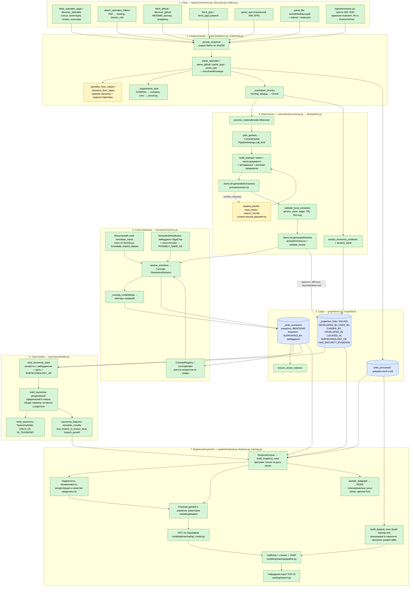
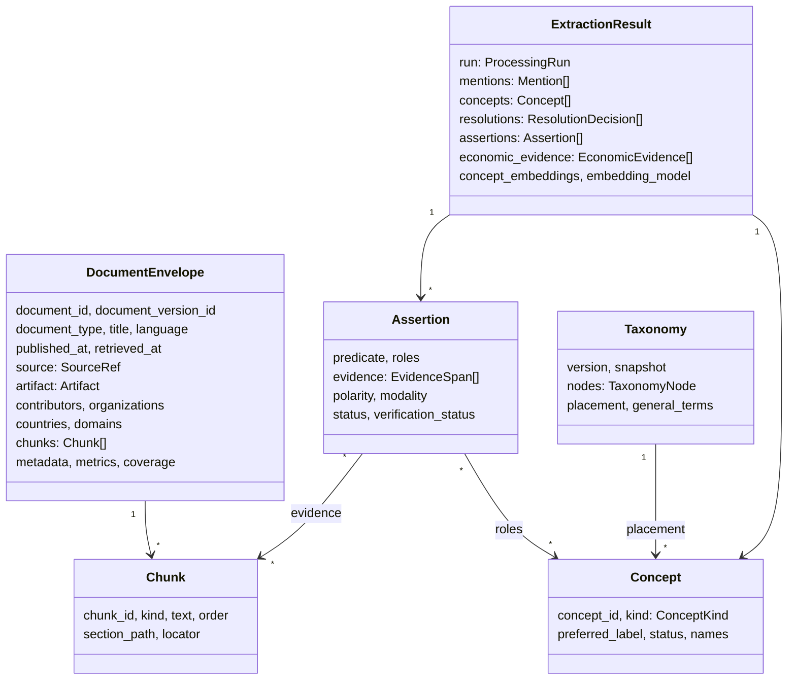
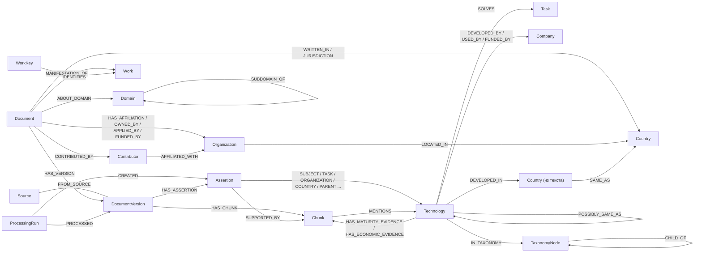

# Пайплайн LCTrendSearch: от источника до признаков слабого сигнала

## Суть

Единица анализа — **технология в момент времени**, а не отдельная статья. Система собирает документы из разных типов источников. LLM извлекает из текста технологии, участников и утверждения, у каждого из которых есть дословная цитата. Всё складывается во временной граф знаний Neo4j. По графу и таксономии технологий считаются признаки на дату среза: рост, разнообразие источников, участники, зрелость, экономика, новизна. На них и на подграфах обучены CatBoost, HGT и их стекинг; оценки записываются в граф и используются поиском ТОП-15 ([src/lctrend/modeling/](../src/lctrend/modeling/), [src/lctrend/ranking/](../src/lctrend/ranking/)).

Статусы на схемах: зелёный — реализовано, жёлтый — частично.

## 1. Общая схема



## 2. Этапы по классам

| # | Этап | Модуль / класс | Вход → выход |
| --- | --- | --- | --- |
| 1 | Сбор | `connectors.fetch_*`, `discovery.discover_*`, `CrawlManager` (веб) | API → сырой JSON/XML/PDF |
| 2 | Снимок | `snapshots.persist_snapshot` | байты → файл `artifacts/raw/<sha256>`; можно перепарсить без повторной загрузки |
| 3 | Адаптер | `adapters.parse_*`, `file_adapters.parse_file` | сырой ответ → `DocumentEnvelope` (метаданные + `Chunk`) |
| 4 | Полный текст | `fulltext.attach_openalex_fulltext` | PDF → чанки `fulltext` с `section_role` |
| 5 | Оркестрация | `processing.process_material`, `JobManager` (веб) | режим `llm`/`none` |
| 5а | Связывание | `linking.records`, `linking.sections`, `linking.known` | грант/вакансия с известной технологией → граф без LLM; разделы данных и служебные → мимо LLM; известные концепты → справочник пакета |
| 6 | Пакеты | `context.plan_packets`, `ContextPacket`, `PipelineSettings` | чанки → пакеты по 10, бюджет 5 вызовов на пакет, не больше 200 |
| 7 | Извлечение | `pipeline.process_document`, `JsonLLM`, `contracts.Extraction` | пакет → `LocalEntity`, `LocalClaim`, `ContextRequest` |
| 8 | Проверка кодом | `validation.validate_local_extraction` | отбраковка сущностей и утверждений без цитат или с неверными ролями |
| 9 | Рецензия | `contracts.Review`, `validation.validate_review` | supported / unsupported / unclear для каждого утверждения |
| 10 | Сопоставление | `resolver.resolve_mentions`, `ConceptRegistry`, `SemanticDeduplicator` | упоминания → `Concept`, `ResolutionDecision` |
| 11 | Экономика | `economics.extract_economic_evidence`, `amount_value` | предложения → `EconomicEvidence` |
| 12 | Результат | `core.models.ExtractionResult` | mentions, concepts, assertions, resolutions, economic_evidence, concept_embeddings |
| 13 | Запись | `GraphStore.write_processed` | документ + результат в одной транзакции |
| 14 | Таксономия | `taxonomy.build_taxonomy`, `GraphStore.write_taxonomy` | эмбеддинги концептов → дерево `TaxonomyNode` на дату среза |
| 15 | Признаки | `TemporalCorpus`, `training.build_snapshot_rows`, `features`, `novelty` | версии и наблюдения до даты T → CSV признаков и manifest |
| 16 | Обучающая выборка | `training.build_dataset_rows` | срезы T → признаки, будущие результаты реализации и временные разбиения |
| 17 | Подграфы | `subgraphs.sample_subgraph`, `write_subgraph_rows`, `to_pyg` | срез T → ограниченный типизированный JSONL; необязательный `HeteroData` |

## 3. Модель данных



## 4. Граф Neo4j



Правило для прямых связей технологий (`SOLVES`, `DEVELOPED_BY` и остальных): связь создаётся только из утверждения, которое рецензент подтвердил (`supported`), которое утвердительное (`affirmed`) и описывает сообщённое или наблюдаемое (`reported`/`observed`), а не план. На связи хранятся `chunk_id`, `quote`, `start`/`end`, `assertion_id`, `run_id`, `observed_at`.

## 5. Три слоя «понимания» технологий

| Слой | Где | Что делает | Ограничения |
| --- | --- | --- | --- |
| Лексический | `lexical.identity_key` (ключ v2), `resolver.json → explicit_aliases` | одинаковые названия после нормализации и стемминга, плюс 14 групп синонимов → один концепт | стемминг Snowball не различает омонимичные основы; аббревиатуры склеиваются только по списку |
| Смысловой | `SemanticDeduplicator` | эмбеддинг названия; при сходстве ≥ 0.78 и оценке cross-encoder ≥ 0.80 — связь `POSSIBLY_SAME_AS` для проверки человеком | сам концепты не склеивает; без эмбеддингов работает только лексический слой |
| Таксономия | `build_taxonomy` | дерево тем по эмбеддингам на дату среза; явные `SUBTECHNOLOGY_OF` подтягивают дочерние технологии к родителю | метки узлов — самые представительные названия, а не сгенерированные имена; строится только из концептов с эмбеддингом |

Как работает `build_taxonomy`, по шагам:
1. Берутся концепты видов `Technology`, `Method`, `Material`, известные на дату среза.
2. Вектор дочерней технологии из `SUBTECHNOLOGY_OF` сдвигается к родителю (вес 0.5).
3. Сферический k-means делит множество на `branching`=4 кластера (инициализация k-means++, фиксированный seed).
4. Термин, одинаково близкий к нескольким кластерам (разница < 0.05), или кластер меньше 3 терминов остаётся у родителя как общий. Так делает TaxoGen.
5. Рекурсия до глубины 4.
6. Метка узла — три самых популярных и центральных названия.
7. Для узла считаются документы за последний и предыдущий год и доля новых терминов (появились позже, чем за год до среза).

Признаки таксономии в `export-features`:
- `semantic_novelty` — 1 − косинус до ближайшего концепта, известного год назад;
- `new_branch_in_known_area` — ветка в основном новая, а родительская в основном старая;
- `branch_growth`, `branch_new_share`, `taxonomy_level`, `taxonomy_node_size`, `taxonomy_sibling_count`, `taxonomy_general_term`.

## 5б. Слой связывания (`lctrend.linking`)

Извлечение читает документ; слой связывания решает, что увидит модель, что до неё вообще дойдёт, и как концепты связаны между собой.

| Модуль | Что делает | Граница |
| --- | --- | --- |
| `names` | находит в тексте проверенные названия концептов реестра по лексическому ключу резолвера (регистр, число, падеж не важны) | совпадение покрывает слово целиком (`GPT4` ≠ `GPT`); общие термины (`generic_terms.json`) не ищутся; название двух концептов не связывает ничего |
| `records` | грант или вакансия, где названа известная технология, пишется в граф без вызова модели: упоминания, `EconomicFact`, экономические свидетельства | запись без известной технологии идёт в LLM: там может быть новая; новые технологии рядом с известной такой путь не найдёт |
| `sections` | чанки ролей `data_description` (источник данных, выборка, описательная статистика) и `administrative` (вклад авторов, конфликт интересов) не отправляются в модель | роль берётся из заголовка раздела или из заголовка в начале чанка («A. Data Source: …»); методы, результаты и благодарности (там финансирование) читаются всегда; документ только из таких чанков читается целиком |
| `known` | в каждый пакет добавляется `known_concepts` — до 15 концептов реестра: сначала названные в тексте пакета, затем близкие по вектору (`label: definition`) к его чанкам | справочник, не доказательство: метка сущности всё равно обязана стоять в тексте, поэтому модель может выбрать известную форму названия, но не переименовать новую технологию в известную; векторы берутся только из кеша (засеян из графа), запрос эмбеддинга — один на пакет |
| `similar` | `lctrend similar-rebuild`: рёбра `SIMILAR_TO` между взаимными k ближайшими концептами одного семейства видов (k=8, cosine ≥ 0.7) | вычисленные, без evidence: `method`, `model`, `cosine`, `computed_at`, `observed_at` = дата появления более позднего концепта; в PageRank, betweenness и энтропию соседей не входят (`novelty.technology_graph` их отбрасывает); пересборка заменяет слой той же модели |

| `reconcile` | после публикации документа его принятые утверждения сверяются с теми, что граф уже знает о тех же концептах. Слот утверждения (`Assertion.claim_key`) — предикат + концепты в ролях + нормализованные условия, без полярности. `CORROBORATES`: другая работа (`Work`) говорит то же; `CONTRADICTS`: фактическое утверждение другой работы с обратной полярностью; `SHARES_CONTEXT_WITH`: две технологии одного семейства в ≥ 2 одинаковых контекстах (тот же предикат с теми же партнёрами); рёбрам `SIMILAR_TO`/`POSSIBLY_SAME_AS` дописывается `shared_claims` | вычисленные рёбра с `observed_at` (дата более позднего утверждения) и `computed_at`, в структурные метрики не входят; измерения и деньги не сверяются (их значения требуют своего сравнения); разные условия — разные слоты, не конфликт; сбой сверки не роняет документ, `lctrend reconcile-claims` пересобирает слой целиком. Без вывода по цепочкам (A→B→C) |

Признаки F05 (`features.claim_slot_features`) считаются внутри среза по `claim_key` и независимым источникам (`independence_groups`): `comparable_claim_slot_count`, `corroborated_claim_slot_count`, `mixed_origin_group_count`, `independent_claim_conflict_strength` (максимум 2·min(P,N)/(P+N) по слотам), `independent_refutation_share`. Нет сопоставимых слотов — пусто, не ноль. `critical_conflict_slot_count` не реализован: нужен каталог критических слотов.

Слот в признаках считается при чтении среза из ролей утверждения, поэтому слияние концептов он учитывает сразу. Рёбра `CORROBORATES`/`CONTRADICTS` и свойство `a.claim_key` после `merge-concepts`, `review-duplicates --apply`, `migrate-concept-keys` и `normalize-graph` устаревают до `lctrend reconcile-claims`. Инкрементальная сверка не читает утверждения через страны и области, а контекст, общий для более чем `max_context_members` технологий, не связывает ни одну пару.

**Чанки в графе** (`graph.json → chunk_nodes = "evidence"`). Узлом `:Chunk` становится только чанк, на котором что-то стоит: упоминание, цитата утверждения, экономическое свидетельство, вектор доказательства. Остальной текст остаётся в снимке источника (`artifacts/raw`), а `ProcessingRun.input_chunk_ids` хранит всё, что прочитал прогон. Документ без извлечения чанков в граф не пишет. Цена: `search_graph` ищет только по оставленным чанкам. `"all"` возвращает прежнее поведение; `lctrend prune-chunks --apply` убирает текстовые чанки из уже собранного графа (без `--apply` — только счёт).

Настройки — `pipeline.json → linking` (роли и паттерны — в `section_roles`). В трассе прогона: `known_concepts` по каждому пакету, `coverage.skipped_section_chunk_ids`; пропущенные разделы не делают прогон `partial`.

## 5в. Дедупликация концептов и документов

**Тип концепта.** Technology, Method и Material — одно семейство идентичности (один `concept_id`), но тип выбирается голосованием упоминаний (`Concept.kind_counts`, `lexical.settled_kind`), а не «высший тип побеждает»: соединение, которое один документ назвал Technology, а большинство — Material, остаётся Material. Организации по-прежнему берут самый конкретный тип (Company > University > Organization). Запись в граф берёт по каждому типу максимум из сохранённых голосов и голосов копии реестра, поэтому устаревшая копия параллельной задачи голоса не теряет. Проверенный тип (`lctrend set-concept-kind ID Material`, статус `accepted`) не переголосовывается. `migrate-concept-keys --apply` пересчитывает голоса по `MENTIONS.type_candidates` уже сохранённого графа и вычищает из `names_json` цитаты, записанные как имена.

**Контекст концепта.** Для Technology/Method/Material модель даёт короткое определение по тексту (`definition`, до 30 слов); первое определение сохраняется в `Concept.definition` и не затирается документом без определения. Эмбеддинг и cross-encoder сравнивают `название: определение` (`resolver.concept_text`), а не голое название: вектор «ML-236B» пуст по смыслу, «ML-236B: ингибитор синтеза холестерина» — нет. Узел хранит `embedding_text`; `embed-concepts` пересчитывает векторы, текст которых устарел.

**Объявленные синонимы.** `aliases` — названия, которые текст сам приравнивает к метке («compactin (ML-236B)»). Валидатор оставляет синоним, только если он стоит в том же чанке рядом с названием (±160 символов), не совпадает с меткой и не является общим термином. Синоним становится принятым именем концепта, и следующий документ с одним «ML-236B» разрешается туда же. Синоним, который уже называет другой концепт того же семейства, не перехватывается: пара пишется как `POSSIBLY_SAME_AS {method: 'declared_alias'}`; синоним, называющий концепт другого семейства («lovastatin (Merck)»), отбрасывается.

**Разбор кандидатов.** `lctrend review-duplicates` показывает пары `POSSIBLY_SAME_AS` с определениями, упоминаниями, областями (`BELONGS_TO_DOMAIN`) и родителями (`SUBTECHNOLOGY_OF`); `--apply` сливает объявленные синонимы и, если задан `--merge-above`, семантические пары с таким score. Пара из разных семейств или с непересекающимися областями (омоним) автоматически не сливается никогда.

**Произведения.** Документ — это копия источника; `Work` объединяет копии одного произведения (`graph.works`). Сильные ключи (`WorkKey`) склеивают сразу: DOI, arXiv id (DOI arXiv сводится к нему), PMID, PMCID, OpenAlex W, номер патента без кода вида (EP1234567A1 = EP1234567B1), патентное семейство, репозиторий, пакет (PEP 503), id записи источника. Слабый ключ — нормализованный заголовок от 5 слов у статей, отчётов, стандартов и новостей: склеивает, только если заголовок ведёт к одному совместимому произведению и ни один постоянный идентификатор (DOI, arXiv, PMID, PMCID, патент, семейство) не противоречит. Препринт и журнальная версия склеиваются, две статьи с разными DOI — никогда. Гранты и вакансии остаются по записи: деньги каждого года и каждой вакансии — отдельные факты. `TemporalCorpus` использует произведение как документ: упоминание технологии в OpenAlex-записи, её PDF и препринте — один документ, метрики берутся из последней копии, где они есть. Уже загруженный корпус: `lctrend link-works` (пробный прогон) и `--apply`; повторный запуск ничего не меняет. Ограничение: если препринт пришёл раньше обеих статей с одинаковым заголовком, он склеится с первой пришедшей.

## 6. Временной датасет

`export-features` и `build-training-set` читают один набор данных через `GraphStore.read_temporal_data`, который содержит версии документов, датированные упоминания, связи, assertions, зрелость, экономику и аудит обходов источников. `TemporalCorpus.view(T)` отсекает данные, опубликованные или наблюдённые после T. Содержимое (версия, чанки, упоминания, связи, зрелость, assertions) неизменно после публикации и видно с даты публикации, даже если собрано и обработано позже. Время сбора и обработки влияет только на изменяемые метрики: они используют собственную дату наблюдения (`metrics_observed_at`). Строгий режим `--as-known` воспроизводит знание самой системы: содержимое видно не раньше первой загрузки версии (`first_retrieved_at`; повторная загрузка обновляет только `last_retrieved_at`) и времени извлечения. Истории релизов, коммитов и цитирования также обрезаются. Позднее обновление документа не меняет его прошлый срез. Если старые данные не содержат даты наблюдения, достоверный исторический признак может остаться неизвестным. Ограничение: корпус, собранный запросами сегодняшнего дня, смещён к технологиям, которые известны сейчас, поэтому исторические срезы описывают прошлое этих технологий, а не всё, что было видно тогда. Векторы названий (семантические и таксономические признаки) датируются первым появлением концепта, а не днём вычисления: эмбеддинг названия от даты не зависит, поэтому исторические строки обучения получают те же семантические колонки, что и инференс. Ограничение: модель эмбеддингов современная и может «знать» связи терминов, сложившиеся после T; бэктест семантической новизны поэтому оптимистичен. В строгом режиме `--as-known` вектор виден только с `embedding_observed_at`.

Строка соответствует `technology_id × snapshot_date`; `snapshot_id` обозначает дату среза. Группы признаков:

- Динамика документов и упоминаний в нескольких окнах, рост публикаций и цитирований, патентов, репозиториев и пакетов, ускорение и плато.
- Независимость и надёжность источников, разнообразие источников, концентрация, повторяемость материалов, полнота текста и качество разрешения сущностей.
- Разнообразие стран, организаций и областей, новые участники и связи; экономические утверждения отдельно от прогнозов и отрицаний.
- Зрелость, TRL, история прототипа и пилота, частота релизов, активность пакетов, патентные семьи и стандартизация.
- Семантическая новизна, положение в таксономии, центральности и мосты между областями; дорогие вычисления общие для всех технологий среза.

Пустое значение и индикатор пропуска отличают неизвестное от нуля. Аудит `CrawlRun` хранит источник, запрос, границы периода, счётчики, состояние возобновления, время и статус. Обход OpenAlex отмечается `exhaustive=true`, только если один запуск увидел все `meta.count` результатов и ни одна страница поиска не упала (`search_failures=0`); сбой обработки отдельной работы (`failures`) неполнотой поиска не считается. Выборка PyPI всегда `exhaustive=false`. Для метки покрытие горизонта проверяется на момент наблюдения (конец датасета), а не на `horizon_end`: обход 2026 года за 2020–2023 доказывает отсутствие в 2020–2023.

`build-training-set` добавляет `horizon_end`, `future_*`, `label_realized` и причину отсутствия метки. Метка оценивает реализацию после T: независимые подтверждения плюс первое появление патента, репозитория, пакета или компании-пользователя, которых до T не было (`first_*`); ещё один репозиторий при уже существующем — продолжение, а не реализация. Ранее коммерческая технология не является новым слабым сигналом. Независимые источники — связные компоненты документов по общим участникам (группа независимости, организации, люди; union-find): статья команды и её репозиторий с общим автором — один источник. Количество будущих публикаций само по себе не является положительной меткой. Незавершённый горизонт или недостаточное покрытие источников оставляют метку неизвестной. Неизвестная исходная зрелость метку не отменяет: это признак `max_maturity_rank_missing`. Поля `future_*`, метки, горизонт и разбиение исключаются из списка входных признаков в соседнем `<output>.manifest.json`.

Для отрицательной метки по умолчанию требуется полный наблюдаемый горизонт в научных, программных, пакетных, патентных и коммерческих источниках. Ограниченные CLI-обходы не удовлетворяют этому условию, а полного обхода коммерческих источников пока нет; отсутствие реализации часто остаётся неизвестным.

Разбиение строится по времени: последние размеченные срезы — `test`; для `valid` выбираются последние более ранние срезы с горизонтом, завершённым не позже начала теста. Строки предыдущей части, у которых `horizon_end` позже начала следующей части, помечаются `purged`; горизонт, заканчивающийся ровно в этот день, ничего после него не использует и остаётся. Строки без метки получают `unlabeled`. Для обучения используются `train`; для оценки — `valid`/`test`. Недостаточная размеченная история может оставить часть пустой.

Подграф каждого образца строится из того же среза T, ограничен количеством переходов, соседей и узлов, хранит типы, даты и маски пропусков (1 — неизвестное, 0 — наблюдаемое). JSONL и соседний manifest со схемой узлов и рёбер работают без библиотек глубокого обучения. `to_pyg(sample, feature_schema=manifest)` лениво импортирует `torch` и `torch-geometric` и создаёт `HeteroData` с общим порядком признаков; на этих графах обучается HGT (`modeling/training/hgt_model.py`). Параметры датасета, меток, разбиений и лимитов находятся в `resources/dataset.json`.

## 6а. Экономический слой

Деньги и спрос собираются отдельным слоем источников параллельно статьям и коду (`ingest/economic.py`, семейства `funding` и `labor_market`). Его задачи — метрики из `research/Метрики.ipynb`: сколько денег идёт в технологию (гранты, APL), кто её нанимает и за какую зарплату (дефицит кадров, TSC), участвует ли индустрия (IAD).

| Источник | Что даёт | Доступ |
|---|---|---|
| NIH RePORTER (`nih`) | грант финансового года: сумма, получатель, институт-плательщик, аннотация | открытый API, до 15 000 записей на запрос |
| NSF Awards (`nsf`) | грант: выделенная и плановая сумма, получатель, программа, аннотация | открытый API |
| Работа России (`trudvsem`) | вакансия: вилка зарплаты в рублях, работодатель с ИНН, регион, обязанности | открытый API; нечёткий поиск отфильтрован по фразе запроса |
| hh.ru (`hh`) | вакансия: зарплата, работодатель, описание, ключевые навыки | нужен токен приложения `HH_ACCESS_TOKEN` (dev.hh.ru), до 2000 записей на запрос |

Технологии грантов и вакансий связываются сначала без модели (`linking.records`): если текст называет технологию, уже известную графу, запись сразу пишется с этой связью; иначе она извлекается LLM, так же как статья. Деньги — не чтение LLM, а поле записи: каждая запись даёт `EconomicFact` (узел `:EconomicFact`, связи `HAS_ECONOMIC_FACT`, `RECEIVED_BY`, `PAID_BY`, и JSON в версии для срезов). Организации получают те же идентификаторы, что в OpenAlex, патентах и GitHub (`core/organizations.py`): Intel, получивший грант, публикующий статьи и нанимающий инженеров, — один узел. Контакты людей (телефоны, почта, рекрутеры) не сохраняются.

**Деньги разных лет.** 10 долларов 2010 года — не 10 долларов 2025-го, и 10 долларов — не 10 рублей. Модель на номинальных суммах выучит инфляцию и курсы своих лет обучения, а следующие срезы уйдут за пределы её диапазона: при временном разбиении тест всегда позже обучения. Поэтому рядом с номинальной суммой хранится `amount_usd_real` — сумма, переведённая в доллары по среднему курсу её года (Всемирный банк) и приведённая к долларам `base_year` по индексу потребительских цен США (`money.json`). Год вне таблиц помечается (`fx_nearest_year`, `cpi_extrapolated`), а не угадывается; неоднозначные `$` и `¥` не пересчитываются. Сверх этого суммы и спрос получают перцентиль внутри среза (`*_snapshot_pct`, `dataset.json → snapshot_percentiles`): дефлятор убирает инфляцию, а перцентиль — рост целой области. Год как признак в модель не добавляется: деревья не экстраполируют на годы, которых не было в обучении.

Признаки (`features.economic_layer_features`): сумма, медиана, рост грантов за год, число грантодателей и получателей, доля денег компаниям, число получателей, которые сами публикуют или патентуют технологию; число вакансий и их рост, число работодателей, медианная зарплата и её рост, доля вакансий с зарплатой, число работодателей, которые сами развивают технологию. Слой, который не искали и в котором ничего не нашли, остаётся пустым (`grant_data_missing`, `vacancy_data_missing`), а не нулём.

## 7. Порядок запуска

```bash
lctrend init-graph                                   # ограничения и индексы Neo4j
lctrend crawl-openalex "edge ai" --limit 500         # или веб-интерфейс / crawl-pypi / ingest
lctrend crawl-economic nsf "edge ai" --limit 200     # гранты; nih, trudvsem, hh — так же
lctrend build-taxonomy --snapshot 2026-01-01         # дерево в Neo4j + artifacts/taxonomy/2026-01-01.json
lctrend similar-rebuild                              # слой SIMILAR_TO по векторам концептов (--dry-run — только счёт)
lctrend reconcile-claims                             # сверка утверждений всего графа: CORROBORATES / CONTRADICTS / SHARES_CONTEXT_WITH
lctrend prune-chunks --apply                         # один раз для старого графа: удалить чанки, на которых ничего не стоит
lctrend export-features --snapshot 2026-01-01        # CSV + manifest; --no-taxonomy отключает новизну
lctrend build-training-set --end-date 2025-01-01 --subgraphs-output artifacts/subgraphs.jsonl
```

Эмбеддинги концептов появляются, только если во время загрузки работал смысловой слой: `resolver.json → semantic.use_in_llm = true` и заданы ключи GigaChat. Без них таксономия пустая.

Дальше — моделирование и выдача: `python scripts/build_dataset.py`, `python scripts/train_model.py`, `python -m lctrend.modeling.labeling.new_points --write` ([README](../README.md#моделирование-три-уровня-над-хранилищем)).
