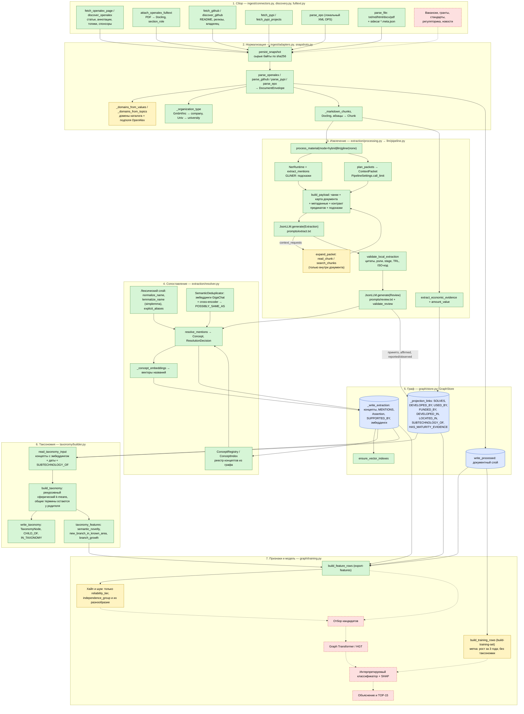
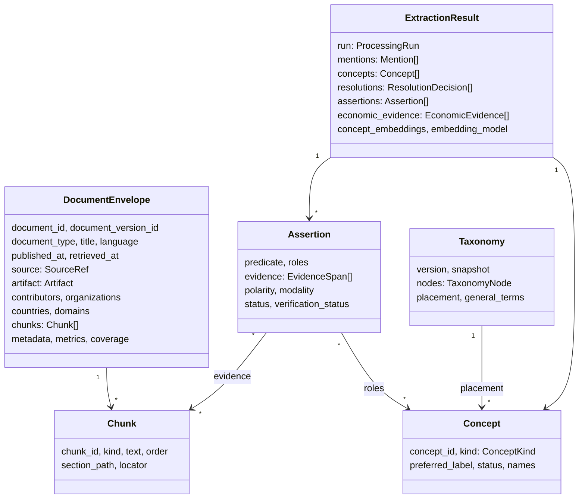
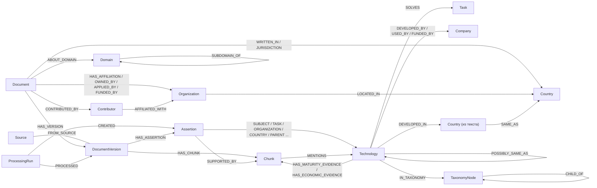

# Пайплайн LCTrendSearch: от источника до признаков слабого сигнала

## Суть

Единица анализа — **технология в момент времени**, а не отдельная статья. Система собирает документы из разных типов источников. LLM извлекает из текста технологии, участников и утверждения, у каждого из которых есть дословная цитата. Всё складывается во временной граф знаний Neo4j. По графу и таксономии технологий считаются признаки на дату среза: рост, разнообразие источников, участники, зрелость, экономика, новизна. Эти признаки — вход для будущего классификатора слабых сигналов.

Статусы на схемах: зелёный — реализовано, жёлтый — частично, красный пунктир — не реализовано.

## 1. Общая схема



## 2. Этапы по классам

| # | Этап | Модуль / класс | Вход → выход |
| --- | --- | --- | --- |
| 1 | Сбор | `connectors.fetch_*`, `discovery.discover_*`, `CrawlManager` (веб) | API → сырой JSON/XML/PDF |
| 2 | Снимок | `snapshots.persist_snapshot` | байты → файл `artifacts/raw/<sha256>`; можно перепарсить без повторной загрузки |
| 3 | Адаптер | `adapters.parse_*`, `file_adapters.parse_file` | сырой ответ → `DocumentEnvelope` (метаданные + `Chunk`) |
| 4 | Полный текст | `fulltext.attach_openalex_fulltext` | PDF → чанки `fulltext` с `section_role` |
| 5 | Оркестрация | `processing.process_material`, `JobManager` (веб) | режим `hybrid`/`llm`/`gliner`/`none` |
| 6 | Пакеты | `context.plan_packets`, `ContextPacket`, `PipelineSettings` | чанки → пакеты по 10, бюджет 3 вызова на пакет, не больше 120 |
| 7 | Извлечение | `pipeline.process_document`, `JsonLLM`, `contracts.Extraction` | пакет → `LocalEntity`, `LocalClaim`, `ContextRequest` |
| 8 | Проверка кодом | `validation.validate_local_extraction` | отбраковка сущностей и утверждений без цитат или с неверными ролями |
| 9 | Рецензия | `contracts.Review`, `validation.validate_review` | supported / unsupported / unclear для каждого утверждения |
| 10 | Сопоставление | `resolver.resolve_mentions`, `ConceptRegistry`, `SemanticDeduplicator` | упоминания → `Concept`, `ResolutionDecision` |
| 11 | Экономика | `economics.extract_economic_evidence`, `amount_value` | предложения → `EconomicEvidence` |
| 12 | Результат | `core.models.ExtractionResult` | mentions, concepts, assertions, resolutions, economic_evidence, concept_embeddings |
| 13 | Запись | `GraphStore.write_processed` | документ + результат в одной транзакции |
| 14 | Таксономия | `taxonomy.build_taxonomy`, `GraphStore.write_taxonomy` | эмбеддинги концептов → дерево `TaxonomyNode` на дату среза |
| 15 | Признаки | `training.build_feature_rows`, `taxonomy_features` | граф + дерево → CSV признаков по технологиям |
| 16 | Обучающая выборка | `training.build_training_rows` | граф → строки с меткой «рост за 3 года» |

## 3. Модель данных



## 4. Граф Neo4j



Правило для прямых связей технологий (`SOLVES`, `DEVELOPED_BY` и остальных): связь создаётся только из утверждения, которое рецензент подтвердил (`supported`), которое утвердительное (`affirmed`) и описывает сообщённое или наблюдаемое (`reported`/`observed`), а не план. На связи хранятся `chunk_id`, `quote`, `start`/`end`, `assertion_id`, `run_id`, `observed_at`.

## 5. Три слоя «понимания» технологий

| Слой | Где | Что делает | Ограничения |
| --- | --- | --- | --- |
| Лексический | `normalize_name`, `lemmatize_name`, `resolver.json → explicit_aliases` | одинаковые названия после нормализации и лемматизации, плюс 14 групп синонимов → один концепт | русские согласованные формы («языковые модели» ≠ «языковая модель»); аббревиатуры склеиваются только по списку |
| Смысловой | `SemanticDeduplicator` | эмбеддинг названия; при сходстве ≥ 0.78 и оценке cross-encoder ≥ 0.80 — связь `POSSIBLY_SAME_AS` для проверки человеком | сам концепты не склеивает; без эмбеддингов работает только лексический слой |
| Таксономия | `build_taxonomy` | дерево тем по эмбеддингам на дату среза; явные `SUBTECHNOLOGY_OF` подтягивают дочерние технологии к родителю | метки узлов — самые представительные названия, а не сгенерированные имена; строится только из концептов с эмбеддингом |

Как работает `build_taxonomy`, по шагам:
1. Берутся концепты видов `Technology`, `Method`, `Material`, известные на дату среза.
2. Вектор дочерней технологии из `SUBTECHNOLOGY_OF` сдвигается к родителю (вес 0.5).
3. Сферический k-means делит множество на `branching`=4 кластера (инициализация k-means++, фиксированный seed).
4. Термин, одинаково близкий к нескольким кластерам (разница < 0.05), или кластер меньше 3 терминов остаётся у родителя как общий. Так делает TaxoGen.
5. Рекурсия до глубины 4.
6. Метка узла — три самых популярных и центральных названия.
7. Для узла считаются документы за последний и предыдущий год и доля новых терминов (появились позже, чем за год до среза).

Признаки таксономии в `export-features`:
- `semantic_novelty` — 1 − косинус до ближайшего концепта, известного год назад;
- `new_branch_in_known_area` — ветка в основном новая, а родительская в основном старая;
- `branch_growth`, `branch_new_share`, `taxonomy_level`, `taxonomy_node_size`, `taxonomy_sibling_count`, `taxonomy_general_term`.

## 6. Все колонки `export-features`

- Активность: `document_count`, `mention_count`, `documents_last_year`, `publication_growth`, `first_seen_date`, `technology_age_days`, `citation_count`.
- Распространение: `country_count`, `company_count`, `university_count`, `domain_count`, `source_type_diversity`, `independence_group_diversity`, `new_relation_count`, `patent_data_available`, `repository_data_available`.
- Участники из текста: `developer_count`, `user_count`, `funder_count`, `text_country_count`, `parent_technology_count`, `task_count`.
- Зрелость и экономика: `max_maturity_rank`, `max_trl`, `economic_evidence_count`, `economic_data_available`.
- Таксономия: 8 колонок из раздела 5.

## 7. Порядок запуска

```bash
lctrend init-graph                                   # ограничения и индексы Neo4j
lctrend crawl-openalex "edge ai" --limit 500         # или веб-интерфейс / crawl-pypi / ingest
lctrend build-taxonomy --snapshot 2026-01-01         # дерево в Neo4j + artifacts/taxonomy/2026-01-01.json
lctrend export-features --snapshot 2026-01-01        # CSV признаков (с таксономией; --no-taxonomy без неё)
lctrend build-training-set                           # строки с меткой роста за 3 года
```

Эмбеддинги концептов появляются, только если во время загрузки работал смысловой слой: `resolver.json → semantic.use_in_llm = true` и заданы ключи GigaChat. Без них таксономия пустая.

## 8. Что не реализовано

- Источники: вакансии, гранты, стандарты, регуляторика, новости (типы документов уже есть в `DocumentType`).
- Поиск контекста по другим документам (RAG) и передача известных концептов в запрос к LLM.
- Склейка организаций из метаданных и из текста.
- Признаки таксономии в `build-training-set` (сейчас только в `export-features`).
- Хайп и шум: нет доли пресс-релизов, поиска дублей, оценки рекламного языка.
- Отбор кандидатов, Graph Transformer, классификатор с SHAP, объяснения, TOP-15.
