# Аудит решений для поиска слабых технологических сигналов — 28.09.2026

Проверены четыре указанных проекта и три дополнительных решения того же кейса. Ещё один найденный репозиторий пуст. Ниже — фактические пути данных, модели, ограничения и идеи для LCTrendSearch. Подробный разбор каждого проекта с исходниками и схемами приведён в приложениях этого же отчёта.

**Главный вывод:** в проверенных снимках нет дообучения самой LLM для определения слабых сигналов. LLM планирует поиск, извлекает названия и пишет карточки; обучение, где оно есть, относится к небольшому классификатору поверх счётчиков, текстовых признаков либо готовых эмбеддингов. Самая частая проблема — разрыв между оценённой моделью на заранее известных названиях и реальным поиском новых кандидатов.

## Как читать выводы

- **Подтверждено кодом:** найден исполняемый путь, схема или доступный текстовый артефакт.
- **Сообщено авторами:** опубликованная метрика или размер непубличного корпуса; здесь не переизмерялись.
- **Не найдено в снимке:** отсутствие подтверждено просмотром файлов и дерева этого commit; это не утверждение о приватных наработках команды.
- **Статический дефект:** конкретный путь к ошибочному поведению виден в исходниках. Частота проявления и поведение развёрнутого стенда не измерялись.

Исходники, контейнеры, установщики, сборщики, тесты и бинарные модели конкурентов не выполнялись. JSON/CSV-артефакты прочитаны и выборочно пересчитаны. Запросы выполнялись к публичным материалам без GitHub-аккаунта; их demo-сайты не открывались. Не было звёзд, подписок, issues, сообщений или иных взаимодействий с владельцами. Платформа может журналировать запросы: обещать абсолютную невидимость нельзя. GitHub документирует агрегированную статистику посетителей и клонов: [официальная справка](https://docs.github.com/en/repositories/viewing-activity-and-data-for-your-repository/viewing-traffic-to-a-repository).

Наш пользовательский код не изменён. Описание LCTrendSearch относится к прочитанной рабочей копии, которая менялась во время аудита; десять основных файлов и их контрольные суммы сохранены отдельно.

## Снимки репозиториев

| Репозиторий | Зафиксированный SHA | Что проверено |
|---|---|---|
| [READY2HYPE/trend-signals-lct2026](https://github.com/READY2HYPE/trend-signals-lct2026) | `768ec23f81805bd408575f815caefdaeb782038e` | Архив, конфигурации, API, два pipeline, схемы, отчёты |
| [wudlq/lct-weak-signals](https://github.com/wudlq/lct-weak-signals) | `4e56cae6c29b9aa71d65e9417287c6e73cbed292` | Архив, SQLite, сбор, training/predict, отчёты |
| [quark28/lct-signals](https://github.com/quark28/lct-signals) | `d54f41797676716573b1bceef581744edb8a87e4` | Архив, CLI, providers, pgvector, clustering |
| [melorri33/weak-signals](https://github.com/melorri33/weak-signals) | `20826cbd1a067c214f54ff9902d231a859f06aa5` | Архив, API/UI, CatBoost и name-model, labels, quality |
| [LapshinYaroslav/Hackaton-2026-trend-radar](https://github.com/LapshinYaroslav/Hackaton-2026-trend-radar) | `536cb909aed6e4f00b51f5675730c7553266af60` | Архив, SQL, live query, counters, bootstrap, CV |
| [maicentre-tech/gpb-weak-signals](https://github.com/maicentre-tech/gpb-weak-signals) | `148b8dae9436b2c6fe23171f85cebaeaa397c241` | Recursive tree и выбранные исходники ingestion/mapping/scoring/ML/UI |
| [mranton152/trendradar](https://github.com/mranton152/trendradar) | `dee6057866ee18c64eb39588ce15ef36a6f2bd6b` | Архив, Parquet/DuckDB/Postgres, live/core, classifier, validation |
| [gulldan/lct2026-kvadriceps-signals](https://github.com/gulldan/lct2026-kvadriceps-signals) | Нет HEAD | GitHub API вернул `409 Git Repository is empty`; сравнивать реализацию нечего |

Ссылки на код во всём отчёте закреплены на этих SHA. Обновления `main` после получения снимков не меняют основания выводов.

## Три ключевых вопроса: БД, наполнение, обучение

| Проект | Реальное хранение | Как заполняют | Что реально обучают / используют |
|---|---|---|---|
| **READY2HYPE** | Онлайн: JSON-кэши и отчёты, jobs в памяти. Офлайн: Parquet, JSON-индекс. Серверной СУБД нет | Офлайн bulk OpenAlex 2010–2025 и arXiv OAI-PMH. Онлайн отдельный поиск по 7 источникам, LLM extraction, досбор | Готовый SPECTER + UMAP/HDBSCAN в офлайн-ветке. Онлайн GPT-4.1 inference и ручной score; supervised-классификатора не найдено |
| **wudlq** | SQLite `documents`, `candidates`; JSON-кэш | На запрос: OpenAlex/arXiv → дедуп → upsert → кандидаты. Большой фоновый корпус не подтверждён | StandardScaler + LogisticRegression, 8 числовых признаков; заявлено 100 positive + 88 negative. GigaChat/Yandex/GPT отдельно для inference |
| **quark28** | PostgreSQL + pgvector(384), 4 таблицы | GigaChat план → 6 включённых источников → extraction → E5/dedup → clusters и raw aggregates | Готовый multilingual-e5-small и агломеративная кластеризация текущей пачки. Обученного оценщика/ранжирования нет |
| **melorri33** | PostgreSQL16, 2 таблицы с JSON-объектами; файловые кэши. pgvector установлен, векторного поиска нет | Новости/OpenAlex/arXiv → кандидаты → отдельные счётчики OpenAlex/HN/Wikipedia → фильтры/модели → досбор → карточки | 25% CatBoost на 10 признаках (100+283) + 75% LogisticRegression на BGE-M3 embeddings (1177 примеров, 222 positive). Qwen3/GigaChat/Yandex inference |
| **Lapshin** | PostgreSQL16: корпус, счётчики, features, labels/model versions, запросы и результаты | Seed обучающего справочника; live discovery OpenAlex/arXiv/TechCrunch; отдельные исторические счётчики и Роспатент | LogisticRegression `s2a2-v1`, 6 числовых признаков, нормировка по области, 100+60. YandexGPT inference. Без внешнего trained artifact fallback задаёт center=0/scale=1 |
| **maicentre** | PostgreSQL16 + pgvector(1024), SQLAlchemy; provenance/ontology/review/metrics/snapshots | Bootstrap создаёт схему, реестр источников и ontology. Корпус отдельно CLI/flows; нормализация → mapping → scoring snapshot | TF-IDF(1,2) + LogisticRegression, OOF sigmoid calibration. 100 positives, 18 seed negatives для smoke. Runtime classifier default OFF. Qwen2.5 inference |
| **mranton** | Parquet + DuckDB → API snapshot в памяти; PostgreSQL16 — отдельная копия | Offline ingestion/semantic/core/cards; live news/GitHub/HF/HN + история OpenAlex; COPY готовых таблиц в Postgres | Отдельный `forest_e5`: RandomForest на числовых признаках + LogisticRegression на E5-large, среднее вероятностей, 100+96. Рабочий ranking использует ручные веса. Ollama Qwen2.5 inference |

Доказательства приведены в приложениях: для каждого ответа указан файл схемы, orchestration и training/serving. Количество сервисов в Docker и название pretrained encoder сами по себе не доказывают наличие работающей модели слабых сигналов.

## Что в их архитектуре действительно интересно

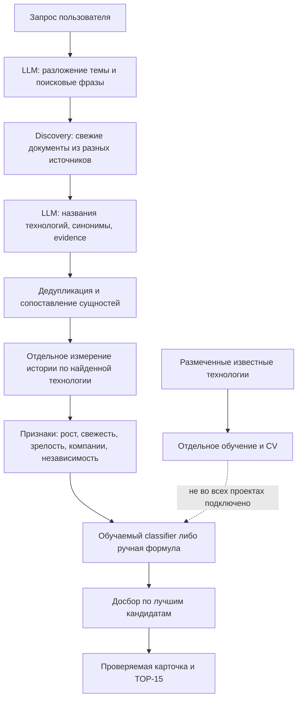

Это обобщение семейства решений, а не утверждение, что все стадии реализованы у каждой команды. quark доходит до кластеров; у mranton обученный classifier остаётся отдельным экспериментом; у maicentre включение обученной модели намеренно ограничено manifest; у READY онлайн-рейтинг полностью эвристический.

### READY2HYPE: широкая онлайн-воронка вместо выдачи из большого корпуса

Самая полезная часть — поисковое планирование, балансировка источников и дополнительный сбор по уже найденным названиям. Большой SPECTER/Parquet pipeline существует отдельно: в runtime Docker нет корпуса, индекса и его ML-зависимостей. Следовательно, нельзя описывать пользовательский ответ как retrieval по миллионам собственных эмбеддингов. [API](https://github.com/READY2HYPE/trend-signals-lct2026/blob/768ec23f81805bd408575f815caefdaeb782038e/app/api.py#L72-L132), [Docker](https://github.com/READY2HYPE/trend-signals-lct2026/blob/768ec23f81805bd408575f815caefdaeb782038e/Dockerfile#L1-L12).

Слабое место — мягкая проверка цитат: после проверки буквального вхождения разрешено совпадение множества слов. Оно допускает потерю порядка и отрицания. Ещё одна проблема: научные DOI из разных журналов часто имеют один hostname `doi.org`, что искажает число независимых источников. Рост и первое появление в ограниченной выдаче также не равны истории всего корпуса. [Цитаты](https://github.com/READY2HYPE/trend-signals-lct2026/blob/768ec23f81805bd408575f815caefdaeb782038e/src/signals/pipeline.py#L77-L91), [источники](https://github.com/READY2HYPE/trend-signals-lct2026/blob/768ec23f81805bd408575f815caefdaeb782038e/src/signals/features.py#L61-L67).

### wudlq: понятный baseline, но признаки обучения и поиска расходятся

Восемь признаков, StandardScaler и логистическая регрессия — хороший минимальный механизм, который можно объяснить пользователю. Существенный риск: авторская разметка стадии/тренда участвует в обучающих признаках, а живой поиск восстанавливает соответствующие значения другим способом по найденным документам. Метрики на хорошо размеченных объектах не гарантируют такое же качество runtime. Зрелость и hype не имеют безусловного veto: высокий probability может перевести их в signal. [Обучение](https://github.com/wudlq/lct-weak-signals/blob/4e56cae6c29b9aa71d65e9417287c6e73cbed292/src/model/train.py#L87-L97), [решение о статусе](https://github.com/wudlq/lct-weak-signals/blob/4e56cae6c29b9aa71d65e9417287c6e73cbed292/src/model/predict.py#L88-L99).

### quark28: полезный ingestion-модуль, ещё без детектора

Их сильная идея — сначала извлекать названия с коротким контекстом, затем объединять близкие названия через complete-link clustering. Одиночные технологии сохраняются: редкий объект не выбрасывается просто за малое число документов. Но classifiers, производных признаков оценщика, финального ранжирования и карточек в этом снимке нет; сырые счётчики и временные ряды уже рассчитываются, а `signals_confident` записывается нулём. Сохранение vector(384) также не означает использование индексированного pgvector retrieval. В патентном provider параметр страницы не включён в запрос: обычно результат ограничится первой страницей; при ответе не меньше 100 объектов и лимите больше 100 возможен повтор без прогресса. Подробные точные ссылки — в приложении.

### melorri33: продуктовая воронка и обратная связь, но метрики не описывают весь blend

Здесь обученные модели действительно подключены к scoring. Особенно полезна разметка реальных ошибок выдачи: weak, mature, too broad, product, not a technology и другие категории. В публичном CSV 928 кандидатов; при обучении name-model borderline/off_topic исключаются, добавлены 136 synthetic примеров. Пересчёт текущего JSON подтверждает 1177 examples / 222 positives / 1024 коэффициента / blend=.75. [Name-training](https://github.com/melorri33/weak-signals/blob/20826cbd1a067c214f54ff9902d231a859f06aa5/src/model/train_names.py#L27-L109), [артефакт](https://github.com/melorri33/weak-signals/blob/20826cbd1a067c214f54ff9902d231a859f06aa5/src/model/artifacts/name_model.json).

CV 84.33% accuracy и F1=.70 описывает CatBoost отдельно, а не итоговые 25/75%, extraction или TOP-15. Обучающие части CV и финальный fit получают исходные NaN, тогда как тестовые части CV и serving подставляют медианы: обработка missingness должна быть общей. Досбор после фильтров не пересчитывает все исходные features; качество карточки и её исходный score могут расходиться. [Training](https://github.com/melorri33/weak-signals/blob/20826cbd1a067c214f54ff9902d231a859f06aa5/src/model/train.py#L43-L192), [scoring](https://github.com/melorri33/weak-signals/blob/20826cbd1a067c214f54ff9902d231a859f06aa5/src/model/score.py#L38-L123).

### Lapshin: наиболее полезное разделение discovery и исторических счётчиков

Ограниченная поисковая выдача ищет кандидатов. Отдельный проход считает частоты найденных технологий за стабильные окна и нормирует их по фону источника. Это архитектурно важнее выбора конкретной БД. Группы смысловых дублей также удерживаются внутри одной части CV, что уменьшает утечку между вариантами одной технологии.

Проблема воспроизводимости существенная: training cache отсутствует в опубликованном дереве. При отсутствии внешнего обученного артефакта резервный bootstrap берёт опубликованные коэффициенты, но задаёт center=0 и scale=1 вместо обученной нормировки. Это уже другая функция предсказания; CV из отчёта нельзя переносить на чистый старт. [Исторические признаки](https://github.com/LapshinYaroslav/Hackaton-2026-trend-radar/blob/536cb909aed6e4f00b51f5675730c7553266af60/model/candidate.py#L44-L61), [bootstrap](https://github.com/LapshinYaroslav/Hackaton-2026-trend-radar/blob/536cb909aed6e4f00b51f5675730c7553266af60/model/bootstrap.py#L39-L85).

### maicentre: дисциплина происхождения, калибровки и допуска модели

Полезны snapshots с `as_of`, change events, DLQ, экспертный review, учёт запаздывания источников, подавление нестабильного роста малых счётчиков и gate на использование classifier. Модель включается только с manifest, который связывает хешами артефакт модели и отчёт оценки, фиксирует источник негативов и одобрение. Dataset hash этот gate не проверяет. Это защищает от выдачи экспериментальных 99% как готового production-качества. [Runtime gate](https://github.com/maicentre-tech/gpb-weak-signals/blob/148b8dae9436b2c6fe23171f85cebaeaa397c241/gpb-weak-signals/src/eti/ml/runtime.py#L16-L94).

Однако свежий Compose создаёт реестр/ontology, не документный корпус и готовый scoring snapshot. Vector(1024) предусмотрен схемой, но mapping job не получает embedder. Checkpoint каждые 500 объектов вызывает `flush` без промежуточного commit: при fatal rollback/crash теряется прогресс всей транзакции. Штатно обработанное завершение со статусом PARTIAL может сохранить транзакцию. Подробные ссылки приведены в приложении.

### mranton: два режима поиска и отдельный модельный эксперимент

Интересны контрактные Parquet-срезы, атомарная загрузка через COPY, происхождение ссылок агрегаторов и разделение старой научной темы с новой коммерческой волной. Однако реально обслуживаемая выдача читает Parquet через DuckDB, а не Postgres, и ранжируется формулой. Отчёт `forest_e5` API лишь показывает в разделе методологии. Отдельное обновление Postgres не обновит API; live-публикация умеет пересоздавать Store и не требует обязательного перезапуска. [Store](https://github.com/mranton152/trendradar/blob/dee6057866ee18c64eb39588ce15ef36a6f2bd6b/api/store.py#L16-L103), [core score](https://github.com/mranton152/trendradar/blob/dee6057866ee18c64eb39588ce15ef36a6f2bd6b/core/score.py#L14-L42).

93% выросших кандидатов — ретроспектива на вручную зафиксированном пуле, а не точность полного поиска. В том же отчёте Precision@15 относительно эталона — 47%. Доля выросших означает рост максимума будущего годового объёма относительно 2021 с псевдосчётчиком +1: это другой критерий. [Отчёт](https://github.com/mranton152/trendradar/blob/dee6057866ee18c64eb39588ce15ef36a6f2bd6b/validation/report.json), [режим pool](https://github.com/mranton152/trendradar/blob/dee6057866ee18c64eb39588ce15ef36a6f2bd6b/validation/report.py#L70-L118).

## Метрики: что можно и чего нельзя сравнивать

Все числа ниже — опубликованные авторами, не независимое воспроизведение.

| Проект | Что оценили | Что опубликовано | Ограничения и связь с рабочей выдачей |
|---|---|---|---|
| READY | Полный pipeline по 6 направлениям; сопоставление эталону и LLM-проверка карточек | Precision@15 около .11, recall около .08; другая LLM-оценка precision около .98 | .98 относится к другому LLM-критерию; исходные eval-данные и полный отчёт отсутствуют |
| wudlq | LOAO известных размеченных технологий | F1 .872; без annotation-derived stage/trend F1 .701 | Иные признаки в serving; не измеряется поиск и извлечение неизвестных объектов |
| quark | Финальный classifier отсутствует | Сопоставимых метрик нет | Clustering не подтверждает качество детектора |
| melorri | CatBoost 5-fold CV | Accuracy .8433; F1 .700; ROC-AUC .8895 | Не итоговый blend, не extraction, не TOP-15. Старые quality-замеры предшествуют новой версии |
| Lapshin | Grouped CV s2a2-v1 | F1 .808±.018; AUC .828±.007. После исключения 11 неслепо переведённых terms F1 .790 | Известные names, не поиск; не опубликованы исходная feature-table и fitted параметры модельного артефакта |
| maicentre | Smoke classifier на положительных и hand-seed отрицательных | Accuracy .9915, AP .9999; сами авторы не считают это доказательством production quality | Мало negatives, разные стиль/источник классов; runtime OFF |
| mranton | forest_e5 CV; отдельно ranking фиксированного pool | F1 .80 / accuracy .781; pool Precision@15 .47 и future growth .93 | Модель не используется для выдачи; fixed pool пропускает discovery/extraction |

Корректное сравнение требует одного набора слепых запросов, одинакового `as_of`, временного бюджета и независимо размеченного финального результата. Минимально нужны четыре отдельных числа: recall кандидатов, precision@15, доля карточек с проверенным evidence и доля запросов с достаточным покрытием источников. Для обещания внедрения через три года требуется отдельный temporal backtest по future outcomes с проверкой цензурирования; label «эксперт назвал слабым сигналом» этого не заменяет.

## LCTrendSearch: что уже есть и что следует довести

Основное хранение у нас — **Neo4j**, с документами, версиями, assertions, сущностями и происхождением. Raw snapshots хранятся по SHA256; SQLite WAL — журнал обхода; optional PostgreSQL из Compose пока кодом не используется. Есть OpenAlex/PDF, GitHub/PyPI, локальные EPO/PubMed и файловые адаптеры; extraction/review, проверка цитат, lexical/embedding/cross-encoder resolution и pending identities. Подготовлены temporal features, labels будущей реализации и purged splits. Код `ranking/` пока является заготовкой; обученный classifier/HGT и полноценный пользовательский TOP-15 не подтверждены.

Это не основание менять Neo4j на PostgreSQL вслед за конкурентами. Нужен следующий продуктовый слой поверх нашего текущего provenance/temporal фундамента.

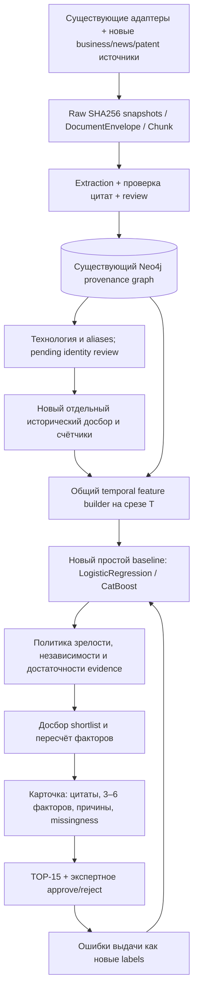

Стрелка labels → model означает будущий контролируемый retraining, не автоматическое обучение на каждой пользовательской оценке. Обновлённая модель проходит отдельную оценку и публикуется новой версией.

### Приоритет 1. Довести простой измеримый baseline

Источники идеи: wudlq, Lapshin, melorri, maicentre. Использовать наш temporal dataset и **одну реализацию features** для training и serving. Сначала логистическая регрессия, затем CatBoost как сравнение; добавление HGT имеет смысл после подтверждённого выигрыша на независимом наборе.

Отрицательный класс брать из реальных кандидатов нашего поиска: mature, hype, overly broad, product/company, not technology, irrelevant. Сохранять borderline отдельно. Разделять semantic groups и time; даты после T исключать из predictors. Результат этапа — артефакт со scaler/imputer/feature schema, calibration и независимыми precision@15/recall, а не одна красивая accuracy.

### Приоритет 2. Отделить обнаружение от измерения истории

Источники: READY, Lapshin, maicentre. Свежий поиск нужен для discovery; рост измеряется отдельными стабильными окнами с учётом aliases, coverage, общего фона источника и indexing lag. Небольшие объёмы сглаживаются; недоступность API остаётся missing, подтверждённое отсутствие — zero. Ключ кэша должен содержать source, запрос/aliases, window, `as_of`, query signature и версию формулы.

У нас уже есть временные срезы и source coverage; дополнение — исторический досбор, новые источники и согласование их измерений с этими срезами. Это не повторная разработка temporal layer с нуля.

### Приоритет 3. Собрать доказательства коммерческого перехода

Источники: READY, mranton, melorri. К научным работам добавить отраслевые новости, финансирование/гранты, патентные семейства, пилоты и industrial adoption. Развести «давно известная наука» и «новая волна применения»: первая старая статья не должна автоматически исключать свежую коммерциализацию.

Считать независимость через происхождение публикации, авторов/организации и lineage перепечаток. Три страницы одного пресс-релиза — одно основание; общий `doi.org` не делает разные исследовательские группы одним источником. Такой графовый контроль уже согласуется с нашей моделью provenance.

### Приоритет 4. Замкнуть качество через воронку и review

Источники: melorri, maicentre, mranton. Измерять документ → извлечение кандидата → сопоставление identity → evidence → фильтры → ranking → карточка. Так видно, где эталонная технология потерялась и какой негатив чаще проходит. Для каждого TOP-15 сохранять human review, причины отклонения и точные цитаты. Для pending `POSSIBLY_SAME_AS` добавить понятное approve/reject.

На карточке разделять model probability, evidence confidence и heuristic rank. Первое требует калибровки, второе характеризует доказательства, третье — относительный порядок. Их нельзя показывать одним процентом «вероятность успеха».

### Приоритет 5. Публиковать согласованную версию данных, модели и ответа

Источники: maicentre, mranton, урок bootstrap Lapshin. Manifest связывает corpus snapshot, `as_of`, labels, feature schema, scaler/imputer, модель, порог, calibration и eval report. Serving переключается атомарно только на готовую версию. У нас уже есть raw hashes и temporal export; надо завершить эту связь до выдачи результата.

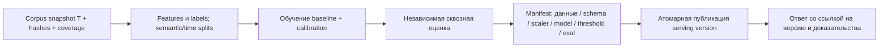

## Что не переносить

- Объявление предобученной LLM или эмбеддера «нашей обученной моделью слабых сигналов».
- Чужие коэффициенты, пороги .5 и вес name-model .75 без собственной calibration и оценки.
- Рост на ограниченных поисковых страницах как рост всего технологического направления.
- Word-set/substring проверки цитат и названий вместо подтверждённых spans.
- Признаки из экспертной разметки при training, если runtime получает другие значения.
- CV по known names, LLM self-eval либо fixed-pool future growth как точность полного поиска.
- Наличие pgvector-образа как подтверждение работающего векторного retrieval.
- `flush` как durable checkpoint и отдельную обновлённую копию БД как обновление API.

Практический перенос — архитектурные идеи собственной реализацией. Для Lapshin GitHub metadata указывает MIT; у остальных явная общая лицензия не подтверждена в проверенных материалах. Не следует считать все публичные исходники автоматически разрешёнными к прямому копированию.

## Полные разборы и поиск дополнительных решений

Ниже сохранены подробные отчёты: READY/wudlq; quark/melorri; Lapshin; maicentre; mranton; методика дополнительного поиска и наша текущая архитектура. У каждой главы свои схемы, доказательства и конкретные ограничения. Уточнения в сводной части выше имеют приоритет при чтении исторических показателей разных версий.

<!-- AUDIT_APPENDICES_START -->

## Приложение A. READY2HYPE и wudlq

Проверены публичные исходники, конфигурации, схемы хранения, данные в архиве, код оценки и тесты. Чужой код, Docker, установщики и `model.joblib` не запускались. Чтение выполнено анонимно через GitHub API и codeload; сайты демонстраций, стороннее облако команды и авторизованный GitHub не открывались. Это аудит опубликованного снимка, а не проверка работающего сервера.

| Проект | Ветка | Зафиксированный commit | Момент получения, UTC | Лицензия в API/архиве |
|---|---|---|---|---|
| READY2HYPE/trend-signals-lct2026 | main | `768ec23f81805bd408575f815caefdaeb782038e` | 2026-09-28 17:33:04 | GitHub `license=null`, LICENSE не найден |
| wudlq/lct-weak-signals | main | `4e56cae6c29b9aa71d65e9417287c6e73cbed292` | 2026-09-28 17:33:10 | GitHub `license=null`, LICENSE не найден |

Все ссылки ниже привязаны к этим commit: последующие изменения в main не меняют доказательства. Отсутствие LICENSE — основание переносить архитектурные идеи своей реализацией, а не считать код автоматически разрешённым к копированию.

### Три ответа, которые нужны в первую очередь

| Вопрос | READY2HYPE | wudlq / «Горизонт», команда negentropy |
|---|---|---|
| **Какая БД?** | Серверной СУБД нет. Offline-корпус в **Parquet**, агрегаты/манифест/пример индекса в JSON. Реальное API хранит отчёты и три уровня кэша в JSON на диске, задания — в памяти одного процесса. | Реально **SQLite**, `data/signals.db`, две таблицы `documents`, `candidates`. PostgreSQL упомянут только как возможный будущий перенос SQL-схемы; драйвера, connection string и сервиса PostgreSQL нет. Векторной БД нет. |
| **Как заполняли?** | Две отдельные ветки: массовая выгрузка OpenAlex 2010–2025 + arXiv OAI-PMH → Parquet; отдельно текущий веб-поиск по OpenAlex, arXiv, Google News, HN, GitHub, Habr, Google Patents → LLM-кандидаты → досбор → JSON-отчёт. Большой корпус **не подключён к обслуживаемому API**. | На запрос пользователя переводят тему в английские поисковые строки, вызывают только OpenAlex и arXiv, нормализуют и удаляют дубли, сохраняют документы SQLite, затем кандидаты и их JSON-карточки. Самостоятельного большого фонового корпуса не опубликовано. |
| **Что обучали?** | **Собственного supervised/fine-tune обучения не найдено.** Offline: готовый `sentence-transformers/allenai-specter` для эмбеддингов; UMAP и HDBSCAN подгоняются без размеченных классов. Runtime: `gpt-4.1` через API, только inference; итоговый балл — ручная эвристика из YAML. | **StandardScaler + LogisticRegression** на восьми числовых признаках, `C=0.1`, `class_weight=balanced`, `max_iter=1000`. Указаны 100 положительных и 88 отрицательных примеров. LLM отдельно помогает переводить запрос, выделять названия и писать карточки; её не дообучают. Default в примере — `GigaChat-2-Pro`; есть YandexGPT и GPT-4.1. |

Основные доказательства: [READY API, live/demo развилка](https://github.com/READY2HYPE/trend-signals-lct2026/blob/768ec23f81805bd408575f815caefdaeb782038e/app/api.py#L72-L132), [READY SPECTER](https://github.com/READY2HYPE/trend-signals-lct2026/blob/768ec23f81805bd408575f815caefdaeb782038e/src/core/embeddings.py#L32), [READY балл](https://github.com/READY2HYPE/trend-signals-lct2026/blob/768ec23f81805bd408575f815caefdaeb782038e/src/signals/scoring.py#L26-L76), [wudlq SQLite](https://github.com/wudlq/lct-weak-signals/blob/4e56cae6c29b9aa71d65e9417287c6e73cbed292/src/storage/db.py#L19-L34), [wudlq модель обучения](https://github.com/wudlq/lct-weak-signals/blob/4e56cae6c29b9aa71d65e9417287c6e73cbed292/src/model/train.py#L87-L97).

### READY2HYPE: архитектура опубликованного продукта

#### Ветка A: реальное API и пользовательский запрос

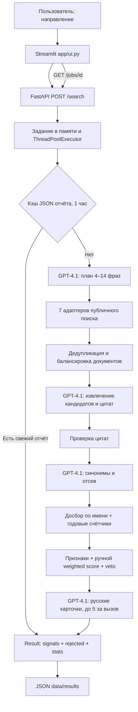

`DEMO_MODE` по умолчанию **0**, а не 1. В live-ветке API вызывает `src.signals.pipeline.run`. В demo-ветке загружает фиксированный `app/fixtures/demo_result.json`; модель там явно обозначена как не запускавшаяся, числовые признаки условные. Нельзя по одному существованию fixture объявлять весь проект демонстрационным. Реальная ветка требует `LLM_API_KEY`. [Развилка API](https://github.com/READY2HYPE/trend-signals-lct2026/blob/768ec23f81805bd408575f815caefdaeb782038e/app/api.py#L72-L132), [fixture, поле модели](https://github.com/READY2HYPE/trend-signals-lct2026/blob/768ec23f81805bd408575f815caefdaeb782038e/app/fixtures/demo_result.json#L986).

Контейнер содержит Python 3.12, FastAPI и Streamlit. Docker копирует `src`, `app`, `config`; **не копирует** `data/index`, `raw` или `embeddings`. `requirements-app.txt` не содержит sentence-transformers, pyarrow, UMAP или HDBSCAN. Это второе независимое подтверждение, что обслуживаемый продукт — онлайн-конвейер, а не поиск в миллионах SPECTER-векторов. [Dockerfile](https://github.com/READY2HYPE/trend-signals-lct2026/blob/768ec23f81805bd408575f815caefdaeb782038e/Dockerfile#L1-L12), [runtime-зависимости](https://github.com/READY2HYPE/trend-signals-lct2026/blob/768ec23f81805bd408575f815caefdaeb782038e/requirements-app.txt#L1-L12).

Внутри прогона:

1. GPT-4.1 строит план узких подобластей: обычно 12 коротких запросов, русские и английские; часть фраз специально ищет стартапы и seed-раунды. Это **направляемый LLM веб-поиск**, а не обнаружение полностью неизвестных тем по всему корпусу.
2. Основной поиск за 540 дней. Google News берут по 25 документов на фразу; остальные выбранные адаптеры — по 10. На извлечение отправляют не более 200 документов, пачками по 40, по 300 символов текста и 200 символов заголовка.
3. Название, синонимы, компании и цитаты извлекаются моделью. Цитата проверяется; затем точные совпадения и предложенные LLM синонимы объединяются через union-find. Есть отдельный отсев слишком общих и нерелевантных кандидатов.
4. До 40 кандидатов проходят точечный досбор без ограничения свежести: Google News, OpenAlex, HN, Habr. По английскому имени отдельно считают упоминания по годам OpenAlex и HN; эти ряды используют прежде всего для зрелости.
5. Считают признаки, фильтруют, ранжируют. Для лучших 15+3 резервных пишут карточки: до пяти карточек на LLM-вызов, до пяти документов на карточку, текст до 500 символов. Компании повторно проверяют присутствием имени в исходных документах.

Доказательства: [настройки лимитов](https://github.com/READY2HYPE/trend-signals-lct2026/blob/768ec23f81805bd408575f815caefdaeb782038e/config/signals.yaml#L4-L27), [главный конвейер](https://github.com/READY2HYPE/trend-signals-lct2026/blob/768ec23f81805bd408575f815caefdaeb782038e/src/signals/pipeline.py#L335-L462), [план и правила](https://github.com/READY2HYPE/trend-signals-lct2026/blob/768ec23f81805bd408575f815caefdaeb782038e/src/signals/prompts.py#L84-L145).

#### Источники текущего поиска

| Адаптер | Что получают | Ограничение |
|---|---|---|
| OpenAlex | название, восстановленная аннотация, DOI/страница, дата, журнал; годовые `group_by` счётчики | Поиск возвращает одну ограниченную страницу релевантной выдачи, не полный временной ряд документов |
| arXiv | Atom-выдача, заголовок, аннотация, первая дата | Полный текст PDF не извлекается |
| Google News | RU+EN RSS, заголовок, дата, издатель, RSS-анонс, Google redirect URL | Не оригинальная статья, независимость издателя оценивают по имени |
| Hacker News | обсуждения/ссылки через Algolia, годовые счётчики | Форумный интерес, а не научное внедрение |
| GitHub | описание и metadata репозитория | Дата создания репозитория не равна дате появления технологии |
| Habr | поиск по ленте, фрагменты | Содержание площадки неоднородно |
| Google Patents | открытый JSON `xhr/query`, название, дата, snippet | Поисковая выдача, а не bulk-патентный корпус; нет обхода семейства патента |

[Реестр семи источников и кэши](https://github.com/READY2HYPE/trend-signals-lct2026/blob/768ec23f81805bd408575f815caefdaeb782038e/src/signals/search/__init__.py#L1-L165), [OpenAlex](https://github.com/READY2HYPE/trend-signals-lct2026/blob/768ec23f81805bd408575f815caefdaeb782038e/src/signals/search/openalex.py#L25-L61), [Google News](https://github.com/READY2HYPE/trend-signals-lct2026/blob/768ec23f81805bd408575f815caefdaeb782038e/src/signals/search/google_news.py#L1-L58), [Google Patents](https://github.com/READY2HYPE/trend-signals-lct2026/blob/768ec23f81805bd408575f815caefdaeb782038e/src/signals/search/patents.py#L12-L40).

#### Как именно они хранят данные

Не найдены SQL-схема, подключение PostgreSQL/SQLite/Neo4j, Elasticsearch, Qdrant или FAISS. Это файловое хранилище:

| Слой | Путь / структура | Идентичность и срок |
|---|---|---|
| Задания API | `jobs` и `active`: Python dict в памяти | Случайный UUID; рестарт теряет статусы; один uvicorn worker |
| Кэш целого результата | `data/results/live-v1-<sha256>.json` / `demo-v1-…` | NFKC/casefold/whitespace-normalized query; TTL по умолчанию 3600 секунд; атомарная запись через tmp |
| Кэш запросов поиска и годовых счётчиков | `data/cache/search/<sha256>.json` | Источник + фраза + since + limit; TTL 24 часа; неуспешные запросы не кэшируются |
| Кэш LLM | `data/cache/llm/<sha256>.json` | Модель + base URL + messages + JSON schema; TTL 24 часа |

[API очередь, TTL и ключи](https://github.com/READY2HYPE/trend-signals-lct2026/blob/768ec23f81805bd408575f815caefdaeb782038e/app/api.py#L72-L105), [поисковый кэш](https://github.com/READY2HYPE/trend-signals-lct2026/blob/768ec23f81805bd408575f815caefdaeb782038e/src/signals/search/__init__.py#L45-L107), [LLM-кэш](https://github.com/READY2HYPE/trend-signals-lct2026/blob/768ec23f81805bd408575f815caefdaeb782038e/src/signals/llm.py#L83-L154).

Публичный контракт — Pydantic `Document → Candidate → Features → Signal → Result`. Документ содержит источник, тип, дату, язык, доверенность, текст и имя адаптера; карточка — объяснение, преимущество, кейс, компании, стадию, score, признаки и источники. Отдельно возвращаются причины отклонений. [Схемы](https://github.com/READY2HYPE/trend-signals-lct2026/blob/768ec23f81805bd408575f815caefdaeb782038e/src/signals/schema.py#L18-L97).

#### Как считается балл

`score = clip(weighted_mean(признаки) − штрафы, 0, 1)`. Веса: свежесть 0.20, рост 0.20, разнообразие 0.25, доверие 0.10, компании/раунд 0.25. Рост — отношение документов за последний год к предыдущему, дополнительно уменьшается при малом числе документов. Свежесть считается от первой даты **среди найденного**, не первого появления на рынке. Разнообразие складывается из числа хостов и типов источников. Раунд даёт бонус только при найденной компании. Штрафы: зрелость 0.65, хайп 0.40, один источник 0.18, неизвестные даты 0.10.

Отсев имеет жёсткие условия: признаки зрелости/хайпа, менее двух документов или двух источников, отсутствие датированного документа за последний год, score ниже 0.40. Число 0.75 используется как порог «уверенных». Это **ручной индекс**, не вероятность обученной модели; авторы прямо это пишут в scoring.py. [Формула и veto](https://github.com/READY2HYPE/trend-signals-lct2026/blob/768ec23f81805bd408575f815caefdaeb782038e/src/signals/scoring.py#L26-L92), [веса](https://github.com/READY2HYPE/trend-signals-lct2026/blob/768ec23f81805bd408575f815caefdaeb782038e/config/signals.yaml#L28-L52).

#### Ветка B: большой offline-корпус

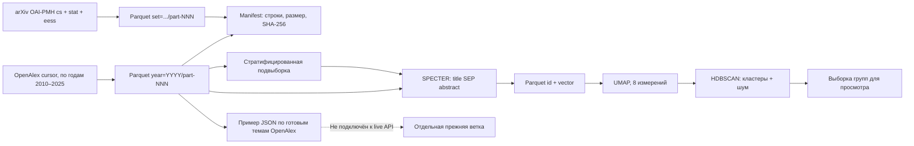

Срез OpenAlex: subfield 1702 (AI), 2010–2025, типы article/preprint. Манифест заявляет 1 509 857 строк и содержит размеры/SHA-256 для raw-файлов. README отдельно заявляет 1 094 429 arXiv-препринтов. Полные raw и embeddings вынесены из GitHub; в публичном архиве есть `openalex-sample.parquet`, агрегаты, манифест, JSON-примеры индекса и ground-truth. Облако команды при аудите не открывалось, поэтому полнота огромного корпуса подтверждается **опубликованным манифестом**, а не нашей проверкой всех файлов. [Срез](https://github.com/READY2HYPE/trend-signals-lct2026/blob/768ec23f81805bd408575f815caefdaeb782038e/config/slice.yaml#L4-L35), [манифест](https://github.com/READY2HYPE/trend-signals-lct2026/blob/768ec23f81805bd408575f815caefdaeb782038e/data/manifest.json#L1-L20), [описание файлов](https://github.com/READY2HYPE/trend-signals-lct2026/blob/768ec23f81805bd408575f815caefdaeb782038e/data/README.md#L1-L52).

OpenAlex скачивают курсором отдельно по каждому году, страницы до 200 строк, файл примерно 25 тыс. строк. После flush сохраняют cursor/part/rows/expected/done в JSON-state. Есть повторы с exponential backoff, обработка суточного лимита, сверка с API-count, порог расхождения 2%. Аннотацию восстанавливают из inverted index. Схема хранит DOI, arxiv_id, тему/subfield, организации и страны, placeholder-date, счётчик цитирований. [Сборщик](https://github.com/READY2HYPE/trend-signals-lct2026/blob/768ec23f81805bd408575f815caefdaeb782038e/src/collect/openalex.py#L23-L173), [Parquet-схема](https://github.com/READY2HYPE/trend-signals-lct2026/blob/768ec23f81805bd408575f815caefdaeb782038e/src/collect/schema.py#L14-L40).

arXiv bulk-ветка использует OAI-PMH, `resumptionToken`, разделы cs/stat/eess, дату **created первой версии**, checkpoint и Parquet по 100 тыс. записей. Повторы между разделами снимаются по id при чтении. Это качественный способ получить исторический корпус, отличающийся от онлайн Atom-поиска. [arXiv bulk](https://github.com/READY2HYPE/trend-signals-lct2026/blob/768ec23f81805bd408575f815caefdaeb782038e/src/collect/arxiv.py#L1-L65).

Эмбеддинги делает готовый SPECTER: title + separator + abstract; язык en или неизвестный, непустая аннотация; normalized vectors. Дальше UMAP → HDBSCAN, seed 42, шум -1, возможность `approximate_predict` для остального корпуса. Это не собственная обученная языковая модель. [SPECTER](https://github.com/READY2HYPE/trend-signals-lct2026/blob/768ec23f81805bd408575f815caefdaeb782038e/src/core/embeddings.py#L32-L42), [UMAP/HDBSCAN](https://github.com/READY2HYPE/trend-signals-lct2026/blob/768ec23f81805bd408575f815caefdaeb782038e/src/core/cluster.py#L24-L112).

**Готовый индекс в README преувеличен относительно содержимого**: `sample-index.json` честно помечен `is_sample=true`; первые строки объясняют, что группы взяты из таксономии OpenAlex, а не собственной кластеризации. Мотивация, кейс и проверка на прошлом содержат placeholders. Нельзя представлять его как готовые результаты обнаружения новых кластерных трендов. [Прямое признание и placeholders](https://github.com/READY2HYPE/trend-signals-lct2026/blob/768ec23f81805bd408575f815caefdaeb782038e/data/index/sample-index.json#L1-L28).

#### Оценка качества и существенные дефекты READY2HYPE

| Приоритет | Подтверждённое наблюдение | Практическое следствие |
|---|---|---|
| Высокий | `_valid_evidence` принимает не только substring, но и любой набор ≥3 слов, если все слова есть в документе | Изменение порядка и удаление отрицания могут превратить неподтверждённый вывод в «дословную цитату» |
| Высокий | `distinct_sources` считает хосты; DOI-ссылки всех журналов имеют `doi.org` | Несколько независимых научных работ превращаются в один источник и могут быть отсеяны; новостные сайты получают преимущество |
| Высокий | Growth и first_seen считаются по ограниченной поисковой выдаче, часто только за 540 дней | Это динамика retrieval-сэмпла; систематически недобирается предыдущее окно, зрелые темы могут выглядеть молодыми |
| Высокий | Published evaluation: precision@15 0.11, recall по области 0.08; classifier recall 0.09 при threshold 0.5 | Высокая «экспертная» оценка LLM 0.98 не означает покрытие эталона; модель-судья и retrieval-качество измеряют разные вещи |
| Средний | `press_release_urls` есть в функции, но нигде в pipeline не передаётся; Google News всем задаёт trust=средняя, type=новости | Новости с перепечатанным пресс-релизом автоматически попадают в независимое подтверждение; источник происхождения не прослеживается |
| Средний | JSON-кэш результата зависит от query и prefix live-v1; настройки scoring, модель и prompt version не входят в ключ | После изменения методики прежние результаты могут оставаться «свежими» до TTL |
| Средний | Историческая кластерная ветка не интегрирована; sample-index placeholders | Нельзя приписать live-продукту поиск по 2.6 млн документов и готовую ретроспективную валидацию |
| Средний | `budget_seconds` только запрещает начинать досбор после deadline; уже начатые LLM/network вызовы не прерываются | 480 секунд не являются строгим wall-clock timeout; возможны долгие задачи и очередь одного процесса |

Доказательства дефектов: [допуск bag-of-words цитаты](https://github.com/READY2HYPE/trend-signals-lct2026/blob/768ec23f81805bd408575f815caefdaeb782038e/src/signals/pipeline.py#L77-L91), [подсчёт source_key](https://github.com/READY2HYPE/trend-signals-lct2026/blob/768ec23f81805bd408575f815caefdaeb782038e/src/signals/features.py#L61-L67), [выборка и рост](https://github.com/READY2HYPE/trend-signals-lct2026/blob/768ec23f81805bd408575f815caefdaeb782038e/src/signals/features.py#L119-L181), [пресс-релизы](https://github.com/READY2HYPE/trend-signals-lct2026/blob/768ec23f81805bd408575f815caefdaeb782038e/src/signals/features.py#L168-L172), [deadline](https://github.com/READY2HYPE/trend-signals-lct2026/blob/768ec23f81805bd408575f815caefdaeb782038e/src/signals/pipeline.py#L300-L315).

Пример дефекта цитаты без запуска чужого кода: в документе «This technology is **not** commercially deployed» находятся все слова строки «This technology is commercially deployed». Проверка множества слов принимает последнюю, хотя утверждение противоположное. Это следует непосредственно из условия `words <= set(normalize(shown).split())`.

В документе оценки авторы приводят собственные результаты прогона 28.09.2026:

| Измерение | Заявленное значение |
|---|---|
| hit@15 по областям | 3 из 6 |
| precision@15 по эталону | в среднем 0.11 |
| recall_area | 0.08 |
| автоматическая «экспертная» precision LLM | 0.98 |
| классификация, threshold 0.5 | precision 0.90, recall 0.09 |
| классификация, threshold 0.75 | положительных ответов нет |
| запрос | 76–107 секунд, $0.14–0.17 |

Это **показатели из документации команды**, а не самостоятельно воспроизведённые замеры. Полный `data/eval/report.md`, XLSX организаторов и negatives.yaml отсутствуют в опубликованном архиве. Авторы отмечают, что негативы составлены командой и часть слишком очевидная. Runtime threshold 0.40 и classifier evaluation thresholds 0.5/0.75 также различаются. [Результаты и ограничения](https://github.com/READY2HYPE/trend-signals-lct2026/blob/768ec23f81805bd408575f815caefdaeb782038e/docs/11-%D0%BE%D1%86%D0%B5%D0%BD%D0%BA%D0%B0.md#L34-L62).

Сильные стороны: отделены добыча свидетельств и описание моделью; устойчивость к отказу одного источника; повторный досбор зрелых упоминаний; атомарные поисковые/API-кэши; причины отказа; раскрытие модели и ограничений найденной выборки; бюджет токенов и стоимость; отдельные live/demo namespaces; исторический корпус с манифестом и контрольными суммами.

### wudlq: архитектура «Горизонта»

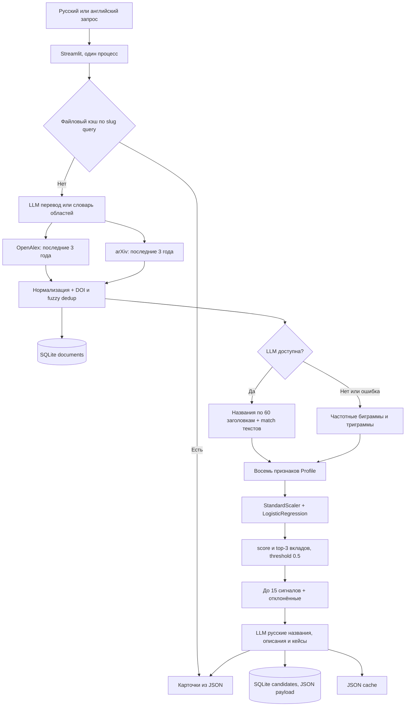

Здесь действительно есть обучаемый классификатор, но нет графа знаний и семантического поиска по векторному корпусу. Pipeline не читает SQLite для поиска подходящих работ: на cache miss заново идёт в API, а БД является журналом документов/карточек. [Вход и реальный pipeline](https://github.com/wudlq/lct-weak-signals/blob/4e56cae6c29b9aa71d65e9417287c6e73cbed292/src/pipeline.py#L312-L404).

#### База данных: схема, индексы и заполнение

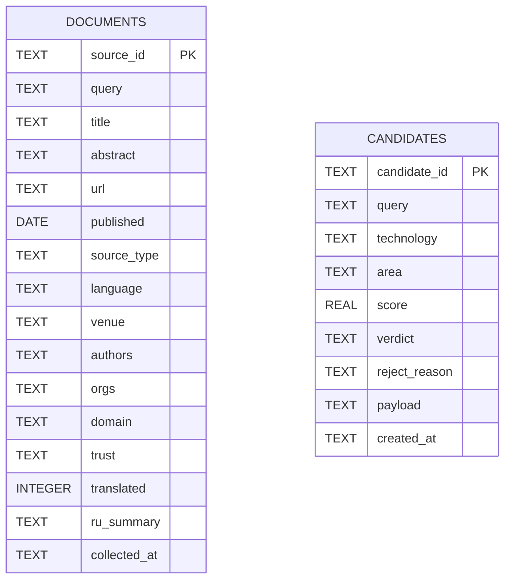

**Между таблицами нет FK или отдельной таблицы связей.** Источники кандидата упакованы в JSON `payload`; авторы и организации документа — TEXT со строковым разделителем ` | `. Индексы: documents(query), documents(published), documents(domain), candidates(query). FTS и векторного индекса нет. [Полная SQL-схема](https://github.com/wudlq/lct-weak-signals/blob/4e56cae6c29b9aa71d65e9417287c6e73cbed292/src/storage/schema.sql#L5-L42).

`save_docs` делает parameterized `executemany INSERT … ON CONFLICT(source_id) DO UPDATE`; `source_id` — например `openalex:W…` или `arxiv:…`. Аннотация и ru_summary сохраняются через COALESCE, остальные поля обновляются. `candidate_id = query + '::' + technology`; карточки записываются полностью в JSON. [Запись документов](https://github.com/wudlq/lct-weak-signals/blob/4e56cae6c29b9aa71d65e9417287c6e73cbed292/src/storage/db.py#L87-L122), [запись карточек](https://github.com/wudlq/lct-weak-signals/blob/4e56cae6c29b9aa71d65e9417287c6e73cbed292/src/storage/db.py#L143-L184).

На живом запросе по умолчанию берут около 100 работ из каждого источника, поделённых между поисковыми строками; минимум 20 на одну строку. Источники последовательно вызываются по всем фразам. OpenAlex: cursor, период последние три года, восстановление аннотации, DOI прежде landing-page; arXiv: Atom, AND по значимым словам, sortBy=submittedDate descending, свежесть отсекают после ответа. Обоим заданы три попытки, 30-секундный timeout, backoff. Патенты, новости, Habr в **активном** collect не подключены. `src/collect/scrapers.py` содержит отдельные старые/заглушечные парсеры, но текущий pipeline импортирует другие, работающие API-адаптеры; нельзя переносить дефекты мёртвого scrapers.py на основной поиск. [Активные источники](https://github.com/wudlq/lct-weak-signals/blob/4e56cae6c29b9aa71d65e9417287c6e73cbed292/src/pipeline.py#L133-L168), [OpenAlex](https://github.com/wudlq/lct-weak-signals/blob/4e56cae6c29b9aa71d65e9417287c6e73cbed292/src/collect/openalex.py#L139-L185), [arXiv](https://github.com/wudlq/lct-weak-signals/blob/4e56cae6c29b9aa71d65e9417287c6e73cbed292/src/collect/arxiv.py#L132-L187).

Дедупликация сильнее простого сравнения URL: сначала DOI, потом похожие названия с threshold 0.90 и допустимой разницей дат 180 дней; выигрывает документ с лучшей доверенностью, аннотацией и организациями, списки авторов/организаций объединяют. [Нормализация и dedup](https://github.com/wudlq/lct-weak-signals/blob/4e56cae6c29b9aa71d65e9417287c6e73cbed292/src/collect/normalize.py#L89-L180).

#### Модель, датасет и признаки

Train-код читает `data/positives.csv` и `data/negatives.csv`, назначает label 1/0, строит Profile, обучает scaler+logistic regression. Основной контроль — leave-one-area-out, не случайный train/test split. Затем финальную модель обучают на всей таблице и записывают `models/model.joblib`; этот файл опубликован, но его содержимое не исполнялось при аудите. CSV обучения, `data/trust_domains.csv`, прогретые кэши и заполненная БД в текущем публичном архиве **отсутствуют**. Есть только тестовые `negatives_fixture.csv`, которые train по умолчанию не читает. [Входы обучения](https://github.com/wudlq/lct-weak-signals/blob/4e56cae6c29b9aa71d65e9417287c6e73cbed292/src/model/train.py#L36-L84), [модель и LOAO](https://github.com/wudlq/lct-weak-signals/blob/4e56cae6c29b9aa71d65e9417287c6e73cbed292/src/model/train.py#L87-L165), [финальное обучение](https://github.com/wudlq/lct-weak-signals/blob/4e56cae6c29b9aa71d65e9417287c6e73cbed292/src/model/train.py#L322-L346).

| Признак | Обучение | Живой запрос |
|---|---|---|
| stage_score | Колонка stage от разметчика; keyword-rule 0–3 | Keywords title+abstract |
| trend_score | Колонка trend от разметчика; rule 0–2 | Число документов за 12 месяцев / предыдущие 12 |
| early_words_ratio | Маркеры прототипа/пилота в названии и why | Те же маркеры в найденных документах |
| maturity_words_ratio | Стандарты/массовость в названии и why | Те же маркеры в документах |
| org_count | Число компаний из размеченной строки | Число уникальных аффилиаций OpenAlex/arXiv |
| top_org_share | Частота имени среди перечисленных компаний | Доля самой частой аффилиации |
| trusted_share | Домен source_urls | Домен найденного DOI/URL |
| media_only | Тип вывели из уровня домена | Type коллектора: научная публикация/препринт |

[Определения и преобразование Profile](https://github.com/wudlq/lct-weak-signals/blob/4e56cae6c29b9aa71d65e9417287c6e73cbed292/src/features/build.py#L28-L48), [разметка против дат](https://github.com/wudlq/lct-weak-signals/blob/4e56cae6c29b9aa71d65e9417287c6e73cbed292/src/features/build.py#L94-L200), [расчёт](https://github.com/wudlq/lct-weak-signals/blob/4e56cae6c29b9aa71d65e9417287c6e73cbed292/src/features/build.py#L210-L243).

`score` — predict_proba класса 1; три главных вклада получают через z-score × coefficient. Это объяснение вклада в линейную модель, а не доказательство причинности или вероятности коммерческого успеха. При score≥0.5 кандидат автоматически считается сигналом; причины «зрелая/хайп/шум» выбирают только ниже порога. [Предсказание и вклады](https://github.com/wudlq/lct-weak-signals/blob/4e56cae6c29b9aa71d65e9417287c6e73cbed292/src/model/predict.py#L43-L99).

LLM-интерфейс допускает GigaChat, YandexGPT, OpenAI и тестовый mock. GigaChat по умолчанию GigaChat-2-Pro, OpenAI — GPT-4.1; TLS у GigaChat сохраняют включённым с дополнительным CA-bundle. В отсутствие ключа перевод запроса идёт по словарю, кандидаты — n-grams, описание остаётся исходной аннотацией на английском. README обещает больше русского fallback, чем делает actual generate.py. [Провайдеры](https://github.com/wudlq/lct-weak-signals/blob/4e56cae6c29b9aa71d65e9417287c6e73cbed292/src/texts/providers.py#L65-L84), [выбор провайдера](https://github.com/wudlq/lct-weak-signals/blob/4e56cae6c29b9aa71d65e9417287c6e73cbed292/src/texts/providers.py#L230-L252), [описание без модели](https://github.com/wudlq/lct-weak-signals/blob/4e56cae6c29b9aa71d65e9417287c6e73cbed292/src/texts/generate.py#L82-L138).

#### Метрики и дефекты wudlq

Опубликованный report: 100 positives и 88 negatives, LOAO precision 0.895, recall 0.850, F1 0.872. Авторы дополнительно выключили stage/trend из разметки: **precision 0.658, recall 0.750, F1 0.701**. Разница F1 = 0.171 показывает, что перенос оценки с таблицы на документы — существенная проблема, а не мелкая оговорка. Нельзя назвать 0.872 подтверждённой end-to-end точностью живого поиска. [Датасет и метрики](https://github.com/wudlq/lct-weak-signals/blob/4e56cae6c29b9aa71d65e9417287c6e73cbed292/reports/metrics.md#L3-L12), [контроль утечки](https://github.com/wudlq/lct-weak-signals/blob/4e56cae6c29b9aa71d65e9417287c6e73cbed292/reports/metrics.md#L50-L63).

| Приоритет | Дефект / ограничение | Что это меняет |
|---|---|---|
| Высокий | Финальную модель обучают с stage/trend разметчика, живые данные измеряют эти признаки иначе | Distribution shift и annotation leakage; авторский ablation прямо показывает падение качества |
| Высокий | Независимость двух подтверждений не проверяют: минимум два docs по разным URL, а не разные исследовательские группы/первоисточники | Два документа одной организации считаются сигналом; официальное определение требует независимых источников |
| Высокий | Номера документов, присланные LLM, принимаются в поддерживающие без проверки смысла; добавочный match ищет ≥60% токенов как substrings | Два выбранных LLM чужих документа могут дать «подтверждённого» кандидата; нет проверки цитаты/span |
| Высокий | Отсев зрелости не является жёстким veto: score≥0.5 немедленно даёт signal | Высокий рост и прочие признаки могут компенсировать маркеры зрелого/хайпового кандидата |
| Средний | `documents.query` одно значение; upsert по source_id переписывает его | Документ, найденный запросом A, после запроса B исчезает из `load_docs(A)`; происхождение поиска теряется |
| Средний | Кэш — slug первых 80 символов, без hash, TTL, модели/версии features | Два длинных запроса могут столкнуться; вчерашняя методика/LLM выдача возвращается неограниченно |
| Средний | Глобальный `_ПОСЛЕДНИЕ_СТРОКИ` хранит search directions для всего процесса | Одновременные Streamlit-сеансы могут получить направления другого запроса при extraction |
| Средний | SQLite в Docker не смонтирован отдельным volume; volume только data/cache | Пересоздание контейнера теряет собранный журнал SQLite, остаются JSON-карточки |
| Средний | Повторный save_candidates не удаляет старые карточки, исчезнувшие из нового результата | `load_candidates(query)` может вернуть смесь разных прогонов; live UI пока читает результат pipeline, поэтому это дефект хранения, не гарантированный дефект текущего экрана |
| Средний | README относится к прежней структуре: `app.py`, `src/train.py`, «13 признаков», random/fivefold описание | Обучение/запуск по README могут не воспроизвестись; actual код содержит восемь признаков и другой путь |

Доказательства: [LLM-номера и token-match](https://github.com/wudlq/lct-weak-signals/blob/4e56cae6c29b9aa71d65e9417287c6e73cbed292/src/collect/candidates.py#L230-L263), [приём docs и минимальный порог](https://github.com/wudlq/lct-weak-signals/blob/4e56cae6c29b9aa71d65e9417287c6e73cbed292/src/collect/candidates.py#L349-L391), [мягкий maturity/reject](https://github.com/wudlq/lct-weak-signals/blob/4e56cae6c29b9aa71d65e9417287c6e73cbed292/src/model/predict.py#L88-L99), [перезапись query](https://github.com/wudlq/lct-weak-signals/blob/4e56cae6c29b9aa71d65e9417287c6e73cbed292/src/storage/db.py#L105-L114), [кэш/global directions](https://github.com/wudlq/lct-weak-signals/blob/4e56cae6c29b9aa71d65e9417287c6e73cbed292/src/pipeline.py#L104-L145), [Docker volume](https://github.com/wudlq/lct-weak-signals/blob/4e56cae6c29b9aa71d65e9417287c6e73cbed292/docker-compose.yml#L7-L19), [публичный README](https://github.com/wudlq/lct-weak-signals/blob/4e56cae6c29b9aa71d65e9417287c6e73cbed292/README.md).

Сильные стороны: прозрачный обученный baseline, LOAO вместо случайного split, показан контроль annotation leakage, простая переносимая схема, parameterized SQL, DOI+fuzzy dedup, объяснение вкладов, отказ одной научной API не валит весь сбор, fallback без ключа, происхождение источников сохранено в карточке.

### Что рационально перенести в LCTrendSearch

Локальный README LCTrendSearch описывает преимущественно сбор, LLM-извлечение/проверку, entity resolution и Neo4j; пакет ranking пока является заготовкой. Поэтому полезнее завершить отбор и доказательство сигналов поверх существующего графа, чем менять базу на SQLite или пересоздавать их файловый конвейер.

| Идея | Откуда | Как адаптировать у нас | Что измерять |
|---|---|---|---|
| Простой интерпретируемый baseline | wudlq: восемь признаков и logistic regression | Взять feature set как отправную точку; считать все признаки из одинаковых документов и графа и для train, и для inference | LOAO + holdout по времени; ablation; precision/recall/F1 и precision@15 |
| Название кандидата → отдельный досбор | READY runtime | После извлечения технологического узла искать исторические и свежие свидетельства по алиасам; записывать происхождение и связи Neo4j | Сколько кандидатов подтвердилось / сколько зрелых отсеяно |
| Историческая нормировка корпуса | READY offline | Ряды «работы технологии / все работы области» по годам из полного freeze-среза; не считать рост по top-N поиска | Backtesting по дате cutoff, recall будущих прорывов и ложные срабатывания |
| Манифест и checkpoint | READY bulk | Для нашего material corpus сохранять source request, fetched_at, snapshot_id, SHA-256, rows, API expected, checkpoint | Воспроизводимость и полнота загрузки |
| Балансировка документов по источнику/типу | READY runtime | Формировать LLM-пакеты из science/patent/code/news с лимитами, чтобы первая search-фраза не заняла контекст | Покрытие подобластей, разнообразие и процент научных доказательств |
| Связка публикация ↔ препринт | wudlq normalize + READY arxiv_id | DOI, arXiv ID, version, title; сохранить один work с несколькими manifestations | Ошибки double counting и сохранённые организации |
| Отдельный список отказов | Оба | В ranking хранить reject_reason и evidence, а также hard maturity/hype veto | False positive по mature/hype/noise, объяснимость эксперту |
| Учёт стоимости и времени | READY | В run audit добавить tokens/calls/cache hits/seconds по стадии; выбирать batch size и лимиты по измерениям | Время до первого результата, p95, стоимость запроса |
| Строгая привязка утверждения к span | Наше преимущество над обоими | Каждое case/advantage/company/stage — quote + document/chunk + locator; не принимать bag-of-words; сохранять отрицания | Доля утверждений с проверенной опорой, ручная factual precision |
| Происхождение вместо числа доменов | Исправление обоих | Neo4j-связи work → organization → primary source; press-release lineage и near-duplicate content | Число независимых групп/первоисточников, а не просто URL |

Предлагаемая схема нашего следующего слоя:

Не стоит переносить как есть: (1) обучение на стадиях/трендах разметчика вместо реальных наблюдений; (2) уверенность в процентах для ручного weighted score; (3) рост ограниченной поисковой выдачи как рост рынка; (4) LLM-подтверждение без текстового span; (5) отсутствие истории прогонов и связи search↔document; (6) крупный offline-корпус, который не используется конечным продуктом.

### Сравнение, которое можно защищать перед командой

READY2HYPE сильнее по разнообразию активных источников, досбору, асинхронному API, протоколу карточки и воспроизводимости bulk-выгрузки. Однако реально обслуживаемый продукт опирается на GPT-4.1 и hand-tuned scoring, а не на обучение по миллионам работ; собственные опубликованные метрики показывают низкое покрытие эталона.

wudlq сильнее по понятному обучаемому baseline и честному отчёту о LOAO/annotation ablation. Однако runtime ограничен двумя научными источниками; training CSV отсутствуют, измерение признаков меняется между разметкой и живыми работами, independent evidence и строгий mature veto не обеспечены.

Для LCTrendSearch наиболее ценный набор: **Neo4j provenance + строгие spans текущего извлечения → досбор и historical counts READY → одинаковые train/inference features и LOAO baseline wudlq → ручная end-to-end проверка ТОП-15**. Прямого основания отказываться от нашего графа или брать их модель как готовый production detector опубликованный код не даёт.

## Приложение B. quark28 и melorri33

Дата получения: 28 сентября 2026, около 17:33 UTC. Аудит выполнен по публичным архивам фиксированных коммитов. Код, зависимости, контейнеры и модели конкурентов не запускались. Проверены исходники, конфигурации, схемы, артефакты и документация. Заявленные авторами замеры отделены от фактов, которые видны в коде. Посещения их демонстрационных сайтов, входа в GitHub, звёзд, issues и иных взаимодействий не было. Это минимизация раскрытия аккаунта, а не обещание отсутствия журналирования со стороны GitHub.

| Репозиторий | Ветка и SHA | Последняя отправка по GitHub API | Лицензия |
|---|---|---|---|
| [quark28/lct-signals](https://github.com/quark28/lct-signals) | `main`, `d54f41797676716573b1bceef581744edb8a87e4` | 22.09.2026 11:07:30 UTC | API `license=null`; LICENSE/COPYING в архиве не найден |
| [melorri33/weak-signals](https://github.com/melorri33/weak-signals) | `main`, `20826cbd1a067c214f54ff9902d231a859f06aa5` | 28.09.2026 16:50:52 UTC | API `license=null`; LICENSE/COPYING в архиве не найден |

Снимки и сведения: `quark28__lct-signals/audit-metadata.json`, `melorri33__weak-signals/audit-metadata.json` рядом с этим отчётом. Все ссылки ниже закреплены на SHA. Публичность репозитория сама по себе не подтверждает лицензию на перенос кода; практически полезный путь — реализовать идеи в нашем проекте самостоятельно.

### Ответ на три ключевых вопроса

| Вопрос | quark28/lct-signals | melorri33/weak-signals |
|---|---|---|
| Какая БД? | PostgreSQL + pgvector; четыре таблицы `queries`, `documents`, `clusters`, `cluster_documents`; векторы 384 измерения, JSONB для сырых фактов и агрегатов | PostgreSQL 16 в образе pgvector; SQLAlchemy + psycopg. Две таблицы `documents`, `search_results`, JSON для полного объекта. Расширение vector создаётся, но векторных колонок или поиска через pgvector в модели хранилища нет. Кэши и готовые результаты также хранятся в файловом `data/` |
| Как заполняют? | Пользовательский запрос → две LLM стадии планирования → параллельный сбор включённых API → дедуп заголовков → LLM извлечение → локальные e5 эмбеддинги → семантический дедуп → запись документов → кластеризация названий → запись сырых агрегатов и журнала прогона | Пользовательский запрос → LLM поисковые фразы → параллельный сбор новостей/OpenAlex/arXiv → дедуп → БД → LLM кандидаты пачками → отдельные API счётчики по названию каждого кандидата → признаки → фильтры → модели → дополнительный поиск по топ-кандидатам → карточки → БД и JSON файловый результат |
| Что обучали? | В публичном коммите обучения оценщика нет. `intfloat/multilingual-e5-small` используется готовым, GigaChat вызывается через API, `AgglomerativeClustering.fit_predict` выполняет кластеризацию текущей пачки. Это не обучение классификатора слабых сигналов. Уверенность и статусы в БД зарезервированы; число уверенных сигналов прямо записывается нулём | Реально есть обученная CatBoostClassifier и её `.cbm`, плюс LogisticRegression на готовых 1024-мерных `BAAI/bge-m3` эмбеддингах названий. Последний name-артефакт обучен 28.09 на 1177 примерах, 222 положительных. Итог `0.25 × CatBoost + 0.75 × name-model`. Qwen3/GigaChat/YandexGPT используются для вывода и текстовых задач, fine-tuning LLM в репозитории нет |

Основания: [quark схема][q-schema], [quark entry point][q-run], [quark модели][q-models], [melorri схема][m-schema], [melorri compose][m-compose], [melorri pipeline][m-run], [melorri обучение][m-train], [melorri смешивание][m-score], [melorri name артефакт][m-name-art].

### 1. quark28/lct-signals: хороший модуль сбора, пока не полное решение

#### Архитектура и реальный объём реализации

В архиве есть CLI парсера, провайдеры, общий контракт документа, LLM-реестр, дедуп, эмбеддер, кластеризация и SQL хранилище. Веб-приложения, API, исполняемого блока признаков/скоринга, тренировочного набора или обученной модели оценки в этом коммите не найдено. Это согласуется с самим entry point: будущий веб-интерфейс упомянут как следующий этап, а оценщик отложен на второй спринт. Существование `src/features/` описано в комментариях БД, но самого каталога нет. [Entry point, строки 1–14 и 372–390][q-run]; [комментарии БД][q-repo].

```mermaid
flowchart LR
    U[Запрос и необязательные даты] --> P1[GigaChat-2: подтехнологии]
    P1 --> P2[GigaChat-2: поисковые фразы и arXiv/CPC]
    P2 --> COL[Параллельные синхронные провайдеры в потоках]
    COL --> D1[Дедуп по заголовкам]
    D1 --> EX[GigaChat-2: технологии, стадия, компании, финансирование]
    EX --> E[intfloat/multilingual-e5-small]
    E --> D2[Семантический дедуп 0.93]
    D2 --> DOC[(PostgreSQL documents)]
    EX --> N[Векторы названий с коротким контекстом]
    N --> C[Complete-link agglomerative: cosine distance 0.15]
    C --> UMB[Удаление зонтичной темы: similarity 0.85]
    UMB --> AG[Сырые агрегаты по технологии]
    AG --> DB[(queries + clusters + cluster_documents)]
    AG --> OUT[Консольный список кластеров по размеру]
    DB -. будущий этап .-> SCORE[Классификатор, вероятность, топ-15, карточки]
```

Ключевой выбор: кластеризуют не весь документ, а названия технологий, извлечённые LLM, с коротким контекстом. Complete linkage мешает эффекту цепочки A≈B≈C, когда A и C уже различны; одиночные элементы намеренно сохраняются. Это разумно для редких ранних технологий. Но сортировка текущей выдачи идёт по числу документов, то есть это ещё не итоговый рейтинг слабых сигналов. [Кластеризатор, строки 71–108 и 175–199][q-cluster]; [эмбеддер, 64–91][q-embed].

#### База, таблицы и индексы

| Таблица | Содержимое | Ключи и индексы |
|---|---|---|
| `queries` | Оригинальный запрос, JSONB план, даты, начало/конец, счётчики, JSONB `run_totals` и ошибки источников | `BIGSERIAL id`; индекс `started_at DESC` |
| `documents` | Provider/doc-id ключ, URL/domain, тип и доверие, заголовок/abstract, дата/язык/авторы, `duplicate_of`, JSONB `extracted`/`raw`, `embedding vector(384)` | PK `doc_key`; индексы `provider`, `published_at`, `duplicate_of`, `source_type`; FK на оригинал дубля |
| `clusters` | Название/синонимы, будущий статус/вероятность/ранг, объёмы, типы/провайдеры, квартальные ряды, патенты, деньги, зрелость, GitHub-счётчики, доверенность, карточка | PK `id`; FK `query_id`; индексы `query_id`, `(query_id,status)`, `(query_id,rank_position)` |
| `cluster_documents` | Связь многие-ко-многим между технологией и документом, вариант названия в нём | Составной PK `(cluster_id,doc_key)`; обратный индекс `doc_key`; каскадные FK |

Сырые агрегаты отделены от производных признаков: это облегчает изменение формул без пересбора корпуса. Векторы сохраняются в PostgreSQL, есть функция поиска похожих документов через cosine distance `<=>`; HNSW/IVFFlat индекса схема не создаёт, вызов этой функции основным pipeline не найден. Семантический дедуп выполняется в памяти через полную матрицу N×N. Следовательно, pgvector здесь — хранение и заготовка SQL поиска, не доказательство наличия полноценного масштабируемого векторного retrieval. [Схема][q-schema]; [repo, 108–231][q-repo]; [dedup, 61–100][q-dedup].

#### Источники: что реально включено

| Источник | Состояние в default config | Как получают документы |
|---|---|---|
| arXiv | Включён, лимит 80, high/science | Atom API, поисковые термины + категории + даты, постраничный обход |
| OpenAlex | Включён, 120, high/science | works API, title/abstract search, cursor, язык RU/EN и даты |
| Crossref | Включён, 80, high/science | works API, курсор, типы journal/proceedings/posted-content |
| Google Patents | Включён, 200, high/patent | Недокументированный `patents.google.com/xhr/query`, приоритет/даты/CPC; в `PROBLEMS.md` автор отмечает 503 |
| Tech media | Включён, 200, medium/media | WordPress REST поиск по архивам TechCrunch, SiliconANGLE, The AI Insider, Pulse2, Robotics and Automation News |
| Yandex Search | Включён, 400, medium/media | Search API v2, отложенные запросы и polling; нужен ключ/каталог; выдача содержит snippets, даты отсутствуют |
| GitHub | Провайдер реализован, но выключен | REST поиск репозиториев, metadata/stars; в обычный прогон не входит |
| Hacker News | Реализован, выключен | Не участвует в стандартном заполнении |
| Habr | Выключен | Конфиг объясняет robots запрет search |
| i.moscow patents | Выключен, провайдер не написан | Только пункт в конфигурации |

Основания: [default конфигурация][q-sources]; [реестр провайдеров][q-registry]; [TechMedia][q-media]; [Yandex][q-yandex]; [публичный список проблем][q-problems]. Верхняя сумма лимитов включённых провайдеров — 960 документов; это настройки максимума, не подтверждённый размер базы.

В БД попадают результаты живого поиска под конкретный пользовательский запрос; периодического предварительного наполнения корпуса, cron и фоновой ETL задачи нет. Документы повторно используются только как потенциальное хранилище: основной кеш извлечения файловый `.cache/extract`, а SQL функция `get_extracted` не подключена к основному extractor. `ON CONFLICT` обновляет только извлечённые факты и embedding, не заголовок, текст, дату или доверие. Полные тексты не скачивают: LLM видит заголовок и максимум 2000 символов аннотации; e5 на документе — заголовок и первые 300 символов. [Extractor][q-extract]; [repo, 156–204][q-repo]; [эмбеддер][q-embed].

#### Модели и «обучение»

- `roles.plan` и `roles.extract`: псевдоним `gigachat-lite`, фактическая модель `GigaChat-2`, temperature 0, max_tokens 1500.
- `roles.write_card`: `GigaChat-2-Max`, но реализованного вызывающего блока генерации карточек в публичном pipeline нет.
- Реестр дополнительно содержит GigaChat Pro, YandexGPT 5 Lite/Pro/5.1, Qwen через Yandex и другие варианты; перечисление в YAML не доказывает их использование. Фактические defaults — GigaChat роли выше.
- Эмбеддинги: готовая `intfloat/multilingual-e5-small`, 384 измерения, нормализация, префикс `query:`. Fine-tuning не найден.
- Agglomerative clustering выполняет fit текущей группы названий. Классификатор, обучающийся на labels сигнал/нет, метрики P/R/F1, валидатор качества и калибровка вероятности отсутствуют.

Основания: [models.yaml, 18–55][q-models]; [эмбеддер][q-embed]; [кластеры][q-cluster]; [run, 376–390][q-run]. Схема предусматривает 59 производных признаков, но это комментарий о будущем составе; нельзя выдавать его за 59 реально рассчитанных и использованных признаков. [SQL, 9–18][q-schema].

#### Подтверждённые дефекты и ограничения

| Приоритет | Дефект | Прямое основание и последствие |
|---|---|---|
| P1 | Нет конечного оценщика | `signals_confident=0` с комментарием о будущем оценщике; кластеры не получают status/confidence/rank. Это парсер/кластеризатор, не готовый поиск top-15 weak signals. [run 376–390][q-run] |
| P1 | Дедуп по заголовкам теряет перепечатки перед сохранением | После маркировки `documents` берут `originals=dedup.originals(documents)`; на извлечение и сохранение идут только они. Поэтому обещание «дубли сохраняются как подтверждение» для этой стадии не выполняется; title-дубли исчезают из БД, кластеров и `duplicate_count`. Семантические дубли при этом остаются среди `originals`, и учитываются в общих doc_count/timeline как обычные документы. Получается непоследовательная статистика. [run 298–340 и 372–374][q-run]; [агрегация 136–155][q-run]; [dedup 103–105][q-dedup] |
| P1 | Патентная пагинация отключена | `_build_url_param(query,page)` не использует page, num тоже закомментирован. Обычно это обрезает первый ответ. Если сервер возвращает ≥100 элементов при limit>100, цикл вновь запрашивает ту же страницу, не увеличивает уникальные docs и может не закончиться до сетевой ошибки. Общего deadline у collector нет. [google_patents 69–92, 110–141][q-patents]; [collector 85–118][q-collect] |
| P2 | `patent_top_applicant_count` содержит число патентов крупнейшей страны | `top_country=country_counts.most_common(1)[0][1]` записывается как top applicant; страна публикации не равна стране заявителя. Два заявителя в одной стране дают ошибочную концентрацию, foreign-count не измеряет иностранных заявителей. [run 157–164,199–202,224–229][q-run] |
| P2 | `trust_counts` не заполняется | Создаётся Counter, затем добавляется ноль по provider, в итоговый row поле вообще не включено. В БД остаётся `{}`; оценка доказательной базы по уровням high/medium/low пока невозможна из cluster aggregates. [run 112–119,188–189,204–244][q-run] |
| P2 | `--no-cache` не отключает кеш | Entry point передаёт cache=None, но extractor делает `cache=cache or ExtractionCache()`, после чего всегда читает и записывает его. Изменённый промпт/модель не входят в ключ, так что ошибочный результат сохраняется по doc-key. [run 303–310][q-run]; [extractor 81–102,117–152][q-extract] |
| P2 | Разные длины списков названий и документов приводят к неверной привязке | Кластер сохраняет уникальные document_keys, но все name_variants; затем `resplit_same_named` сопоставляет их по индексу и использует последний ключ при нехватке. Аналогично сохранение `cluster_documents` берёт variant[i] для unique key[i]. Один документ, упомянувший две близкие технологии, может сдвинуть соответствия и потерять/перепривязать доказательства. [clusterer 100–106,144–156][q-cluster]; [repo 273–285][q-repo] |
| P2 | Даты Yandex выдачи навсегда пусты в текущем pipeline | Провайдер ставит `published_at=None`, обещает восстановление LLM, но `ExtractedFields` не содержит даты и не изменяет документ. Такие материалы не дают временного ряда, возраста и роста. [yandex 183–194][q-yandex]; [extractor 45–56][q-extract]; [run 150–155][q-run] |
| P2 | TLS проверки отключены у GigaChat defaults | `verify_ssl_certs:false` во всех трёх GigaChat-конфигах. Авторы сами отмечают временность, но текущий публичный коммит не исправляет её. [models 12–16,27–54][q-models] |
| P2 | Default `timeout_s` в YAML не является deadline источника | Collector не передаёт его в провайдеры и ждёт все Futures через as_completed без timeout. Много последовательных deferred Yandex запросов или зацикленный патентный провайдер удержат весь прогон. [config defaults][q-sources]; [collector 85–118,147–175][q-collect] |

Все дефекты выше выведены статически; их частота на реальном стенде не измерена. Уже опубликованный `clusters.txt` показывает два отдельных кластера «федеративное обучение» в начале выдачи, что согласуется с проблемой повторной кластеризации: `RESPLIT_FACTOR=1.0` не делает повторный порог строже. Сам текстовый дамп не содержит query id, дату или метрики — это демонстрация результата, не воспроизводимый benchmark. [Дамп][q-dump]; [clusterer 30–33,111–172][q-cluster].

#### Какие идеи стоит взять

1. **Два уровня планирования.** Вначале 8–15 подтехнологий, затем короткие RU/EN фразы и предметные коды. Это улучшает покрытие, когда узкая технология не содержит слова исходной области. Перемешивание первых фраз всех подтем делает ограниченный поисковый бюджет справедливее. В LCTrendSearch это можно встроить в discovery, сохраняя каждый план и объяснение выбора. [Planner][q-plan].
2. **WordPress REST поиск по архивам отраслевых медиа.** Архив может дать более глубокую историю, чем обычная свежая RSS лента. Провайдер отдельно отключает умерший сайт, сохраняет остальные и отдаёт site_report. Для нас — адаптер новости с raw snapshot, контентом/библиографией и проверкой независимости; не наследовать общий medium для всех web-results. [TechMedia][q-media].
3. **Названия технологии + контекст для объединения.** Сравнивать названия в multilingual пространстве, но хранить отдельную сущность упоминания `(doc,span,canonical concept)`. У нас уже есть resolver и граф; можно использовать этот паттерн для расширения aliases, не переносить их ошибочные параллельные массивы. [Embedder][q-embed].
4. **Роли LLM по стоимости.** Лёгкая массовая extraction, более сильная модель для малого числа финальных карточек. В нашем клиенте лестница уже есть; полезна именно явная роль вызова, измеряемый бюджет и отдельные эксперименты качества каждой роли. [Registry][q-llm-reg].
5. **Хранить исходные агрегаты и пересчитывать признаки.** Наши временные графовые features уже глубже; quark подтверждает практичность разделения исходных наблюдений и производных формул. Не копировать его будущую SQL схему целиком ради числа полей.

### 2. melorri33/weak-signals: наиболее законченная из этих двух реализаций

#### Архитектура

Это полноценный Python pipeline с FastAPI, React/Vite, дополнительным Streamlit, PostgreSQL и локальными ML моделями. Код актуальнее README: начало README ещё говорит о заглушках кандидатов и текстов, но `candidates.py` и `cards.py` реально вызывают LLM. Ошибка отдельных источников или ограничение времени приводит к частичному результату и fallback, а не обязательно к остановке. У LLM есть Pydantic schema validation, JSON repair, повтор с объяснением ошибки, дисковый кеш и журнал вызовов. [Pipeline][m-run]; [Candidates][m-candidates]; [Cards][m-cards]; [LLM client][m-llm].

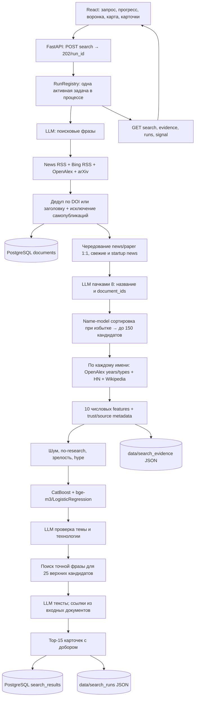

API возвращает run_id сразу, frontend опрашивает прогресс. Реестр держит 20 результатов в памяти, список показывает до 50, один активный прогон ограничен внутри одного процесса. Настоящей распределённой очереди, durable job worker и межпроцессного lock нет; Streamlit запускает pipeline самостоятельно. [RunRegistry 26–69][m-api-runs]; [compose 28–84][m-compose].

#### Хранилище и схема

| Слой | Что хранит | Фактическая реализация |
|---|---|---|
| PostgreSQL | Документы и полные результаты | Образ `pgvector/pgvector:pg16`, SQLAlchemy 2, psycopg, `metadata.create_all` |
| `documents` | id, source/type, title, url, publication date, язык, fetched_at, полный сериализованный Document | PK id, индексы source/source_type, JSON `raw`. Нет embedding, JSONB или отдельных концептов/кандидатов |
| `search_results` | run_id, query, status, started_at, полный SearchResult | PK run_id, индексы query/status, JSON raw |
| `data/cache` | Ответы API статистики | SHA256 ключ source+term; TTL по умолчанию семь дней |
| `data/llm_cache` | Ответы LLM | Ключ model + messages + schema + max_tokens, без TTL |
| `data/search_runs` | Готовые результаты API и Streamlit | JSON, позволяет демонстрации пережить перезапуск без БД |
| `data/search_evidence` | Features и публикации по годам для всех кандидатов | JSON отдельный от результата; используется картой и графиками |

Расширение vector активируется init SQL, но фактически embeddings живут в памяти name-model; vector-store/RAG через pgvector нет. Нет отдельной таблицы источников, mentions, predictions, training examples или features, нет Alembic migrations, нет векторных индексов. Документ обновляется через session.get по id, т.е. повторное заполнение является upsert на уровне ORM. Результат перезаписывается после каждого шага для прогресса. [Модели БД][m-schema]; [DB][m-db]; [documents][m-doc-store]; [search store][m-run-store]; [API cache][m-api-cache]; [LLM cache 103–160][m-llm]; [evidence][m-evidence].

#### Как наполняют базу и откуда данные

1. LLM формирует поисковые фразы из пользовательского запроса. Опционально добавляют freshness-фразы про стартапы, funding и launch. При сбое — запрос сам становится фразой.
2. Сбор запускает отдельную задачу для каждой пары фраза+лента и для OpenAlex/arXiv. Общий сбор по умолчанию 60 секунд; частично полученные новости сохраняются даже при отмене задач. Фразы про startup funding направляют только в новости.
3. Новости: TechCrunch, SiliconANGLE, The AI Insider, VentureBeat через поисковые RSS; Bing News RSS по точной фразе и страницам 1/11/21/41. Google News намеренно не включён. Наука: OpenAlex последние три года, до 200 результатов на фразу; arXiv.
4. Дедуп по DOI при doi.org URL, иначе по нормализованному заголовку, первый документ выигрывает. Исходные sources выдаются по кругу, чтобы большой OpenAlex ответ не вытеснил остальные при limit. Конвейер исключает собственные публикации проекта.
5. Документы получают trust по типу и домену и записываются в БД. Затем LLM читает максимум 500 документов по умолчанию, пачка 8, первые 600 знаков abstract. Порядок news/paper 1:1; в news приоритет startup-launch и freshness; внутри групп новые первыми.
6. LLM возвращает name+company+document_ids. Ссылки на несуществующие входные метки, названия компаний/продуктов и broad names отбрасываются. Одинаковые slug сливаются; отдельной семантической кластеризации всех кандидатов нет. При отказе — heuristic названия из заголовков.
7. На каждом кандидате отдельно собирают OpenAlex по годам и типам, Hacker News counts, английскую/русскую Wikipedia. Это не полная выгрузка всех статей за историю; API group_by даёт агрегаты. Дополнительно топ-25 получают до 8 документов поиска точной фразы для карточки. Все результаты и прогресс сохраняются.

Основания: [collector][m-collect]; [feeds][m-feeds]; [OpenAlex][m-openalex]; [candidates 235–501][m-candidates]; [run 134–185,223–281][m-run]; [term stats][m-stats]; [trust][m-trust].

Патентный поиск отсутствует: `patents_by_year=None`, `standard_mentions=None`, `distinct_orgs=None` прямо возвращаются из term_stats. API credentials PatentsView/Lens существуют в settings, но это конфигурационные заготовки. README обещает патенты — текущий основной collector вызывает только news/openalex/arxiv. Hacker News и Wikipedia используются для агрегатов признаков, а не основной ленты документов. [collect 15,37,54][m-collect]; [stats 79–89][m-stats]; [settings 49–53][m-config].

Демо не означает фиктивную основную выдачу: штатный pipeline использует реальные модульные collectors. Однако deps при ошибке импорта collector подставляет тестовую fixture; кандидаты могут деградировать до заголовков; карточка при недоступной LLM остаётся с пустым/служебным описанием. Файловые saved_runs и LLM cache дают мгновенный просмотр ранее выполненного прогона. Это сохранённый результат, не доказательство такой же скорости нового запроса. [deps 46–66][m-deps]; [candidates 241–255][m-candidates]; [cards 90–104][m-cards]; [saved runs][m-saved].

#### Обученные модели, данные и признаки

**CatBoostClassifier — локальная бинарная модель слабый сигнал/нет.** Параметры: 400 итераций, depth 4, learning_rate 0.05, l2_leaf_reg 5, auto_class_weights Balanced, seed 42. Итоговый артефакт `src/model/artifacts/weak_signal.cbm` присутствует в архиве. Features считаются общим compute/vectorize для обучения и вывода. Входы: лог числа всех публикаций, лог публикаций за последний полный год, CAGR за три года, доля недавних публикаций, возраст темы, лог всего/недавнего HN внимания, log media/science, наличие Wikipedia, доля препринтов. [Train 43–52 и 73–85][m-train]; [Vectorize 21–56][m-vector].

Данные обучения: 100 положительных технологий организаторов из xlsx и 283 отрицательных команды из CSV. В current negatives.csv: mature 172, hype 42, mainstream 28, noise 11, not_a_technology 13, too_broad 12, product 5. Публикационные и attention traces загружаются из `data/openalex_years_phrase.json`, `attention_stats.json`, `openalex_types_orgs.json`. Положительный xlsx, positive_terms.csv и статистические JSON не опубликованы; переобучение с одного архива невоспроизводимо. Существование кода и сохранённых весов подтверждает реализованный механизм, но аудит не воспроизводил качество. [Dataset][m-dataset]; [Train 55–70,168–190][m-train]; [CSV][m-negatives].

Оценка CatBoost — 5-fold stratified CV с shuffle. `reports/metrics.md` на текущем дереве говорит 383=100+283; `metrics.json`: accuracy 0.8433, precision/recall/F1 0.700, ROC-AUC 0.8895, PR-AUC 0.748. `reports/model_report.md` устарел: 353=100+253, accuracy 0.836, F1 0.713, ROC-AUC 0.878. Две таблицы относятся к разным версиям; не смешивать. [Current metrics][m-metrics]; [JSON metrics][m-metrics-json]; [старый report][m-model-report].

**Name-model — LogisticRegression на готовой BAAI/bge-m3.** Encoder на CPU, 1024 измерения, normalized embeddings. Учится классификатор поверх embedding, bge-m3 не дообучается. Параметры LR: C=1, class_weight balanced, max_iter=3000. Training table: 100 positive organizer terms + 283 negatives + 658 кандидатов с labels weak/mature/not_a_technology/product/too_broad + 136 synthetic примеров; borderline/off_topic исключаются. Итог: 1177 строк, 222 положительных. На 28.09 name_model.json показывает trained=2026-09-28, examples=1177, positives=222, coef length 1024, blend=.75. [Train names 27–62,81–109][m-name-train]; [Name inference][m-name]; [артефакт][m-name-art]; [labels CSV][m-candidate-labels]; [synthetic CSV][m-synthetic].

Name-model ранжирует лишних кандидатов перед лимитом 150 и затем участвует в финальном score с весом 75%. Это существенно: score карточки преимущественно зависит от смысла названия, не публикационного CatBoost. Нет калибровки итоговой смеси, отдельной метрики probabilistic calibration или доверительных интервалов; выводить её как измеренную вероятность успеха технологии оснований нет. SHAP относится к CatBoost части, а причина name_pattern — отдельный contribution относительно 0.5, не SHAP полного ансамбля. [Candidates 356–371][m-candidates]; [Score 55–77,93–118][m-score].

**LLM только inference.** Defaults: Ollama `qwen3:8b`; README сравнивает также 4b, документы описывают тестовые Qwen3 14b. Поддержаны GigaChat-2/-Pro/-Max и YandexGPT Lite 5/Pro 5/5.1. Выбор одного провайдера/model через settings; в unlike quark нет разделения defaults роли карточки/извлечение на разные модели. Облако используется как альтернатива локальному Qwen. Fine-tuning LLM, LoRA, train script Qwen/GigaChat/Yandex не найдены. [Settings 14–47][m-config]; [providers][m-providers]; [README 38–110][m-readme].

#### Качество настоящего поиска: нельзя подменять его 84% CV

Все цифры этого подраздела — **заявленные авторами в документации**. Исходные прогоны в непубличном `data/`, независимо повторить их в рамках этого статического аудита нельзя.

| Измерение | Заявленный результат | Важное ограничение |
|---|---|---|
| CatBoost CV на готовых известных названиях, 383 строки | accuracy .8433, F1 .7 | Не включает расширение запроса, поиск, extraction, фильтры, name-model, LLM topic-check и карточки |
| Name-model domain-holdout 23.09 | ROC-AUC .755, AI Protection .58, Robots .64 | На старой модели 1115/202; current artifact уже 1177/222 от 28.09 |
| Offline reranking, 270 слотов | Сигналы 40→47, сигналы+спорные 65→91, broad 76→29 | На сохранённых тех же кандидатах; benchmark и все raw labels не опубликованы |
| Live 23–24.09, 90 карточек | Сигналы 11→19, уникальных около16; dataset top совпадения 3→4; 4 карточки без описания | До latest topic-check/order изменения 27–28.09; разницу 3→4 авторы считают шумом |
| Extraction funnel 26.09, GigaChat Lite | 43/100 есть в собранном;39 видимы среди 500;4 извлечены | Основное ограничение extraction, не CatBoost |
| Frozen corpus trace 27.09, Qwen 14b | Из94 упоминаний:6 точных,8 близких,40 выписано другое,14 ничего,26 за пределом600 chars |42/94 также глубже160-го документа, куда local runtime не успевал |

Особенно полезно для нас: docs/quality.md прямо раскрывает, что их «ручная разметка» — экспертная оценка Claude по инструкции команды, не разметка организаторов. Нельзя читать её как независимый человеческий ground truth. Актуальный артефакт названий переобучен 28.09, но новые end-to-end показатели этому SHA в документации не соответствуют. [Quality 9–40,42–88,127–181][m-quality]; [name_model.json][m-name-art].

#### Подтверждённые дефекты и ограничения

| Приоритет | Дефект | Прямое основание и последствие |
|---|---|---|
| P1 | Обработка preprint missing отличается в обучении и выводе | CV обучает `fit(X_train)` с сырыми NaN, тест — `apply_impute(X_test,median train)`; final fit тоже raw X, а score.py заполняет median из impute.json до inference. Модель не обучалась на той обработке пропуска, которую ей дают в runtime. Это train/serving skew, особенно материально для одного из важнейших признаков preprint_share. [train 88–115,187–190][m-train]; [score 100–103][m-score]; [feature importance][m-metrics] |
| P1 | Подтверждённый ноль научных результатов превращается в «нет данных» | `year_counts` возвращает `{}` при пустом group_by; term_stats `pubs_by_year=... or {}`; compute `total_pubs=sum(...) if pubs else None`. Правило no_research работает только при total_pubs!=None; кандидат с нулём работ не отсеется, хотя 1–2 отсекаются. Нулевой результат не проходит и tail-rescue, где `if pubs is None` return. [OpenAlex 122–126][m-openalex]; [stats 79–89][m-stats]; [compute 31–42][m-features]; [filters 66–72][m-filters]; [run 335–352][m-run] |
| P1 | GigaChat не получает credentials в стандартном compose | Compose передаёт LLM_PROVIDER/LLM_MODEL и ключи Yandex, но не `GIGACHAT_CREDENTIALS`, `GIGACHAT_CA_BUNDLE` или прочие GigaChat settings; `.env` исключён из образа, env_file/mount для него нет. Следование README «вписать GigaChat в .env → docker compose up» приводит к пустым credentials внутри api/ui. [compose 33–48][m-compose]; [.dockerignore 14][m-dockerignore]; [GigaChat settings 69–80,110–122][m-giga]; [Dockerfile 20–24][m-docker] |
| P2 | Один transient SQLAlchemy сбой выключает БД до рестарта процесса | `_db_down=True` выставляется на любом SQLAlchemyError. Сброс `forget_db_state` вызывается только тестами; deps.new_run сбрасывает лишь news feeds. Поэтому исправленная доступность БД не восстанавливает записи следующих прогонов. Комментарий обещает «до конца прогона», код — process global. [DB 44–72][m-db]; [deps 69–80][m-deps] |
| P2 | API одна задача не ограничивает всю систему | RunRegistry лимит process-local; другой uvicorn worker и отдельно Streamlit имеют свои pipeline/LLM calls. Нагрузка, очередь, кеш-записи и GigaChat semaphore не координируются межпроцессно. Обычный compose уже запускает API+UI раздельно. [registry 26–60][m-api-runs]; [compose 28–84][m-compose]; [GigaChat 83–93][m-giga] |
| P2 | Фильтры доверия и features рассчитаны до добора источников | _features/_apply_filters выполняются раньше second_round. Кандидат с только low источником отсеется до попытки найти первоисточник; новый trusted материал карточки не пересчитывает признаков/оценки. Это не ложные ссылки, а упущенные возможности и разрыв между признаками и финальным evidence. [run 160–180,223–281][m-run] |
| P2 | Ссылки сохранены корректно, но подтверждение каждого текста карточки не проверяется | Ссылки/даты/типы берут из documents, source summary IDs сверяют. Но description/advantage/case/why принимаются напрямую, `used_document_ids` не используется для проверки утверждений; keep_known helper не вызывается в make_card. Отсюда существующая ссылка не гарантирует, что она подтверждает вывод. [cards 44–53,67–87,106–147][m-cards] |
| P2 | Патенты, стандарты и организации недоступны в основном скоринге | Реальные поля всегда None; ключи в settings не подключают collector. Обещание патентов в README опережает код. [stats 79–89][m-stats]; [collector 15,54][m-collect] |
| P2 | Документы, metrics и модель артефакта не имеют единой версии | Старый model_report 353/.836 vs latest metrics383/.8433; old name quality1115/202 vs current1177/222. Нет привязки отчёта quality к SHA/feature snapshot и финальному score pipeline. [Metrics][m-metrics]; [старый report][m-model-report]; [quality][m-quality]; [name art][m-name-art] |
| P2 | Группировка имён и точные фразы не разрешают полноценные aliases | Candidate merge slug совпадений + word-subset drop_name_variants; неизвестная английская формулировка/опечатка меняет OpenAlex counts, возраст, признаки. LR по названию частично компенсирует, но дата/подлинность так не восстанавливаются. [candidates 451–501][m-candidates]; [run 435–468][m-run]; [name rationale 3–15][m-name] |

Эти пункты не утверждают, что на их стенде обязательно воспроизводится каждый сбой. P1/P2 — приоритет для проверки и исправления, не внешняя CVSS оценка.

#### Что взять в LCTrendSearch

| Идея | Что именно полезно | Как адаптировать к нашему графу |
|---|---|---|
| Два класса моделей | Простая CatBoost baseline + отдельная семантическая модель качества названия могут быстро дать работающий baseline | Обучить CatBoost на нашем snapshot feature manifest; temporal train/valid/test сохранить. Name classifier использовать для general-term/сущность, проверив domain holdout, а не слепо75% веса |
| Воронка качества | Отдельно считать «видно в источниках → прочитано → извлечено → retained → top-15» | Добавить coverage counters для документов/пакетов и технологии в каждом этапном экспорте; исходные frozen snapshots у нас уже есть |
| Справедливый бюджет документов | Чередование news/paper, раунды/launch выше, очереди по разным источникам | Priority scheduler в ingestion/extraction с сохранённым found_by, датой, source family и reason; не сводить все этапы к глобальному top by popularity |
| Дополнительный поиск верхних кандидатов | Общий поиск даёт одно случайное упоминание; exact candidate search добавляет пригодные источники | Перед финальным принятием сигнала добрать sources по aliases, company и документным entities; затем заново проверить независимость/доверие и features |
| Отдельный evidence API | Карта/графики доступны для всех кандидатов, включая отсеянных | Возвращать snapshot features, provenance, temporal series из Neo4j плюс filter reason; не сохранять только top15 |
| График объём × новизна | Log publication count по X и recent share по Y быстро объясняет пользователю положение темы | Дополним размером/цветом независимость и зрелость, показывать unknown отдельно от zero |
| Генерация только15 карточек | Русские поля и подробные тексты не нужны всем150 кандидатам | Структурированное извлечение в graph first; final synthesis15 после ранжирования. Утверждения привязывать к span/source и сохранять review status |
| Cached demo с provenance | Готовый результат переживает restart, прогресс виден, отсутствующее evidence объясняется | Разделить «сохранённый просмотр» и новый прогон; показать SHA/модель/дату/доля источников с кеша в метаданных |
| Истинная baseline оценка | Сравнить несколько providers на одном frozen corpus, не менять данные одновременно с моделью | Один набор пакетов/queries/snapshots, uniform annotations; сравнить extraction recall, groundedness, cost, latency; выбирать model role по этим метрикам |

Наша README уже описывает Neo4j, temporal snapshots, raw-byte provenance, source independence и training-set с будущими outcome labels; здесь есть существенный архитектурный запас относительно простого точного count search melorri. Но в нашем проекте обученный ranker пока не подтверждён этой README: `build-training-set` готовит данные, не учит модель, а текущий ranking score — взвешенный z-score с логистикой, явно не probability. Поэтому выигрыш — довести baseline обучение/проверку и end-to-end воронку, не усложнять граф ради графа. Основание: локальный `README.md` строки259–306 и316–317, модули `src/lctrend/graph/training.py`, `src/lctrend/ranking/scoring.py`.

### Практический приоритет

1. В первую очередь взять **измерение потерь extraction**, frozen corpus и evidence UI. Собственное число документов без числа реально прочитанных/подтверждённых технологий почти ничего не говорит о качестве.
2. Построить простую CatBoost baseline на корректных временных features; сравнить с текущим heuristic ranking. Заранее разделить discovery recall, precision@15, recall известных сигналов, калибровку и latency. Их84% — готовый terms классификатор, не обнаружение слабого сигнала.
3. Подключить глубокий архивный поиск отраслевых медиа и второй проход по aliases+companies. Финальное решение принимать после проверки independence и evidence; melorri делает second-pass слишком поздно для фильтров.
4. Сделать генерацию русского объяснения для конечного shortlist с жёсткой привязкой каждого вывода к доказательству. Сохранять reason для excluded и missing отдельно от0.
5. Не переносить их дефекты: query-only extraction cache без версии, нулевой count какNone, probability без calibration, stale metric reports, page loops без прогресса/deadline, weak source as единственная основа.

### Ссылки на проверенный код

[q-schema]: https://github.com/quark28/lct-signals/blob/d54f41797676716573b1bceef581744edb8a87e4/sql/001_init.sql#L20-L193
[q-run]: https://github.com/quark28/lct-signals/blob/d54f41797676716573b1bceef581744edb8a87e4/src/MODULE_parser/run_parse.py#L94-L390
[q-repo]: https://github.com/quark28/lct-signals/blob/d54f41797676716573b1bceef581744edb8a87e4/src/db/repo.py#L108-L352
[q-models]: https://github.com/quark28/lct-signals/blob/d54f41797676716573b1bceef581744edb8a87e4/config/models.yaml#L12-L120
[q-sources]: https://github.com/quark28/lct-signals/blob/d54f41797676716573b1bceef581744edb8a87e4/src/MODULE_parser/config/sources.yaml#L19-L118
[q-registry]: https://github.com/quark28/lct-signals/blob/d54f41797676716573b1bceef581744edb8a87e4/src/MODULE_parser/providers/registry.py#L9-L43
[q-collect]: https://github.com/quark28/lct-signals/blob/d54f41797676716573b1bceef581744edb8a87e4/src/MODULE_parser/pipeline/collector.py#L58-L175
[q-cluster]: https://github.com/quark28/lct-signals/blob/d54f41797676716573b1bceef581744edb8a87e4/src/MODULE_parser/pipeline/clusterer.py#L27-L255
[q-dedup]: https://github.com/quark28/lct-signals/blob/d54f41797676716573b1bceef581744edb8a87e4/src/MODULE_parser/pipeline/dedup.py#L39-L114
[q-embed]: https://github.com/quark28/lct-signals/blob/d54f41797676716573b1bceef581744edb8a87e4/src/MODULE_parser/pipeline/embedder.py#L26-L91
[q-extract]: https://github.com/quark28/lct-signals/blob/d54f41797676716573b1bceef581744edb8a87e4/src/MODULE_parser/pipeline/extractor.py#L26-L185
[q-media]: https://github.com/quark28/lct-signals/blob/d54f41797676716573b1bceef581744edb8a87e4/src/MODULE_parser/providers/tech_media.py#L40-L203
[q-patents]: https://github.com/quark28/lct-signals/blob/d54f41797676716573b1bceef581744edb8a87e4/src/MODULE_parser/providers/google_patents.py#L69-L141
[q-yandex]: https://github.com/quark28/lct-signals/blob/d54f41797676716573b1bceef581744edb8a87e4/src/MODULE_parser/providers/yandex_search.py#L79-L207
[q-problems]: https://github.com/quark28/lct-signals/blob/d54f41797676716573b1bceef581744edb8a87e4/PROBLEMS.md#L1-L4
[q-plan]: https://github.com/quark28/lct-signals/blob/d54f41797676716573b1bceef581744edb8a87e4/src/MODULE_parser/pipeline/planner.py#L131-L166
[q-llm-reg]: https://github.com/quark28/lct-signals/blob/d54f41797676716573b1bceef581744edb8a87e4/src/llms/registry.py#L1-L76
[q-dump]: https://github.com/quark28/lct-signals/blob/d54f41797676716573b1bceef581744edb8a87e4/clusters.txt#L1-L10
[m-schema]: https://github.com/melorri33/weak-signals/blob/20826cbd1a067c214f54ff9902d231a859f06aa5/src/storage/models.py#L21-L46
[m-compose]: https://github.com/melorri33/weak-signals/blob/20826cbd1a067c214f54ff9902d231a859f06aa5/docker-compose.yml#L8-L109
[m-run]: https://github.com/melorri33/weak-signals/blob/20826cbd1a067c214f54ff9902d231a859f06aa5/src/pipeline/run.py#L108-L555
[m-train]: https://github.com/melorri33/weak-signals/blob/20826cbd1a067c214f54ff9902d231a859f06aa5/src/model/train.py#L43-L192
[m-score]: https://github.com/melorri33/weak-signals/blob/20826cbd1a067c214f54ff9902d231a859f06aa5/src/model/score.py#L38-L123
[m-name-art]: https://github.com/melorri33/weak-signals/blob/20826cbd1a067c214f54ff9902d231a859f06aa5/src/model/artifacts/name_model.json#L1
[m-readme]: https://github.com/melorri33/weak-signals/blob/20826cbd1a067c214f54ff9902d231a859f06aa5/README.md#L9-L336
[m-candidates]: https://github.com/melorri33/weak-signals/blob/20826cbd1a067c214f54ff9902d231a859f06aa5/src/pipeline/candidates.py#L235-L501
[m-cards]: https://github.com/melorri33/weak-signals/blob/20826cbd1a067c214f54ff9902d231a859f06aa5/src/llm/cards.py#L44-L164
[m-llm]: https://github.com/melorri33/weak-signals/blob/20826cbd1a067c214f54ff9902d231a859f06aa5/src/llm/client.py#L52-L160
[m-api-runs]: https://github.com/melorri33/weak-signals/blob/20826cbd1a067c214f54ff9902d231a859f06aa5/src/api/runs.py#L26-L144
[m-db]: https://github.com/melorri33/weak-signals/blob/20826cbd1a067c214f54ff9902d231a859f06aa5/src/storage/db.py#L25-L76
[m-doc-store]: https://github.com/melorri33/weak-signals/blob/20826cbd1a067c214f54ff9902d231a859f06aa5/src/storage/documents.py#L12-L43
[m-run-store]: https://github.com/melorri33/weak-signals/blob/20826cbd1a067c214f54ff9902d231a859f06aa5/src/storage/search_results.py#L10-L31
[m-api-cache]: https://github.com/melorri33/weak-signals/blob/20826cbd1a067c214f54ff9902d231a859f06aa5/src/collectors/cache.py#L17-L44
[m-evidence]: https://github.com/melorri33/weak-signals/blob/20826cbd1a067c214f54ff9902d231a859f06aa5/src/api/evidence.py
[m-collect]: https://github.com/melorri33/weak-signals/blob/20826cbd1a067c214f54ff9902d231a859f06aa5/src/collectors/collect.py#L26-L87
[m-feeds]: https://github.com/melorri33/weak-signals/blob/20826cbd1a067c214f54ff9902d231a859f06aa5/config/news_feeds.yaml#L15-L33
[m-openalex]: https://github.com/melorri33/weak-signals/blob/20826cbd1a067c214f54ff9902d231a859f06aa5/src/collectors/openalex.py#L108-L140
[m-stats]: https://github.com/melorri33/weak-signals/blob/20826cbd1a067c214f54ff9902d231a859f06aa5/src/collectors/term_stats.py#L57-L90
[m-trust]: https://github.com/melorri33/weak-signals/blob/20826cbd1a067c214f54ff9902d231a859f06aa5/src/trust/levels.py
[m-config]: https://github.com/melorri33/weak-signals/blob/20826cbd1a067c214f54ff9902d231a859f06aa5/src/common/config.py#L8-L81
[m-deps]: https://github.com/melorri33/weak-signals/blob/20826cbd1a067c214f54ff9902d231a859f06aa5/src/pipeline/deps.py#L46-L113
[m-saved]: https://github.com/melorri33/weak-signals/blob/20826cbd1a067c214f54ff9902d231a859f06aa5/src/api/saved_runs.py#L66-L105
[m-vector]: https://github.com/melorri33/weak-signals/blob/20826cbd1a067c214f54ff9902d231a859f06aa5/src/model/vectorize.py#L21-L56
[m-dataset]: https://github.com/melorri33/weak-signals/blob/20826cbd1a067c214f54ff9902d231a859f06aa5/src/model/dataset.py#L1-L107
[m-negatives]: https://github.com/melorri33/weak-signals/blob/20826cbd1a067c214f54ff9902d231a859f06aa5/src/model/training/negatives.csv
[m-metrics]: https://github.com/melorri33/weak-signals/blob/20826cbd1a067c214f54ff9902d231a859f06aa5/reports/metrics.md#L1-L41
[m-metrics-json]: https://github.com/melorri33/weak-signals/blob/20826cbd1a067c214f54ff9902d231a859f06aa5/reports/metrics.json#L1-L8
[m-model-report]: https://github.com/melorri33/weak-signals/blob/20826cbd1a067c214f54ff9902d231a859f06aa5/reports/model_report.md#L1-L30
[m-name-train]: https://github.com/melorri33/weak-signals/blob/20826cbd1a067c214f54ff9902d231a859f06aa5/src/model/train_names.py#L27-L109
[m-name]: https://github.com/melorri33/weak-signals/blob/20826cbd1a067c214f54ff9902d231a859f06aa5/src/model/names.py#L1-L110
[m-candidate-labels]: https://github.com/melorri33/weak-signals/blob/20826cbd1a067c214f54ff9902d231a859f06aa5/src/model/training/candidate_labels.csv
[m-synthetic]: https://github.com/melorri33/weak-signals/blob/20826cbd1a067c214f54ff9902d231a859f06aa5/src/model/training/synthetic_names.csv
[m-providers]: https://github.com/melorri33/weak-signals/blob/20826cbd1a067c214f54ff9902d231a859f06aa5/src/llm/providers/__init__.py
[m-quality]: https://github.com/melorri33/weak-signals/blob/20826cbd1a067c214f54ff9902d231a859f06aa5/docs/quality.md#L9-L181
[m-features]: https://github.com/melorri33/weak-signals/blob/20826cbd1a067c214f54ff9902d231a859f06aa5/src/features/compute.py#L25-L113
[m-filters]: https://github.com/melorri33/weak-signals/blob/20826cbd1a067c214f54ff9902d231a859f06aa5/src/filters/rules.py#L30-L116
[m-giga]: https://github.com/melorri33/weak-signals/blob/20826cbd1a067c214f54ff9902d231a859f06aa5/src/llm/providers/gigachat.py#L69-L178
[m-dockerignore]: https://github.com/melorri33/weak-signals/blob/20826cbd1a067c214f54ff9902d231a859f06aa5/.dockerignore#L1-L16
[m-docker]: https://github.com/melorri33/weak-signals/blob/20826cbd1a067c214f54ff9902d231a859f06aa5/Dockerfile#L12-L33

## Приложение C. LapshinYaroslav

Публичный код зафиксирован на `536cb909aed6e4f00b51f5675730c7553266af60` (main), прочитан 28.09.2026. Репозиторий создан 15.09.2026; описание совпадает с кейсом слабых научно-технологических сигналов. Лицензия в API — MIT. Исходники скачаны анонимно с GitHub, не запускались; публичный стенд не посещался. Архив и API-метаданные сохранены в `.audit-research/2026-09-28/discovery/`.

### Главный вывод

Это содержательная реализация: сбор по пользовательской теме, извлечение кандидатов LLM, отдельный повторный сбор исторических счетчиков и обучаемая логистическая регрессия, PostgreSQL, API и Streamlit. Самая полезная идея — **отделить документы для поиска кандидатов от статистики для расчета признаков**. Самое существенное ограничение воспроизводимости — в публичном дереве нет полного обучающего feature-cache и артефакта; резервный запуск создает модель с опубликованными коэффициентами, но без обученной нормировки.

### Три ключевых ответа

| Вопрос | Ответ по коду |
|---|---|
| БД | PostgreSQL 16, SQL через psycopg; документы, счетчики, признаки, 160 обучающих технологий, оценки, история запросов. Плюс файловые JSON-кэши. Neo4j, MongoDB, Qdrant и векторная БД не обнаружены. |
| Как заполняют | При старте применяют схему и seed CSV/labels/evidence. В живом запросе собирают OpenAlex, arXiv, TechCrunch; Роспатент дает **число** патентов, а не корпус полных патентов. Сохраняют URL-дедуплицированные документы, связи с технологиями, исторические счетчики, признаки и результаты запроса. |
| Что обучают | `s2a2-v1`: scikit-learn `LogisticRegression(class_weight="balanced", max_iter=2000)` на 6 числовых признаках, 100 положительных примеров + 60 авторских отрицательных. Это отдельная модель от YandexGPT. YandexGPT в этом репозитории не дообучают. |

Источники: [Compose](https://github.com/LapshinYaroslav/Hackaton-2026-trend-radar/blob/536cb909aed6e4f00b51f5675730c7553266af60/docker-compose.yml), [SQL schema](https://github.com/LapshinYaroslav/Hackaton-2026-trend-radar/blob/536cb909aed6e4f00b51f5675730c7553266af60/db/schema.sql), [training pipeline](https://github.com/LapshinYaroslav/Hackaton-2026-trend-radar/blob/536cb909aed6e4f00b51f5675730c7553266af60/model/train.py#L58-L87), [model version](https://github.com/LapshinYaroslav/Hackaton-2026-trend-radar/blob/536cb909aed6e4f00b51f5675730c7553266af60/model/config.py#L29-L55).

### Архитектура

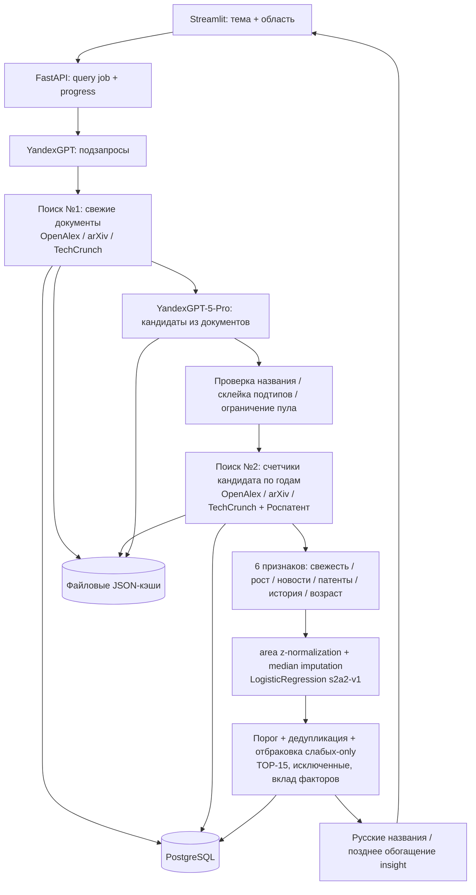

Точка сборки — [pipeline/run_query.py:390–501](https://github.com/LapshinYaroslav/Hackaton-2026-trend-radar/blob/536cb909aed6e4f00b51f5675730c7553266af60/pipeline/run_query.py#L390-L501). API действительно запускает этот оркестратор: [api/main.py:167–183](https://github.com/LapshinYaroslav/Hackaton-2026-trend-radar/blob/536cb909aed6e4f00b51f5675730c7553266af60/api/main.py#L167-L183). README еще называет API заглушкой, но текущий код использует mock только при `QUERY_MOCK=1`: [api/main.py:83–85](https://github.com/LapshinYaroslav/Hackaton-2026-trend-radar/blob/536cb909aed6e4f00b51f5675730c7553266af60/api/main.py#L83-L85).

### БД и заполнение подробнее

Схема содержит три разных слоя. Первый — корпус и статистика: `documents`, `tech_documents`, `counters`, `source_totals`, `features`. Второй — обучающий справочник: `technologies`, `signal_groups`, `technology_companies`, `technology_evidence`, `rospatent_counts`, `source_totals_training`, `eval_labels`, `model_versions`. Третий — пользовательские задания и результат: `queries`, `subqueries`, `candidates`, `candidate_sources`, `scores`, `insights`. Данные массива и результата частично лежат в JSONB, документы имеют отдельную связь многие-ко-многим с технологиями. URL документа глобально уникален; ключ счетчика включает технологию, хеш поисковых терминов, источник, период и вариант запроса. Это защищает от повторного использования счетчиков после изменения семантики поиска. [schema:4–93](https://github.com/LapshinYaroslav/Hackaton-2026-trend-radar/blob/536cb909aed6e4f00b51f5675730c7553266af60/db/schema.sql#L4-L93), [schema:238–362](https://github.com/LapshinYaroslav/Hackaton-2026-trend-radar/blob/536cb909aed6e4f00b51f5675730c7553266af60/db/schema.sql#L238-L362).

Seed собирается из `data/interim/technologies.csv`, `labels/negatives.csv`, смысловых групп, стоп-листа компаний, предварительно собранных totals и патентных счетчиков; локальный `data/raw/dataset.xlsx` дополнительно обогащает метаданные, если он присутствует. Таблица обучающих технологий и **таблица признаков для обучения — разные вещи**. Seed первого слоя не восстанавливает отсутствующий feature-cache. [seed:28–48](https://github.com/LapshinYaroslav/Hackaton-2026-trend-radar/blob/536cb909aed6e4f00b51f5675730c7553266af60/db/seed.py#L28-L48), [loaders:330–375](https://github.com/LapshinYaroslav/Hackaton-2026-trend-radar/blob/536cb909aed6e4f00b51f5675730c7553266af60/db/loaders.py#L330-L375).

Поиск №1 нужен для того, чтобы найти возможные технологии в свежих документах. Его ограниченная выдача не используется как знаменатель роста. Для каждой отобранной технологии поиск №2 независимо получает годовые счетчики за 2020–2025 и предыдущее окно 2014–2020; рабочие окна складываются из непересекающихся счетчиков. Есть нормировка роста по общему фону источника. [collector/api.py](https://github.com/LapshinYaroslav/Hackaton-2026-trend-radar/blob/536cb909aed6e4f00b51f5675730c7553266af60/collector/api.py#L1-L7), [model/candidate.py](https://github.com/LapshinYaroslav/Hackaton-2026-trend-radar/blob/536cb909aed6e4f00b51f5675730c7553266af60/model/candidate.py#L44-L61).

У TechCrunch используют WordPress REST API. Его поиск работает по словам и не поддерживает ожидаемые кавычки/булев OR. Адаптер учитывает это, берет максимум по вариантам термина и сохраняет `query_variant="words|all"`. Это счетчик новостей с совпадением слов, а не число новостей, которые эксперт подтвердил как упоминания технологии. У Роспатента окно и набор мировых датасетов зафиксированы отдельно. [TechCrunch:94–132](https://github.com/LapshinYaroslav/Hackaton-2026-trend-radar/blob/536cb909aed6e4f00b51f5675730c7553266af60/collector/adapters/techcrunch.py#L94-L132), [patent configuration](https://github.com/LapshinYaroslav/Hackaton-2026-trend-radar/blob/536cb909aed6e4f00b51f5675730c7553266af60/model/config.py#L80-L84).

PostgreSQL подключается через `DATABASE_URL`; без него collection-cache может быть в памяти. Файловые кэши отдельно сохраняют поиск, extraction, счетчики и решения дедупликации. Результаты живого прогона пишутся в конце `run_query` через `persist_search_documents` и `persist_features_and_scores`. Это описание механизма по коду; доступ к фактической развернутой БД и ее содержимому не получен. [collector/db.py:236–239](https://github.com/LapshinYaroslav/Hackaton-2026-trend-radar/blob/536cb909aed6e4f00b51f5675730c7553266af60/collector/db.py#L236-L239), [persist](https://github.com/LapshinYaroslav/Hackaton-2026-trend-radar/blob/536cb909aed6e4f00b51f5675730c7553266af60/pipeline/persist.py).

### Модели и валидация

Основной классификатор `s2a2-v1` использует `share_patent`, `growth_research`, `recency`, `share_news_wordmatch`, `share_prev6`, `age_first_arxiv`. Версия `s2a1-v1` использовала вместо `share_patent` общий объем. Векторизатора текста, GNN, BERT и обучения LLM в этом классификаторе нет. Нормировка — центр и масштаб внутри предметной области; пропуски заполняются медианой. Порог выбирается по внутренним OOF-предсказаниям на сетке 0.25–0.75 с шагом 0.025 по accuracy. Группы смысловых дублей удерживают одну технологию в одной части выборки. [config:29–55](https://github.com/LapshinYaroslav/Hackaton-2026-trend-radar/blob/536cb909aed6e4f00b51f5675730c7553266af60/model/config.py#L29-L55), [train:58–87](https://github.com/LapshinYaroslav/Hackaton-2026-trend-radar/blob/536cb909aed6e4f00b51f5675730c7553266af60/model/train.py#L58-L87).

Публичный отчет заявляет для `s2a2-v1`, 160 строк: CV F1 0.808±0.018, AUC 0.828±0.007; исключение 11 технологий с неслепым выбором английского названия понижает F1 до 0.790 и AUC до 0.812. Это **их опубликованные результаты**, не независимо воспроизведенные здесь метрики. Есть проверка leave-one-area-out и nested CV в отдельном release-report. Результат классифицирует экспертно заданные слабые сигналы; он сам по себе не доказывает точность прогноза внедрения через три года. [methodology:466–483](https://github.com/LapshinYaroslav/Hackaton-2026-trend-radar/blob/536cb909aed6e4f00b51f5675730c7553266af60/docs/methodology.md#L466-L483).

LLM — отдельный контур. Живой extraction явно получает `yandexgpt-5-pro`; общий gateway по умолчанию имеет `yandexgpt-lite`, поэтому у подзапросов/перевода возможна другая модель или env override. Gateway поддерживает Yandex Foundation Models и OpenAI-совместимый endpoint. Извлечение, генерация подзапросов, русские названия, парная проверка дублей и обогащение карточки являются inference. [orchestrator:390–433](https://github.com/LapshinYaroslav/Hackaton-2026-trend-radar/blob/536cb909aed6e4f00b51f5675730c7553266af60/pipeline/run_query.py#L390-L433), [gateway:15–42](https://github.com/LapshinYaroslav/Hackaton-2026-trend-radar/blob/536cb909aed6e4f00b51f5675730c7553266af60/search/llm_yandex_gpt.py#L15-L42), [dedup](https://github.com/LapshinYaroslav/Hackaton-2026-trend-radar/blob/536cb909aed6e4f00b51f5675730c7553266af60/pipeline/dedup.py).

### Существенные ограничения

1. **Свежая установка не воспроизводит обученную модель.** `training_table.load_features()` ожидает `data/experiments/axis_features_*.csv`, которого в опубликованном дереве нет. При неудачном training bootstrap создает pipeline из опубликованных коэффициентов, задает всем признакам center=0, scale=1 и вручную назначает медианы. Настоящий инференс берет именно эти center/scale и коэффициенты из meta. Значит на свежем clone публикуемые CV-метрики нельзя автоматически относить к его live-модели. [training_table:23–29](https://github.com/LapshinYaroslav/Hackaton-2026-trend-radar/blob/536cb909aed6e4f00b51f5675730c7553266af60/model/training_table.py#L23-L29), [bootstrap:39–85](https://github.com/LapshinYaroslav/Hackaton-2026-trend-radar/blob/536cb909aed6e4f00b51f5675730c7553266af60/model/bootstrap.py#L39-L85), [bootstrap:92–115](https://github.com/LapshinYaroslav/Hackaton-2026-trend-radar/blob/536cb909aed6e4f00b51f5675730c7553266af60/model/bootstrap.py#L92-L115), [predict:47–65](https://github.com/LapshinYaroslav/Hackaton-2026-trend-radar/blob/536cb909aed6e4f00b51f5675730c7553266af60/model/predict.py#L47-L65).
2. **Рыночный сигнал смешан с совпадением слов.** В `model/config.py` авторы фиксируют, что только 6.5% полученных TechCrunch документов содержали точную фразу технологии. Это сознательно названо `share_news_wordmatch`; данный признак не равен verified adoption/market evidence. [config:7–13](https://github.com/LapshinYaroslav/Hackaton-2026-trend-radar/blob/536cb909aed6e4f00b51f5675730c7553266af60/model/config.py#L7-L13).
3. **Патентный компонент необязателен технически, но входит в основную модель.** Без ключа Роспатента он заменяется медианой; отображается warning, однако результат уже не использует один из шести исходных измерений. Это нужно отражать в confidence и сравнениях. [run_query:445–462](https://github.com/LapshinYaroslav/Hackaton-2026-trend-radar/blob/536cb909aed6e4f00b51f5675730c7553266af60/pipeline/run_query.py#L445-L462).
4. **Полноценный temporal forecast не подтвержден.** Классификатор обучают на фиксированных label weak/non-weak и срезе 01.09.2026. Группированная и тематическая CV полезна, но не заменяет проверку «что было известно на дату T → реализация после T».
5. **Документация отстает от кода.** README про mock уже неверен для default runtime. Аудит по README без чтения orchestrator и bootstrap дал бы ошибочные выводы сразу о готовности API и модели.

### Что взять в LCTrendSearch

- Двухступенчатую схему поиска: сначала широкий discovery-корпус, затем независимые счетчики для каждого кандидата. Наши graph features не должны считать рост по числу документов, возвращенных одним ограниченным поисковым запросом.
- Версионирование семантики счетчика: source + temporal window + terms hash + query variant + corpus total. У нас уже есть raw snapshots/версии документов; для статистики источников нужен аналогичный контракт.
- Простой обучаемый baseline на наших текущих числовых графовых признаках с отложенной проверкой по времени. Логистическая регрессия даст объяснения вклада факторов быстрее, чем HGT; чужие коэффициенты брать не нужно.
- Негативы трех видов — mature, hype, fading — с ручной проверкой. Их 60 примеров полезны как схема отбора контрпримеров, а не как готовая оценка generalization.
- Раздельные warning для отсутствующего патентного сигнала, недостаточного corpus coverage и слабых-only источников; экран исключенных кандидатов с конкретной причиной.
- Учет смены версии модели и фактического scaler/imputer вместе с результатом. Резервный bootstrap с unit-scale как штатную модель не переносить.

### Границы проверки

Не запускались модель, контейнеры, тесты, сборщики или LLM. Не подтверждены API availability, фактический корпус развернутого стенда, расход токенов и latency. Статические выводы о отсутствующих файлах проверены по recursive GitHub tree этого SHA; метрики изложены как заявления авторов. Ни аккаунт GitHub, ни interaction с владельцами/стендом не использовались.

## Приложение D. maicentre-tech

Публичный код зафиксирован на `148b8dae9436b2c6fe23171f85cebaeaa397c241` (main), прочитан 28.09.2026. Создан 19.09.2026; README и описание прямо указывают кейс Газпромбанк.Тех 2026. Основной Python-проект находится во вложенной папке `gpb-weak-signals/`; вокруг него есть дополнительные Replit/UI/presentation артефакты и временные копии frontend. GitHub API не указывает общую лицензию. Выбранные исходники скачаны анонимно в `discovery/maicentre-code/`; код, контейнеры, модели и внешние стенды не запускались.

### Главный вывод

Это развитая инфраструктура для измеряемых сигналов, доказательств и экспертного ревью, но **готовую обученную production-модель и воспроизводимый заполненный стенд публичное дерево не подтверждает**. Есть обучаемый TF-IDF + LogisticRegression baseline, однако он выключен в runtime до независимой оценки и отдельного разрешения. Выдачу ранжирует статистическая формула ETS, а открытый поиск возвращает эвристический индекс и review-only кандидатов. Объявленные pgvector и semantic mapping не означают, что embedding-модель уже работает.

### Три ключевых ответа

| Вопрос | Ответ по коду |
|---|---|
| БД | PostgreSQL 16 + pgvector, SQLAlchemy async + psycopg, Alembic migrations. `Vector(1024)` для документа/технологии, много JSONB полей, таблицы source provenance, snapshots, mapping/review, metric series и trend scores. |
| Как заполняют | Bootstrap только применяет миграции и добавляет реестр источников + пилотную онтологию. Документы загружают отдельно CLI/flow адаптерами OpenAlex, arXiv, GitHub, GDELT и metadata-only P0-адаптерами. Ingestion нормализует, считает hash, сохраняет change events, metric snapshots и checkpoint/DLQ; затем mapping и scoring создают snapshot. |
| Что обучают | Baseline TF-IDF uni-/bigrams + `LogisticRegression(class_weight="balanced", max_iter=2000)`, OOF sigmoid calibration. 100 положительных примеров организаторов; negatives должны получить экспертное подтверждение. Есть 18 ручных seed-негативов для smoke test. Qwen2.5:14b-instruct — отдельно, inference через OpenAI-совместимый gateway, без fine-tuning в репозитории. |

Источники: [Compose](https://github.com/maicentre-tech/gpb-weak-signals/blob/148b8dae9436b2c6fe23171f85cebaeaa397c241/gpb-weak-signals/docker-compose.yml#L1-L38), [DB models](https://github.com/maicentre-tech/gpb-weak-signals/blob/148b8dae9436b2c6fe23171f85cebaeaa397c241/gpb-weak-signals/src/eti/db/models.py), [classifier](https://github.com/maicentre-tech/gpb-weak-signals/blob/148b8dae9436b2c6fe23171f85cebaeaa397c241/gpb-weak-signals/src/eti/ml/signal_classifier.py#L193-L224), [trainer](https://github.com/maicentre-tech/gpb-weak-signals/blob/148b8dae9436b2c6fe23171f85cebaeaa397c241/gpb-weak-signals/scripts/train_signal_classifier.py#L17-L68).

### Архитектура и фактический путь

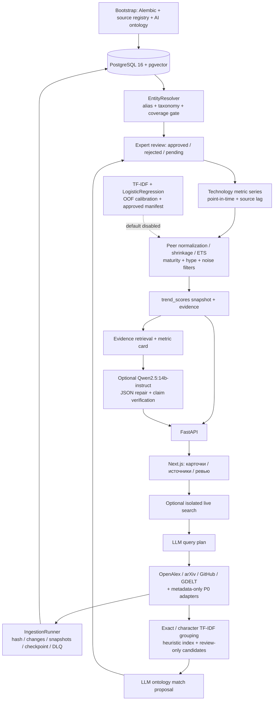

Snapshot-скоринг и live discovery — разные пути. В snapshot считаются статистические признаки по привязанным документам, нормируются внутри peer group, агрегируются с явными весами; модель probability добавляется только при успешно загруженном валидированном classifier. В discovery LLM планирует поисковые запросы и предлагает сопоставление с онтологией, а сами группы кандидатов строятся детерминированно. Для discovery в ответе зафиксированы `is_probability=false`, `classifier_confidence=null`, `review_only=true`. [scoring](https://github.com/maicentre-tech/gpb-weak-signals/blob/148b8dae9436b2c6fe23171f85cebaeaa397c241/gpb-weak-signals/src/eti/scoring/pipeline.py#L381-L475), [open search](https://github.com/maicentre-tech/gpb-weak-signals/blob/148b8dae9436b2c6fe23171f85cebaeaa397c241/gpb-weak-signals/src/eti/discovery/search.py#L416-L507), [extractor](https://github.com/maicentre-tech/gpb-weak-signals/blob/148b8dae9436b2c6fe23171f85cebaeaa397c241/gpb-weak-signals/src/eti/discovery/extractor.py#L378-L412).

### БД и загрузка

Основные сущности: `Source`, `SourceCoverage`, `Document`, `DocumentMetricSnapshot`, `DocumentChangeEvent`; канонические `Technology`/`TechnologyAlias`, `TechnologyMapping`, `CandidateMappingReview`; `PeerGroup`, `TechnologyMetric`, `TrendScore`, `TrendEvidence`; lineage/cluster tables; `ExpertFeedback`; `IngestionRun`, `IngestionCheckpoint`, `DeadLetterRecord`, `ModelVersion`, `AnalysisJob`, `SourceFreshness`, `CandidateTechnology`. Наличие cluster/vector tables само по себе не подтверждает обученный clustering.

У документа разделены `published_at` (дата события), `available_from` (публичная доступность с лагом источника), `first_seen_at` (первый сбор системой), `retrieved_at`. Для патента выделены priority/filing/publication/grant dates. Есть raw payload, content hash и soft delete. Скоринг отбирает только одобренные mappings и доступные на дату snapshot документы. Изменяемые цитаты/stars и другие метрики сохраняются отдельными датированными наблюдениями. [document schema:145–210](https://github.com/maicentre-tech/gpb-weak-signals/blob/148b8dae9436b2c6fe23171f85cebaeaa397c241/gpb-weak-signals/src/eti/db/models.py#L145-L210), [scoring selection:355–372](https://github.com/maicentre-tech/gpb-weak-signals/blob/148b8dae9436b2c6fe23171f85cebaeaa397c241/gpb-weak-signals/src/eti/scoring/pipeline.py#L355-L372).

Чистый Compose **не заполняет корпус**. Bootstrap выполняет три команды: миграции, seed источников, seed `ai_pilot.json`. Для документов нужен отдельный ingestion. В CLI зарегистрированы OpenAlex, arXiv, GitHub, GDELT, Crossref, Semantic Scholar, GHArchive, Hugging Face, PyPI, npm. Последние шесть реализованы как metadata-only: библиографические карточки, package/event metadata; это не выгрузка полного текста, модельных весов или многолетних complete snapshots. Курсор и режим backfill/incremental задаются отдельно. [bootstrap](https://github.com/maicentre-tech/gpb-weak-signals/blob/148b8dae9436b2c6fe23171f85cebaeaa397c241/gpb-weak-signals/scripts/bootstrap_compose.sh#L9-L11), [CLI connectors](https://github.com/maicentre-tech/gpb-weak-signals/blob/148b8dae9436b2c6fe23171f85cebaeaa397c241/gpb-weak-signals/scripts/ingest.py#L41-L52), [P0 adapters](https://github.com/maicentre-tech/gpb-weak-signals/blob/148b8dae9436b2c6fe23171f85cebaeaa397c241/gpb-weak-signals/src/eti/sources/p0.py#L1-L6).

`IngestionRunner` получает raw record, нормализует, сравнивает hash, создает/обновляет документ и change event, пишет metric snapshot; при ошибке записи добавляет DLQ. При rate-limit выставляет `PARTIAL`. Источники имеют coverage, freshness и trust metadata. Дальше `run_mapping` пишет оценки соответствия и их разложение по компонентам; scoring использует только `auto_accepted`/`approved`. [runner](https://github.com/maicentre-tech/gpb-weak-signals/blob/148b8dae9436b2c6fe23171f85cebaeaa397c241/gpb-weak-signals/src/eti/ingestion/runner.py#L134-L223), [mapping job](https://github.com/maicentre-tech/gpb-weak-signals/blob/148b8dae9436b2c6fe23171f85cebaeaa397c241/gpb-weak-signals/src/eti/ontology/mapping_job.py#L45-L125).

### Обучение и LLM

TF-IDF использует ngrams 1–2 и sublinear TF. Default inputs — название технологии, bucket зрелости, bucket динамики упоминаний. Rationale, предметную область и число ссылок убрали из default: у benchmark и production они были несопоставимы. Оценка — nested stratified group CV; calibrator логистический на OOF probabilities из train fold, фиксированный threshold=0.5. Выдаются вклад токенов, precision/recall/F1, PR-AUC summary, Brier, ECE, ablation по группам признаков. [feature contract](https://github.com/maicentre-tech/gpb-weak-signals/blob/148b8dae9436b2c6fe23171f85cebaeaa397c241/gpb-weak-signals/src/eti/ml/signal_classifier.py#L38-L95), [ML evaluation](https://github.com/maicentre-tech/gpb-weak-signals/blob/148b8dae9436b2c6fe23171f85cebaeaa397c241/gpb-weak-signals/docs/ml-evaluation.md#L87-L109).

100 positives читаются из организаторского XLSX. 18 seed negatives написаны авторами как mature/hype/noise, а не размечены организаторами. Для рабочего обучения предлагается экспортировать excluded candidates из **того же корпуса**, собрать экспертную разметку и обучать только approved examples. Trainer не выбирает seed по умолчанию: negative source обязателен. [positive loader / seeds](https://github.com/maicentre-tech/gpb-weak-signals/blob/148b8dae9436b2c6fe23171f85cebaeaa397c241/gpb-weak-signals/src/eti/ml/signal_classifier.py#L129-L189), [trainer](https://github.com/maicentre-tech/gpb-weak-signals/blob/148b8dae9436b2c6fe23171f85cebaeaa397c241/gpb-weak-signals/scripts/train_signal_classifier.py#L17-L68).

Заявленные smoke metrics 0.9915 accuracy и 0.9999 average precision **самими авторами признаны непригодными для заявления качества**: source-only/rationale-only почти так же идеально разделяют классы из-за разных источников и стиля написания seed/benchmark. Публично не обнаружены утвержденный корпусный negative dataset, связанный с ним production model artifact и runtime approval manifest. [current result](https://github.com/maicentre-tech/gpb-weak-signals/blob/148b8dae9436b2c6fe23171f85cebaeaa397c241/gpb-weak-signals/docs/ml-evaluation.md#L111-L133).

Runtime loader требует `ETI_ENABLE_VALIDATED_CLASSIFIER=true`, joblib и hash-bound sidecar с approved validation, calibrated status, источником негативов, approver/date и хешем evaluation report. Без этого возвращает `None`, а classifier probability не участвует в scoring. Это полезный технический контроль, однако также подтверждает отсутствие включенной обученной модели в default path. [runtime loader](https://github.com/maicentre-tech/gpb-weak-signals/blob/148b8dae9436b2c6fe23171f85cebaeaa397c241/gpb-weak-signals/src/eti/ml/runtime.py#L16-L94).

Default LLM — `qwen2.5:14b-instruct`, endpoint Ollama/OpenAI-compatible `/v1`; Compose самого Ollama не поднимает. LLM пишет structured card по заранее выбранному evidence, получает собственный невалидный ответ + ошибку схемы для repair; после неудачи используется metric card. Дополнительно LLM строит search plan и предлагает candidate-to-ontology match. Формулировка README «только объяснение» уже не описывает весь current discovery path. Fine-tuning Qwen в дереве не обнаружен. [LLM config](https://github.com/maicentre-tech/gpb-weak-signals/blob/148b8dae9436b2c6fe23171f85cebaeaa397c241/gpb-weak-signals/src/eti/config.py#L191-L194), [card repair](https://github.com/maicentre-tech/gpb-weak-signals/blob/148b8dae9436b2c6fe23171f85cebaeaa397c241/gpb-weak-signals/src/eti/rag/generator.py#L205-L246), [query planner](https://github.com/maicentre-tech/gpb-weak-signals/blob/148b8dae9436b2c6fe23171f85cebaeaa397c241/gpb-weak-signals/src/eti/discovery/query_planner.py#L160-L186).

### Существенные ограничения и дефекты

1. **Новая БД не дает готовый сценарий.** README прямо сообщает: нет reproducible full corpus import и DB snapshot; после чистого Compose `latest_scoring=null`, snapshot-dependent queries получают 503. Benchmark JSON не является live corpus. [README:86–93](https://github.com/maicentre-tech/gpb-weak-signals/blob/148b8dae9436b2c6fe23171f85cebaeaa397c241/gpb-weak-signals/README.md#L86-L93).
2. **Semantic mapping пока фактически не включен.** Схема имеет `Vector(1024)`, но `run_mapping` создает `EntityResolver(candidates, params)` без embedder. `_semantic_similarity` возвращает `None`; cooccurrence, organization overlap и link graph также заданы `None`. Работают alias/taxonomy и экспертная очередь. Называть эту часть работающей BGE/M3 или transformer resolution по одному типу колонки нельзя. [mapping:56](https://github.com/maicentre-tech/gpb-weak-signals/blob/148b8dae9436b2c6fe23171f85cebaeaa397c241/gpb-weak-signals/src/eti/ontology/mapping_job.py#L56), [resolver:209–231](https://github.com/maicentre-tech/gpb-weak-signals/blob/148b8dae9436b2c6fe23171f85cebaeaa397c241/gpb-weak-signals/src/eti/ontology/resolver.py#L209-L231).
3. **Checkpoint не гарантирует сохранение при crash/fatal error.** Каждые 500 записей runner делает `flush`, а не commit. CLI оборачивает весь run в `session_scope`; commit происходит после завершения run, при исключении вызывается rollback. Следовательно crash процесса или uncaught fatal exception откатывает накопленные документы/checkpoint/DLQ. При штатно пойманном rate-limit PARTIAL функция возвращается и commit возможен. Это статическое следствие проверенных транзакционных границ, не runtime-эксперимент. [runner:186–203](https://github.com/maicentre-tech/gpb-weak-signals/blob/148b8dae9436b2c6fe23171f85cebaeaa397c241/gpb-weak-signals/src/eti/ingestion/runner.py#L186-L203), [CLI:89–105](https://github.com/maicentre-tech/gpb-weak-signals/blob/148b8dae9436b2c6fe23171f85cebaeaa397c241/gpb-weak-signals/scripts/ingest.py#L89-L105), [transaction:25–34](https://github.com/maicentre-tech/gpb-weak-signals/blob/148b8dae9436b2c6fe23171f85cebaeaa397c241/gpb-weak-signals/src/eti/db/session.py#L25-L34).
4. **Ранжирование сейчас не обучено.** ETS — percentile-normalized weighted composite с default weights, которые config прямо помечает стартовыми гипотезами. Probability weak_signal и evidence confidence — разные величины. Discovery index явно не probability. Высокий красивый score не означает вероятность реального внедрения.
5. **Не доказан forecast через годы.** Текущий target — бинарное соответствие benchmark weak/non-weak; stage/trend доступны как inputs и требуют same-corpus shortcut audit. Nested CV защищает настройку и дубли, но не превращает benchmark-классификацию в проверку будущего outcome. [target protocol](https://github.com/maicentre-tech/gpb-weak-signals/blob/148b8dae9436b2c6fe23171f85cebaeaa397c241/gpb-weak-signals/docs/ml-evaluation.md#L28-L52).
6. **Live discovery ограничен expert local mode и зависит от LLM planner.** В public/read-only/default non-opt-in mode запрос прекращается; при planning failure поиск не запускается. Это важно при оценке фактической готовности открытого поиска. [live guard](https://github.com/maicentre-tech/gpb-weak-signals/blob/148b8dae9436b2c6fe23171f85cebaeaa397c241/gpb-weak-signals/src/eti/discovery/search.py#L291-L318), [planning failure](https://github.com/maicentre-tech/gpb-weak-signals/blob/148b8dae9436b2c6fe23171f85cebaeaa397c241/gpb-weak-signals/src/eti/discovery/search.py#L446-L456).

### Что полезно перенести в LCTrendSearch

- **Лаг по каждому источнику/метрике и shrinkage для малого объема.** Месяцы OpenAlex, патентов и GitHub нельзя одинаково считать полностью наблюдаемыми. Их `TechnologySeries.effective_end_for(metric)` с отдельным лагом решает реальную причину ложного спада. [series:56–81](https://github.com/maicentre-tech/gpb-weak-signals/blob/148b8dae9436b2c6fe23171f85cebaeaa397c241/gpb-weak-signals/src/eti/scoring/series.py#L56-L81).
- **Review UI с разложением причин.** У нас уже есть `POSSIBLY_SAME_AS pending`; полезен полный цикл approve/reject с provenance и не только общим similarity score.
- **Минимальное покрытие исходных весов для автоматического решения.** После удаления недоступных компонентов два слабых совпадения могут нормироваться до 1.0. Их gate `min_evidence_weight` предотвращает ложную уверенность. [resolver:3–18](https://github.com/maicentre-tech/gpb-weak-signals/blob/148b8dae9436b2c6fe23171f85cebaeaa397c241/gpb-weak-signals/src/eti/ontology/resolver.py#L3-L18).
- **Same-corpus negatives + ablation + калибровка.** Это недостающий шаг для нашего classifier: positives из зрелых отраслей и придуманные negatives дают легкое распознавание стиля, а не weak signals.
- **Отдельные поля probability, evidence quality и heuristic rank.** Это делает результат честным и проверяемым; одинаковый процент без определения вводит жюри в заблуждение.
- **Ограниченный deterministic fallback карточки.** Наши quote-verified assertions уже дают основу; готовую карточку можно собрать по ним даже при недоступном LLM.
- **Пакетные metadata connectors как расширение источников.** Crossref/Semantic Scholar/Hugging Face/npm/GDELT полезны для diversity, но добавление класса адаптера еще не доказывает историческое покрытие.

Point-in-time, versioned documents, observed metrics, raw snapshots и separation extraction/scoring в LCTrendSearch уже есть; не следует выдавать их за новые идеи из этого конкурента. Смена Neo4j на PostgreSQL ради повторения их стека из этого аудита не следует.

### Границы проверки

Проверены source paths и recursive tree фиксированного SHA. Контейнеры, API, ingestion, PostgreSQL, joblib и Qwen не запускались. Доступа к развернутой базе нет, поэтому опубликованное число 835 документов не перепроверено. Smoke/CV результаты представлены как сообщения авторов; независимая оценка метрик не выполнена. Публичные GitHub read-only запросы не требуют входа в аккаунт, но не гарантируют отсутствие журналирования платформой.

## Приложение E. mranton152

Проверен публичный main, SHA `dee6057866ee18c64eb39588ce15ef36a6f2bd6b`. Архив получен анонимно, исходники не выполнялись, бинарные модели не загружались. README, документы, фактический compose, API, сбор, скоринг, обучение и отчёты сверены между собой. Данные о метриках ниже — опубликованные результаты команды, не наши повторные измерения. GitHub metadata: license=null; наличие явной лицензии на перенос кода не подтверждено.

### Три ключевых ответа

1. **Хранение:** PostgreSQL 16 как копия контрактных таблиц; **основной путь вычислений и API — Parquet + DuckDB и снимок в памяти**. ClickHouse, Redis и pgvector встречаются в ранних планах, но не являются действующим стеком этого снимка. `api/store.py:1–103` загружает Parquet через DuckDB. К Postgres обработчики выдачи не обращаются.
2. **Заполнение:** отдельные команды сбора → семантики → статистики → карточек пишут Parquet, затем `storage/load.py` атомарно копирует выбранный dataset в PostgreSQL через COPY. Compose включает загрузку готового `golden` снимка. У живого запроса собственный сбор, Parquet-папка и регистрация индекса.
3. **Обучение:** отдельный исследовательский классификатор выбирает **RandomForestClassifier + LogisticRegression на эмбеддингах intfloat/multilingual-e5-large** (`forest_e5`), усредняя две вероятности. Обучение на 196 технологиях: 100 положительных организаторов, 96 зрелых отрицательных команды. **Эта модель не вызывается при ранжировании API**: действующая выдача использует статистические компоненты, ручные веса и фильтры. Ollama `qwen2.5:7b` выполняет перевод, выделение названий и написание карточек; её дообучения не найдено.

Источники: [API Store](https://github.com/mranton152/trendradar/blob/dee6057866ee18c64eb39588ce15ef36a6f2bd6b/api/store.py#L16-L103), [DDL](https://github.com/mranton152/trendradar/blob/dee6057866ee18c64eb39588ce15ef36a6f2bd6b/storage/schema.py), [загрузка](https://github.com/mranton152/trendradar/blob/dee6057866ee18c64eb39588ce15ef36a6f2bd6b/storage/load.py#L86-L130), [обучение](https://github.com/mranton152/trendradar/blob/dee6057866ee18c64eb39588ce15ef36a6f2bd6b/classifier/train.py#L47-L89), [рабочий скоринг](https://github.com/mranton152/trendradar/blob/dee6057866ee18c64eb39588ce15ef36a6f2bd6b/core/score.py#L14-L42).

### Архитектура

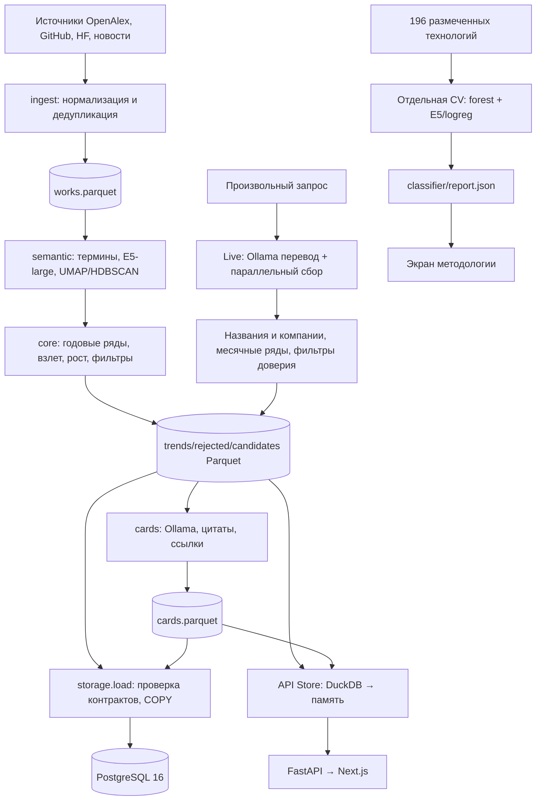

Стрелки от обученного классификатора к рабочему core отсутствуют по фактическому коду. У двух режимов разный смысл сигналов: офлайн — научные технологические темы с многолетней историей; live — свежие технологии, компании и продукты из новостей. Нельзя автоматически переносить метрики одного режима на другой.

### База и схема

`storage/schema.py` выводит SQL из PyArrow-контрактов: `works`, `candidates`, `cand_docs`, `trends`, `rejected`, `cards`, `features`; отдельно `loads` с числом строк, путём и SHA256. Каждая таблица содержит `dataset`; первичные ключи составные, например `(dataset, cand_id, doc_id)` у связей и `(dataset, trend_id)` у трендов. Есть индексы на `(dataset, as_of, rank)`, документные связи и год.

У загрузчика сильные решения: проверка Parquet по контракту до COPY, удаление старых строк только выбранного набора, целая загрузка в одной транзакции, журнал контрольных сумм. Схема обновляется отдельной короткой транзакцией, чтобы не удерживать эксклюзивную блокировку при большой загрузке. PostgreSQL можно использовать для SQL-аналитики и контроля сохранённых результатов, но API читает отдельные файлы; это две копии состояния.

### Источники и реальные пути наполнения

Офлайн-сбор пишет `data/corpus/{domain}/works.parquet`; семантика — `data/index/{domain}/candidates.parquet` и `cand_docs.parquet`. Извлекаются названия/фразы, их E5-векторы и группы. Ядро считает годовые ряды и нормированные компоненты: новизна 0.20, рост 0.32, ускорение 0.23, всплеск 0.15, распространение 0.10, со штрафом за зрелость. Это **рейтинг по формуле**, не вероятность обученного класса.

Live (`ingest/live.py:166–221`) параллельно собирает Hacker News, GitHub, Hugging Face, Google News на английском и русском, RSS. Ollama переводит запрос в английские фразы и извлекает названия из заголовков. OpenAlex используется для истории/проверки зрелости. Ошибки источников получают статус timeout/error/partial, а не превращаются безусловно в пустой успешный результат. Ядро live считает месячные ряды на окне 24 месяцев, число изданий, долю доверенных источников, давность взлёта, зрелость по OpenAlex и причины отсева.

Есть отдельный инструмент `ingest/origins.py`, который разрешает ссылки агрегаторов в адреса оригиналов и сохраняет привязку к SHA корпуса. Документация честно уточняет: разрешение URL не подтверждает содержание, независимость и качество первоисточника; trust/features этот этап пока не пересчитывает.

Источники: [live сбор](https://github.com/mranton152/trendradar/blob/dee6057866ee18c64eb39588ce15ef36a6f2bd6b/ingest/live.py#L166-L221), [семантика](https://github.com/mranton152/trendradar/blob/dee6057866ee18c64eb39588ce15ef36a6f2bd6b/semantic/embed.py), [live core](https://github.com/mranton152/trendradar/blob/dee6057866ee18c64eb39588ce15ef36a6f2bd6b/core/live.py), [ограничения происхождения](https://github.com/mranton152/trendradar/blob/dee6057866ee18c64eb39588ce15ef36a6f2bd6b/ingest/README_ORIGINS.md).

### Обучение и оценка

`classifier/train.py` сравнивает логистическую регрессию со StandardScaler, GradientBoostingClassifier, RandomForestClassifier и ансамбль `forest_e5`. У леса 400 деревьев, `min_samples_leaf=2`; у логрегрессии на E5-векторах `C=10`. По умолчанию признаки плюс эмбеддинги английского `query_en`; название из XLSX намеренно исключают из эмбеддинга, поскольку стиль разметки сильно различается между положительными и отрицательными.

Отчёт заявляет для `forest_e5` accuracy **0.781**, precision 0.76, recall 0.83, F1 **0.80**; 5-fold stratified CV на 20 случайных разбиениях, диапазон accuracy 0.765–0.801. Есть опубликованные `features_v1.json`, `.npy`-эмбеддинги и привязка к снимку, поэтому исходные признаки доступны для независимого повторения. В этом аудите обучение не запускалось.

Параметры выбирались на части тех же CV-разбиений; команда сама сообщает дополнительную проверку seed 100–119. Это полезная устойчивость к разбиению, но свежие seeds используют те же объекты и **не заменяют новый независимый датасет или отложенную область**. Отрицательный класс состоит из зрелых технологий: навыки отличать хайп, нерелевантность и шум таким экспериментом напрямую не проверяются. `main()` пишет отчёты, а не serving-артефакт; интеграции forest_e5 в рабочий core/API не найдено.

[Отчёт классификатора](https://github.com/mranton152/trendradar/blob/dee6057866ee18c64eb39588ce15ef36a6f2bd6b/classifier/REPORT.md), [что сохраняет main](https://github.com/mranton152/trendradar/blob/dee6057866ee18c64eb39588ce15ef36a6f2bd6b/classifier/train.py#L306-L355).

### Существенные ограничения и дефекты

#### MR-1. Обученный классификатор не обеспечивает рабочую выдачу

Классификатор оценивается отдельно; API выводит его JSON-отчёт в разделе методологии, а `core/score.py` и `core/live.py` ранжируют вручную. Следствие: 78.1% accuracy относится к набору известных технологий, не к поиску пользователя. Это архитектурный разрыв, а не доказательство, что алгоритм поиска вообще не работает.

#### MR-2. Результат «93% выросли» получен на фиксированном пуле кандидатов

README рекомендует `validation.report --source pool`. `validation/report.py:70–118` прямо говорит, что этот режим меряет ранжирование при вручную зафиксированных кандидатах. Пул складывается из reference + background, а не из сквозного извлечения. В опубликованном `validation/report.json` сохранена соответствующая пометка. В Markdown-генераторе эта пометка не переносится в текст; верхнеуровневый README с 93% и форой 6 лет легче прочитать как результат всего решения. Фактический Precision@15 по эталону этого же отчёта — **47%**, а 93% — доля кандидатов, у которых максимум будущей годовой активности превышает значение 2021 более чем в 1.2 раза; отношение сглажено псевдосчётчиком +1. Это разные критерии. Нельзя заявлять 93% точности детектора по этой цифре.

#### MR-3. Агрегатор повышает доступный вес доверия без проверки издателя

`core/live.py:139–155` присваивает документам `source='gnews'` доверие 0.5 независимо от `trust_level`; порог `MIN_TRUSTED_SHARE=0.34`. Поэтому два документа разных издателей, полученные через Google News, могут пройти фильтр доверия даже когда эти издатели не подтверждены как доверенные. `издание()` разделяет издателей для разнообразия, но уровень доверия к ним не подставляет. Отдельный origins-этап пока не переписывает features. Это статически подтверждённый риск ложного независимого подтверждения; реальные частоты ошибок в этом аудите не измерялись.

#### MR-4. Обновление PostgreSQL не обновляет ответ API

`api/store.py:16–20` загружает снимок из Parquet и хранит его в памяти. Перезагрузка dataset в PostgreSQL через COPY не меняет файлы и память API: оператор может видеть свежую базу, а пользователь — старую выдачу. Это ограничение именно отдельного обновления PostgreSQL. У live-режима механизм публикации есть: `api/routes/live.py:119,162` заменяет `app.state.store=Store(root)` после записи индекса и карточек. Поэтому неверно утверждать, что любое обновление выдачи обязательно требует перезапуска.

#### MR-5. Метрики публикаций недостаточны для нового коммерческого применения старой науки

В отчёте классификатора прямо перечислены ошибки на нейроморфных чипах, event-based сенсорах и analog compute-in-memory: научная история старая, коммерческий сигнал свежий. Live-режим снимает часть проблемы новостями и компаниями, но его качество требуется оценивать отдельно. Отсутствие Ollama ведёт к резкому уменьшению кандидатов; резервный режим не равноценен полноценному поиску.

### Что взять в LCTrendSearch

- **Контрактные Parquet-срезы и журнал SHA256.** Наш граф может экспортировать snapshot среза T в Parquet для дешёвого многократного обучения; Neo4j остаётся источником происхождения утверждений.
- **Разделение новых технологий и новой волны применения.** Старая первая публикация не должна автоматически отклонять свежую коммерциализацию; используйте отдельные даты научного рождения и начала внедрения.
- **Ошибка API не равна нулю.** Научный счётчик при сбое источника должен оставаться missing с причиной; ноль означает подтверждённое отсутствие результатов.
- **Публикация версий индекса.** Сделать связанный manifest данных, признаков и модели, плюс атомарное переключение выдачи на готовую версию.
- **Валидация по этапам.** Отдельно замерять генерацию кандидатов, ranking на фиксированном пуле, полный TOP-15 и историческую проверку. Метрика 93% на фиксированном пуле не должна попадать в презентацию как качество полного поиска.
- **Защита от стиля разметки.** Сравнить длину, язык, скобки и шаблоны названий между положительными и отрицательными до обучения эмбеддинг-классификатора.

Переносить архитектурные идеи и самостоятельно реализовывать решения. Доступный публичный код без найденной явной лицензии не следует автоматически считать готовой библиотекой для копирования.

## Приложение F. Дополнительный поиск и текущая архитектура LCTrendSearch

Дата чтения: 28.09.2026, примерно 17:16–17:45 UTC. Поиск и просмотр только публичных материалов: GitHub API, raw.githubusercontent.com, один codeload-архив и поисковая выдача web. Аккаунт GitHub, demo-стенды, stars, watchers, issues, PR и сообщения владельцам не использовались. Код конкурентов не выполнялся. Это пассивный обзор открытого кода; отсутствие журналирования самими платформами не гарантируется.

### Что найдено дополнительно

| Репозиторий | Соответствие кейсу | Зафиксированный HEAD | Что реально видно |
|---|---|---|---|
| [LapshinYaroslav/Hackaton-2026-trend-radar](https://github.com/LapshinYaroslav/Hackaton-2026-trend-radar) | Высокое: дословное описание требуемого сервиса, создан 15.09.2026 | `536cb909aed6e4f00b51f5675730c7553266af60` | PostgreSQL16; live query pipeline OpenAlex/arXiv/TechCrunch + patent counts Роспатента; YandexGPT inference; обучаемая LogisticRegression s2a2-v1. Не хватает обучающего feature-cache/scaler для воспроизведения чистого запуска. MIT в GitHub metadata. |
| [maicentre-tech/gpb-weak-signals](https://github.com/maicentre-tech/gpb-weak-signals) | Высокое: README прямо указывает Газпромбанк.Тех 2026, создан 19.09.2026 | `148b8dae9436b2c6fe23171f85cebaeaa397c241` | PostgreSQL16+pgvector; source registry/ontology, ingestion/mapping/scoring/review/RAG, Next.js; TF-IDF+LogisticRegression baseline c OOF calibration; Qwen2.5:14b-instruct inference. Runtime classifier default disabled; чистый Compose без корпуса/snapshot. Общая лицензия в API не указана. |
| [mranton152/trendradar](https://github.com/mranton152/trendradar) | Высокое: описание задачи/ЛЦТ в README и docs, создан 08.09.2026 | `dee6057866ee18c64eb39588ce15ef36a6f2bd6b` | Фактические PostgreSQL16 + DuckDB/Parquet, FastAPI+Next.js, live ingestion/core/semantic pipeline; отдельный offline classifier report: forest_e5 = RandomForest на счетчиках + LogisticRegression на multilingual-e5-large embeddings запросов. ClickHouse встречается в старых планах, его нельзя считать фактической БД. Подробный обзор выполняет основной аудитор. |
| [gulldan/lct2026-kvadriceps-signals](https://github.com/gulldan/lct2026-kvadriceps-signals) | Название похоже на кейс, создан 27.09.2026 | HEAD отсутствует | **Пустой репозиторий**: `/commits/master` и `/git/trees` вернули HTTP409 `Git Repository is empty`. Ни БД, ни ingestion, ни модель по нему подтвердить нельзя; не включать в сравнение работающих реализаций. |

Подробные отчеты: `LapshinYaroslav__Hackaton-2026-trend-radar.audit.md`, `maicentre-tech__gpb-weak-signals.audit.md`. Метаданные и recursive tree сохранены в `discovery/*-meta.json` и `discovery/*-tree.json`. Пустота gulldan отдельно отражена в исправленном `gulldan__lct2026-kvadriceps-signals-tree.json` (`empty=true`, `tree=[]`).

Постоянные источники для трех ключевых пунктов новых конкурентов:

- Lapshin: [схема БД](https://github.com/LapshinYaroslav/Hackaton-2026-trend-radar/blob/536cb909aed6e4f00b51f5675730c7553266af60/db/schema.sql), [наполнение seed](https://github.com/LapshinYaroslav/Hackaton-2026-trend-radar/blob/536cb909aed6e4f00b51f5675730c7553266af60/db/seed.py#L28-L48), [live ingestion/answer](https://github.com/LapshinYaroslav/Hackaton-2026-trend-radar/blob/536cb909aed6e4f00b51f5675730c7553266af60/pipeline/run_query.py#L390-L501), [обучение](https://github.com/LapshinYaroslav/Hackaton-2026-trend-radar/blob/536cb909aed6e4f00b51f5675730c7553266af60/model/train.py#L58-L87), [дефект bootstrap/scaler](https://github.com/LapshinYaroslav/Hackaton-2026-trend-radar/blob/536cb909aed6e4f00b51f5675730c7553266af60/model/bootstrap.py#L39-L85).
- maicentre: [БД pgvector](https://github.com/maicentre-tech/gpb-weak-signals/blob/148b8dae9436b2c6fe23171f85cebaeaa397c241/gpb-weak-signals/docker-compose.yml#L15-L38), [ingestion](https://github.com/maicentre-tech/gpb-weak-signals/blob/148b8dae9436b2c6fe23171f85cebaeaa397c241/gpb-weak-signals/src/eti/ingestion/runner.py#L134-L223), [классификатор](https://github.com/maicentre-tech/gpb-weak-signals/blob/148b8dae9436b2c6fe23171f85cebaeaa397c241/gpb-weak-signals/src/eti/ml/signal_classifier.py#L193-L224), [runtime gate](https://github.com/maicentre-tech/gpb-weak-signals/blob/148b8dae9436b2c6fe23171f85cebaeaa397c241/gpb-weak-signals/src/eti/ml/runtime.py#L16-L94).
- mranton: [фактический Compose](https://github.com/mranton152/trendradar/blob/dee6057866ee18c64eb39588ce15ef36a6f2bd6b/docker-compose.yml), [storage schema](https://github.com/mranton152/trendradar/blob/dee6057866ee18c64eb39588ce15ef36a6f2bd6b/storage/schema.py), [ingestion](https://github.com/mranton152/trendradar/blob/dee6057866ee18c64eb39588ce15ef36a6f2bd6b/ingest/live.py), [offline train/model selection](https://github.com/mranton152/trendradar/blob/dee6057866ee18c64eb39588ce15ef36a6f2bd6b/classifier/train.py#L45-L96), [E5 pretrained model](https://github.com/mranton152/trendradar/blob/dee6057866ee18c64eb39588ce15ef36a6f2bd6b/classifier/embed.py#L21-L28).

### Как искали и где границы

Web-запросы: `github ЛЦТ 2026 "слабые сигналы"`, `site:github.com "lct" "2026" "weak" "signals"`, `site:github.com "ЛЦТ" "2026" "трендов"`, затем `lct2026 signals`, `weak-signals ЛЦТ`, `слабых сигналов 2026`. Общая web-выдача почти не индексирует свежие репозитории и в основном дала нерелевантные результаты; на нее как на полный список участников опираться нельзя.

Анонимный GitHub repository search (per_page=100): `lct2026` → 16, `lct-2026` → 35, `weak-signals` → 415 (проверена первая страница), `слабые сигналы` → 3, `lct signals` → 6; затем `weak signals created:>=2026-09-01` → 26, `trend radar created:>=2026-09-01` → 180 (проверена первая страница), `ЛЦТ in:readme created:>=2026-09-01` → 60, `научно-технологических` → 7. Последние четыре ответа сохранены в `discovery/search-*.json`.

Кандидаты проверены по repo metadata, конкретному commit и recursive tree; для трех содержательных дополнительно прочитаны README и выбранные исходники. Не включались другие кейсы ЛЦТ, радиосвязь/weak GNSS, старые академические weak-signals projects, generic TrendRadar forks и проекты без подтверждения участия в этом кейсе. Отсутствие в этом списке не доказывает отсутствие других участников: приватные репозитории, SourceCraft/GitLab, неиндексируемые названия, результаты после даты обзора и следующие страницы broad search не охвачены.

### LCTrendSearch: что есть в нашей текущей рабочей копии

HEAD: `9a50386a4b46188a46aabb59d77b64493e1fb6bf`. Рабочее дерево **dirty и менялось во время аудита**. Поэтому описание относится к прочитанным файлам текущего дерева, а не автоматически к чистому HEAD. Я пользовательские исходники не изменял. Для воспроизводимости сохранены копии 10 ключевых файлов в `local-static-snapshot/` и SHA256/mtime в `local-static-snapshot/manifest.json`.

Dirty status в 17:38 UTC: изменены `.env.example`, `frontend/server/app.py`, `frontend/src/ingest/App.jsx`, `src/lctrend/cli.py`, `extraction/{lexical,resolver}.py`, `graph/{merge,migration,store}.py`, `ingest/{adapters,file_adapters,topics}.py`, `llm/{client,context,pipeline,validation}.py`, `resources/{llm_schema,pipeline}.json`, `resources/prompts/extract.txt`, `tests/conftest.py`, `tests/llm/test_llm_validation.py`. Untracked: audit outputs, существующий `artifacts/`, `gigachat-keys.example.json`, `core/organizations.py`, `graph/normalize.py`, `llm/stats.py`, новые tests. Это наблюдение состояния, не список дефектов.

#### Три пункта для нашей архитектуры

| Вопрос | Подтвержденный ответ |
|---|---|
| БД | Внешняя Neo4j — основной knowledge graph; SQLite WAL `ledger.sqlite` — задания/курсор/состояния обхода; файлы artifacts/raw — исходные immutable snapshots. PostgreSQL16 в Compose лишь optional profile: код его пока не читает. |
| Заполнение | OpenAlex DOI/ID/topic search + аннотации и доступные PDF; GitHub README/releases/owner; PyPI API и discovery из GitHub; локальные XML EPO/PubMed, PDF/DOCX/TXT/MD/HTML. DocumentEnvelope/Chunk → LLM packets → quote validation + review → entity resolution → Neo4j. |
| Модели | GigaChat model ladder или OpenAI-compatible LLM для extraction/review; GigaChat EmbeddingsGigaR, fallback MiniLM, отдельный cross-encoder для сопоставления; Docling PDF/OCR. Обученного слабосигнального classifier и HGT пока нет. Есть temporal feature/dataset/subgraph export как основа. |

Подтверждение текущими путями/строками: `compose.yaml:16–70` (Postgres optional), `frontend/server/crawl.py:77–125` (SQLite/таблицы), `src/lctrend/graph/store.py:159–175` (Neo4j driver), `src/lctrend/ingest/connectors.py:238–419` (OpenAlex/PDF/PubMed/PyPI/GitHub), `extraction/processing.py:98–132` (общий CLI/web llm|none путь), `resources/llm.json:14–35` (GigaChat ladder/routes), `resources/resolver.json:20–33` (эмбеддинги/cross-encoder), `ranking/README.md:3–22` (заготовка ответа), `graph/training.py:740–822` (temporal dataset), `graph/training.py:847–853` (one-class guard). Копии этих основных исходников сохранены локально; `docs/architecture.md` использован как карта модулей и перепроверен по коду.

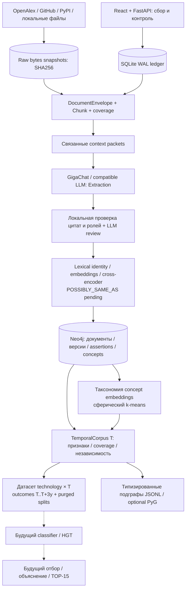

Сильная часть у нас — provenance и temporal evidence: цитаты с исходными chunks; типизированные assertions и участники; разделение времени публикации/наблюдения; confidence в данных, независимость по связанным авторам/организациям; будущий label реализации с проверкой source coverage; исключение future columns из predictors; purged temporal splits. Taxonomy builder делает clustering **готовых** label embeddings и не обучает embedding-модель. JSONL/PyG экспорт тоже не означает обученный GNN.

Главный продуктовый пробел — сам ответ: текущая документация явно говорит, что candidate selection/ranking/TOP-15 пока не делают. В `ranking/` есть подключенная заготовка weighted z-score, SearchService и backtest, но ее выдачу нельзя считать готовой подтвержденной моделью. Не повторяем старые audit findings как актуальные баги без новой проверки: текущие пользовательские изменения еще идут. Конкурентский обзор не изменял этот scope.

### Три наиболее полезные идеи

1. **Когда возвращаемся к получению ответа: простой обучаемый baseline на нашем temporal dataset.** LogisticRegression или tree baseline на существующих graph features, negatives из того же корпуса, temporal holdout + grouped checks, calibration и precision@15. Lapshin показывает, что шесть осмысленных числовых признаков уже дают проверяемый baseline; maicentre показывает, почему ручные seed negatives дают ложные 99%. Не копировать чужие веса/scalers.
2. **Развести discovery и измерение частоты, учесть фон/покрытие/индексационные лаги.** Поиск по теме находит кандидатов, отдельные стабильные счетчики измеряют их историю; source/query/window/signature входят в ключ. Лаг рассчитывается по источнику/метрике, рост малых счетчиков shrinkage, наблюдение отсутствие/недоступность не превращается в ноль. Lapshin дает двухпоисковую архитектуру, maicentre — concrete lag/shrinkage guards.
3. **Завершить evidence-to-card и expert review цикл.** Карточка должна показывать 3–6 факторов, verified quotes, независимые источники, статус missingness и конкретные причины исключения. Similarity candidate можно approve/reject через UI; confidence доказательств, model probability и heuristic rank показываются отдельными полями. Основной graph/quote фундамент у нас уже есть; это превращает его в проверяемый пользовательский результат.

Смена Neo4j ради повторения чужой БД здесь не обоснована. Все три идеи дополняют существующий ingestion/graph/temporal фундамент, а не требуют его переписывать.
