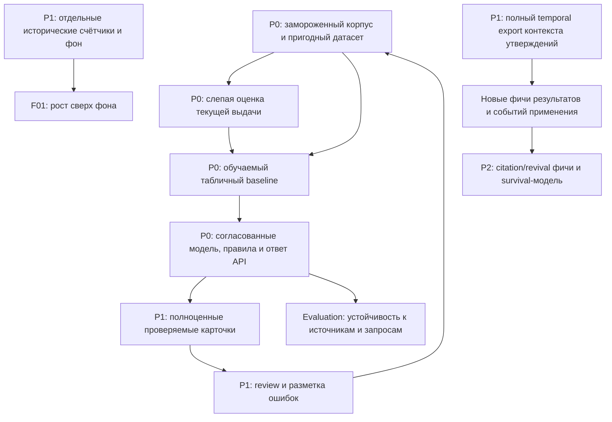

# Что добавить в LCTrendSearch

Дата: 28 сентября 2026. Основание: текущая рабочая копия и [аудит семи конкурентов](competitive-audit-2026-09-28.md). Рабочее дерево менялось после аудита; этот план учитывает появившиеся экономические адаптеры и признаки. Проверялись исходники, а не наполненность работающей Neo4j. Документ описывает будущие изменения; перечисление задачи не означает, что она уже реализована.

**Главная цель — закончить проверяемый пользовательский ответ:** направление → кандидаты → оценка → до 15 карточек с доказательствами. Следующий выигрыш даст завершение этой цепочки и измерение её качества. Смена Neo4j или добавление сложной нейросети до такого измерения не обоснованы.

Конкретные входные признаки технологии вынесены в [файл новых фичей](new-model-features-2026-09-28.md). Идентификаторы F01–F15 ниже ссылаются на его разделы. Показатели качества продукта остаются в evaluation и не подменяют входные фичи модели.

## Что уже есть: повторно добавлять не нужно

| Уже реализовано | Где | Что ещё надо довести |
|---|---|---|
| Raw snapshots, DocumentEnvelope/Chunk, точные цитаты, extraction/review, происхождение утверждений | `ingest/snapshots.py`, `llm/validation.py`, `graph/store.py` | Использовать этот фундамент в окончательных карточках и оценке качества |
| Neo4j, канонические сущности, кандидаты `POSSIBLY_SAME_AS` | `extraction/resolver.py`, `graph/store.py` | Понятное экспертное approve/reject и журнал решений |
| TemporalCorpus, признаки на T, future outcomes, coverage-aware labels, цензурирование и purged splits | `graph/temporal.py`, `graph/training.py` | Наполнить данными, измерить баланс классов, обучить модель |
| Рост 3/6/12/24 месяцев, ускорение, burst, persistence, decline | `graph/features.py` | Проверить полезность в рейтинге; добавить знаменатели общего фона |
| Независимость, разнообразие, концентрация организаций, авторское retention | `graph/features.py` | Проверить качество identity/lineage и чувствительность к отдельным группам |
| Paper→package/repository/patent/company lags, длина evidence chain, длительность стадий | `graph/features.py` | Считать более строгие переходы с actor/application и когортами |
| Графовая и семантическая новизна, structural holes, bridge, recombination, task novelty | `graph/novelty.py` | Сравнить с baseline; не переименовывать существующие поля в «новые метрики» |
| NIH/NSF гранты, «Работа России»/hh.ru вакансии, постоянные USD, грантовые/зарплатные признаки | `ingest/economic.py`, `core/money.py`, `graph/features.py` | Проверить реальное покрытие и связывание с технологиями/организациями |
| Исполняемый черновой ranking, `/api/search`, объяснения факторов и цитаты | `ranking/scoring.py`, `ranking/search.py` | Выбрать методику, проверить качество, наполнить карточки и подключить обученную модель |
| Dataset manifest и hashes extraction run | `graph/training.py`, `llm/pipeline.py` | Связать их с версией модели, ranking и конкретным ответом API |
| Backtest precision@K и random baseline | `ranking/scoring.py` | Его цель сейчас — рост документов; нужна отдельная проверка реализации и полной выдачи |

Наличие адаптера или формулы не подтверждает полноту данных. В стандартном ranking сейчас участвуют семь признаков; остальные вычисляются и доступны в экспорте/строках кандидатов. Подключать все сразу без проверки не нужно.

## Порядок выполнения

P0 — минимально законченный и измеримый продукт. P1 — качество доказательств, источников и обратная связь. P2 — исследовательские улучшения после появления надёжного baseline. Эти обозначения не задают календарные сроки.

## P0. Закончить основной результат

### P0-01. Получить пригодный обучающий и проверочный набор

**Проблема.** Экспорт датасета реализован, но готовность двухклассового набора для обучения пока не подтверждена. В проверенных путях `artifacts/training` и `artifacts/features` наполненные CSV не обнаружены; живую базу в этой проверке не опрашивали.

**Добавить.** Управляемый прогон существующего сбора и экспорта, отчёт о пригодности набора и две отдельные задачи:

1. `weak_signal_now`: экспертная оценка, является ли кандидат ранним сигналом на T.
2. `realized_within_H`: будущая реализация по существующему контракту `label_realized`.

Это разные targets. Рост публикаций, экспертная метка раннего сигнала и будущая реализация не должны смешиваться в один label.

Для `weak_signal_now` разметить реальные кандидаты поиска: ранний сигнал, зрелая технология, хайп/неподтверждённое обещание, слишком широкая тема, продукт/компания, нерелевантность, сомнительный случай. Для `realized_within_H` использовать существующие исходы и правила покрытия; отсутствие данных не становится отрицательным классом.

**Приёмка.** Зафиксированы корпус, T, H, query set, canonical IDs и инструкция разметки. Есть counts по labels/областям/splits, missingness, доля неполного покрытия и цензурированных строк. Обучение блокируется при одном классе. Semantic duplicates и временные горизонты не пересекают закрытый тест. Уже существующие purging/censoring и feature builder сохраняются.

**Куда подключать:** `graph/training.py`, `resources/dataset.json`, существующие команды экспорта. Результат — versioned dataset и отчёт пригодности.

### P0-02. Добавить слепую проверку всей выдачи

**Проблема.** Хорошая классификация заранее известных названий не проверяет поиск, извлечение, фильтры и карточки. У конкурентов это основной разрыв между метрикой и продуктом.

**Добавить.** Evaluator, вызывающий тот же путь ответа, что API. Заморозить темы разных областей и сложности, проверять relevance и канонические технологии, сохранять результаты каждого запроса. Размер набора определять до настройки модели; не добирать только удачные запросы.

**Измерять отдельно:** candidate recall; Precision@15/Recall@15; nDCG@15 при заранее заданных градациях полезности; количество заполненных позиций; зрелые/нерелевантные/дублирующиеся карточки; качество поддержки утверждений цитатами. Методика фиксирует, что считается правильным сигналом.

**Приёмка.** Есть закрытый query set, macro-average по запросам, результаты по областям и доверительные интервалы. Незаполненные позиции учитываются явно. Отдельно сравниваются random, growth-only, текущие веса и обученный baseline. Если настройка использовала тест, этот набор перестаёт быть закрытым тестом.

**Куда подключать:** новый evaluation-модуль рядом с `ranking/`, существующий `SearchService`. Тесты на маленьких искусственных пулах сохраняются как технические проверки.

### P0-03. Развести бэктест роста и бэктест реализации

**Проблема.** Нынешний `ranking.scoring.backtest` проверяет рост числа документов. В датасете уже есть более содержательный контракт `label_realized`. Это разные критерии успеха.

**Добавить.** Отдельный `realization_at_k` поверх существующей разметки будущей реализации. Сохранять рядом `document_growth_at_k`, но подписывать его именно так. Не создавать новые правила labels поверх уже реализованных. Для lead time отдельно экспортировать дату первого выполнения полного определения реализации: бинарный label и дата первого патента не заменяют такую дату; event time и availability сохраняются раздельно.

**Приёмка.** Для неполного горизонта официальный показатель реализации получает `N/A`; сохраняются число и доля оценимых результатов. Неизвестный исход не становится неуспехом. Текущий режим «число precision плюс warning» не используется как итоговая публикация качества. Результаты по полному и частичному наблюдению не смешиваются.

**Куда подключать:** `ranking/scoring.py` и `graph/training.py`. Условия публикации — в разделе показателей продукта ниже.

### P0-04. Обучить воспроизводимый baseline и подключить его к выдаче

**Добавить.** Сначала LogisticRegression, затем CatBoost как сравнительный вариант. Оба используют существующие snapshot features и временные splits. Текстовую/name-модель рассматривать только после проверки, что она не распознаёт стиль разметки вместо сигнала.

Фиксировать preprocessing, missingness, feature order, scaler/imputer, модель, seed, label target и порог. `future_*`, labels, IDs и splits исключаются из predictors. Калибровку обучать на отдельном разрешённом train/validation участке. Уверенность извлечения LLM не заменяет вероятность модели.

**Приёмка.** Offline и serving дают одинаковый результат на одной строке. Есть PR-AUC, precision/recall, F1, Brier и calibration curve для выбранного target; метрики по областям и закрытая сквозная проверка из P0-02. Улучшение относительно baseline показывается с неопределённостью, а не одним лучшим seed.

**Куда подключать:** новый model training/inference модуль; `dataset_feature_fields()` и общий feature builder; `ranking/scoring.py`. Готовность PyG-экспорта не означает, что для этого этапа нужен GNN.

### P0-05. Утвердить правила отбора и корректный смысл score

**Проблема.** Текущие веса временные. Sigmoid взвешенной z-суммы не является вероятностью реализации; `stats.confident` сейчас считает объекты по условному порогу score > .75.

**Добавить.** Версию методики: допустимые кандидаты, работа с зрелостью, coverage, независимость, правила неизвестного состояния и новый target модели. Правила проверяются на train/validation. Разделить `rank_score`, калиброванное `model_probability` с именем target, качество evidence и статус достаточности данных.

Старую науку с новым применением проверять как отдельный кандидат «технология × application». Не отменять защиту от зрелых массовых тем просто ради старого возраста; добавить обоснованное исключение для нового подтверждённого сценария.

**Приёмка.** В интерфейсе нет процента «вероятность успеха», полученного из ручной формулы. Порог и причина отказа воспроизводимы. Unknown maturity/coverage отражаются явно. Любые исключения проверены на слепых запросах, включая старую науку и новую коммерциализацию.

## P1. Добавить качество, которое отличит нас от конкурентов

### P1-01. Разделить discovery и исторические измерения

Добавить отдельный добор по технологии/aliases для измерения её истории. Собирать totals по семейству источника, области и окну; хранить query signature, полноту, дату наблюдения и состояние запроса. Ограниченный TOP-N поиска не выдавать за глобальное количество публикаций.

**Приёмка.** Поиск отвечает «что обнаружено», счётчик — «какую долю сопоставимого наблюдаемого фона занимает технология». Нулевые результаты после успешного полного поиска отличимы от failed/partial/unsearched. Расширение сбора в четыре раза без роста доли технологии не даёт ложного всплеска F01.

**Основа:** существующие temporal/coverage и адаптеры. Новый слой — totals/exposure и versioned counter queries. Идеи: Lapshin, READY, maicentre.

### P1-02. Довести промышленное evidence и источники

Гранты и вакансии уже добавлены; проверить их фактическое покрытие и смысл технологии в записи. Следующее дополнение — отраслевые новости, подтверждённые пилоты/закупки/продления, данные о внедрениях и автоматизированный поиск патентов поверх имеющегося EPO-адаптера. Сбор официальных статусов стандартов — отдельный источник, а не вывод LLM по новости.

Каждый новый adapter должен сохранять raw, canonical URL/ID, event date и availability, actor/application, coverage/error state и lineage. Патентное семейство — единица, отличная от числа национальных публикаций. Вакансия, грант и пресс-релиз сами по себе не подтверждают внедрение.

**Приёмка.** Для каждого подключённого источника видны успешные/частичные/неудачные окна, полнота дат, доля разрешённых организаций и релевантность technology matching. Есть реальные карточки с первичным промышленным evidence, а не только объявленная поддержка источника в конфигурации.

### P1-03. Сохранить контекст утверждений в temporal export

**Критическая зависимость новых метрик.** `Assertion` уже хранит роли, qualifiers, values и polarity. Однако текущий temporal export assertions передаёт сокращённый набор полей; maturity export также не сохраняет весь actor/application контекст.

**Добавить.** В snapshot-export — нормализованные роли subject/actor/application/baseline/metric, значения и единицы, условия/версию объекта, время события и evidence references. Передача этих данных должна сохранять существующие point-in-time ограничения.

**Приёмка.** Два результата на разных датасетах не сравниваются как один benchmark. Отрицание вчерашнего утверждения не конфликтует автоматически с сегодняшним новым состоянием. Повторный документ не становится повторным внедрением. Значения доступны из `TechnologyView` на T, а не читаются из будущего состояния живого графа.

**Куда подключать:** `core/models.py`, `graph/store.py`, `graph/temporal.py`, feature builder. Предусловие F02–F08, F10–F13 и transfer-части F15. Для F09 дополнительно нужны dependency manifests, для F14 — citation closure.

### P1-04. Собрать полноценную карточку из доказательств

Существующие цитаты и factors сохранить. Достроить поля преимуществ, кейсов и подтверждений, которые сейчас в ответе остаются пустыми. Карточка показывает: конкретную технологию и application; почему появилась сейчас; 3–6 факторов; источники и точные цитаты; компании и их роли; зрелость; ограничения данных; причины включения.

**Приёмка.** Каждое фактическое предложение связано с assertion/version/quote/date/URL. Название компании из funding или авторства не превращается в покупателя технологии. Отсутствующий кейс остаётся отсутствующим. Расхождения источников видны. Дополнительный сбор приводит к пересчёту соответствующих факторов и оценки.

LLM может улучшать формулировку, но не заполняет недостающие факты. Повторно писать literal quote validator не нужно.

### P1-05. Замкнуть экспертный review и ошибки поиска

Добавить интерфейс approve/reject для pending identities и оценку финальных карточек. Сохранять canonical IDs, reason code, комментарий, автора решения, дату и версию ответа. Переход из feedback в training проходит проверку; тестовая разметка не возвращается в обучение до закрытия эксперимента.

**Приёмка.** Можно найти, где потерялся известный сигнал и почему прошёл ложный. Есть отчёт ошибок по стадиям: discovery → extraction → identity → evidence → filtering → ranking → card. Повторная разметка спорных случаев разрешается adjudication, а не молчаливой перезаписью label.

**Идеи:** melorri — реальные негативные кандидаты; maicentre — review и допуск решений.

### P1-06. Добавлять новые входные фичи по очереди

Первый набор: **F01 рост сверх фона, F02 новые внешние пользователи, F05 сопоставимые противоречия, F06 воспроизведённый выигрыш**. Для каждого сначала закрыть зависимость данных: фон, actor/application, полный Assertion export и нормировку benchmark. Затем **F07 связная передача результата и F08 смена контекста применения**. Включение в score следует после проверки полезности.

Следующие группы: **F03 повторное применение, F04 отраслевой перенос, F09 внешние dependency-потребители, F10 запас до практических требований, F11 снятие blockers, F12 выполнение обещаний, F13 сохранение эффекта при scale-up**. Это новые смыслы входных данных, а не переименование существующих counts. Для application-specific чисел нужен явный ключ `technology × application × T` либо заранее заданный пригодный агрегат; расширение строки датасета делается отдельным изменением.

**Приёмка для каждого семейства фичей.** Есть формула/версия, единицы, temporal grain, missingness, объём evidence, синтетические контрольные примеры и ablation на закрытой методике. Predictor считается только из прошлого относительно T и одинаково offline/serving. Полезность не предполагается по названию поля. Устойчивость к перефразированию, Precision@K и calibration остаются проверками всей системы; score/model output не становится собственным входом.

### P1-07. Связать данные, модель и конкретный ответ

Расширить существующие manifest/hashes до цепочки `corpus snapshot → features → labels → preprocessing/model → ranking policy → response`. В ответ добавить run ID, as-of, corpus/config/model/schema versions, target и evaluator version. Кэш инвалидируется изменением данных или модели, а не только TTL.

**Приёмка.** Один ответ воспроизводится по его версии; обновление одной копии storage не оставляет незаметно старую выдачу. Операционные показатели измеряются для полной обработки: latency p50/p95, ошибки источников, cache-hit rate, freshness, стоимость ответа и полезной проверенной карточки. Существующую LLM статистику токенов/очереди/ошибок использовать как вход, не создавать её заново.

## Новые функции рабочего места аналитика

Это пользовательские фичи продукта; F01–F15 в соседнем файле — входные признаки модели. Сбор по темам, очередь, AI-предложения тем, пауза/продолжение/retry, просмотр extraction, JSON download, search/filter/details/quotes и печать PDF уже доступны в интерфейсе и не объявляются новыми.

| Фича | Что пользователь сможет сделать | Что добавить поверх существующего |
|---|---|---|
| UI01. Избранные технологии и направления | Сохранить сигналы/поиски, заметки и открыть свою рабочую подборку | Persisted watchlist, notes, экран подборок по canonical IDs; нынешний hash URL не заменяет подборку |
| UI02. Лента существенных изменений | Увидеть новый пилот, внешнего пользователя, патент, изменение зрелости или потерю evidence между обновлениями | Saved versions + event diff по watchlist; расписание после завершения versioning. Уведомления включаются пользователем отдельно |
| UI03. История ответа и сравнение дат | Выбрать T/две даты и понять, как изменилась выдача и какие evidence появились | Date selector и передача даты в search API, сохранённые policy/corpus versions и diff-экран. API уже принимает дату; экран пока не передаёт её |
| UI04. Сравнение 2–4 технологий | Получить общую таблицу зрелости, динамики, применений, evidence и пробелов | Compare selection и расширенные snapshot fields на одном T/корпусе/нормировке; scores разных запусков не сравниваются молча |
| UI05. Переход из вывода к точному фрагменту | Нажать на claim карточки и увидеть подсвеченный фрагмент, роли и происхождение | Сквозные assertion/version/chunk IDs и deep links между существующими карточкой и просмотром chunks; quote validator уже есть |
| UI06. Решение аналитика и исправление identity | Подтвердить/отклонить карточку, указать ошибочное объединение или пропущенный сигнал | Ручной workflow и журнал автора/даты/версии/reason. Существующий LLM review не является ручным решением аналитика; связано с P1-05 |
| UI07. Собственные материалы через экран | Перетащить PDF/файл, запустить обработку и увидеть факты/статус/связь с сигналом | File picker/dropzone и отображение файловых jobs поверх уже реализованного `/api/ingest/uploads` |
| UI08. Пробелы данных и целевой добор | Узнать, какие периоды/источники не наблюдались или устарели, и запустить сбор конкретного пробела | Coverage-экран на уровне технологии/направления, связь с заданиями и пересчёт ответа после завершения; crawl history уже есть |

Первым соединить **UI03/UI05/UI08** с проверяемыми карточками и версиями. UI01/UI04/UI06 формируют рабочее место аналитика; UI02 зависит от saved versions, UI07 использует готовый upload API. Компонент карты уже есть, но backend `/api/graph` отсутствует: полноценная карта — завершение существующей заготовки, а не новая идея с нуля. Backtest существует в CLI; его веб-экран — отдельное представление имеющейся логики.

Основания: `frontend/src/App.jsx:14,173,293`, `frontend/src/ingest/App.jsx:62,237,267`, `frontend/src/api.js:42,56`, `frontend/server/app.py:543,704`, `frontend/README.md:5,108`.

## P2. Исследования после базового результата

1. **Вероятность реализации с учётом времени и цензурирования.** Survival/landmark — отдельная модель и target/evaluation, а не новая входная фича. Проверяется против классификатора с тем же endpoint, временным тестом и данными.
2. **F14 citation disruption и F15 scientific revival с новым application.** Для первого нужен направленный citation graph с контролем полноты; для второго — пригодная история признания и прямые transfer-связи. Это исследовательские входные признаки, не доказательства коммерческого успеха.
3. **Graph Transformer/HGT.** Только после проверенного выигрыша над табличным baseline; экспорт подграфов уже существует.
4. **Автоматизированный исторический добор и дополнительные страны/отрасли.** Расширять покрытие после измерения ошибки сопоставления, а не ради числа источников.

## Три основных показателя завершённого продукта

| Показатель | Что подтверждает | Важная граница |
|---|---|---|
| Evidence-verified Precision@15 | Полезность выдачи по слепым темам и достоверность поддержки карточек | Не замена forecast accuracy; незаполненные позиции учитываются |
| Realization@15 + доля оценимых исходов | Результаты будущей реализации по заданному endpoint/H | Не смешивать с ростом документов; censored не становятся negative |
| Lead time до реализации + покрытие событий | Насколько рано система находила подтверждённые будущие реализации | Median считается на обнаруженных событиях и показывается вместе с recall/цензурированием |

Калибровка, reliability, заполненность карточек, ошибки, задержки и стоимость — диагностические/защитные показатели. Целевые проценты пока не назначаются: сначала нужен измеренный baseline на наших данных.

**Определения evaluation.** Evidence-verified Precision@15 — число карточек, прошедших слепую relevance/weak-signal/evidence проверку, делённое на 15; отдельно сохранять precision среди возвращённых и заполненность. Realization@15 использует существующий label/H: при неполной наблюдаемости полный fixed-K показатель — `N/A`, отдельно evaluable subset и его доля, без превращения unknown в negative. Рост документов остаётся другим outcome.

Для lead time нужен независимый reference registry реализаций в заданных областях/периоде, включающий пропущенные системой события. Дата реализации — первая дата выполнения полного доказательного определения, а не только первого патента. Event time и availability раздельны; alert берётся из исторического replay с заранее фиксированной политикой. Missed events входят в recall; позднее обнаружение сохраняет отрицательный lead time. Registry coverage и доля наблюдаемого раннего периода показываются вместе с медианой.

## Чего не делать в рамках этого плана

- Не переписывать Neo4j, quote validation, temporal labels и splits, которые уже есть.
- Не называть sigmoid ручного рейтинга вероятностью реализации.
- Не переносить чужие веса и метрики качества без своего датасета.
- Не обучать сразу на десятках непроверенных новых факторов.
- Не выдавать co-mentions, публикации, грант или вакансию за промышленное внедрение.
- Не публиковать наивный fixed-H показатель реализации при неполном наблюдении: цензурированные исходы обрабатываются по заранее зафиксированной методике, а не превращаются в negative. Future outcomes не используются как predictors.

## Основания в текущем коде

Пути указаны от корня LCTrendSearch; номера относятся к прочитанной рабочей копии и могут сместиться при дальнейших правках.

| Вывод | Источник |
|---|---|
| Ranking — исполняемая заготовка с временной методикой | `ranking/README.md:3,19`; `frontend/server/app.py:543`; `ranking/search.py:340` |
| Семь весов, score не probability | `resources/ranking.json:21`; `ranking/scoring.py:112`; `ranking/search.py:245,311` |
| Общий feature builder и schema | `graph/training.py:433,537,542` |
| Labels/censoring/purged splits уже существуют | `graph/training.py:687,723`; `resources/dataset.json:4` |
| Growth-backtest отличается от realization target | `ranking/scoring.py:303,336,347`; `graph/training.py:687` |
| Карточки пока не заполнены полностью | `ranking/search.py:227,232` |
| Контекст Assertion и сокращённый export | `core/models.py:255`; `graph/store.py:1618,1645` |
| Экономические адаптеры уже есть | `ingest/economic.py`; `resources/sources.json` |
| Dataset/extraction versioning уже есть | `graph/training.py:906`; `llm/pipeline.py:669` |
| Точная проверка цитаты уже есть | `llm/validation.py:98` |

В таблице сокращено общее основание путей: исходники находятся в `src/lctrend/`, кроме явно указанных `frontend/...`. Подробное сравнение подходов конкурентов — в отдельном аудите; новые входные признаки, определения и источники — в файле фичей.
