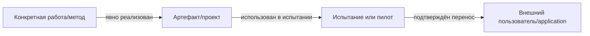

# Новые метрики для LCTrendSearch

> После уточнения запроса основной документ — [новые входные фичи для модели](new-model-features-2026-09-28.md). Ниже сохранена прежняя подборка метрик, включая показатели всей системы; она не является актуальным списком predictors.

Дата: 28 сентября 2026. Ниже — **11 отсутствующих в проверенной рабочей копии определений**, а не переименование существующих признаков. Это спецификации для реализации и проверки; значения на нашем корпусе ещё не измерялись. Все численные примеры иллюстративные.

Одни показатели характеризуют технологию, другие — надёжность доказательств или устойчивость всей системы. Смешивать их в единую «вероятность успеха» нельзя. Приоритеты и изменения модулей — в [плане дополнений](implementation-roadmap-2026-09-28.md).

## Что уже есть и поэтому не считается новым

Уже рассчитываются growth/acceleration/burst/persistence, diversity/entropy/HHI, возраст, first-date lags, `evidence_chain_length`, author retention, supported/speculative/negated claim ratios, attention–evidence gap, grants/salaries/vacancies, maturity, graph centralities, bridge, recombination и task novelty. Они подключены к общему feature builder. Стандартный ranking использует семь из этих признаков.

OpenAlex `referenced_works`, `reference_count`, FWCI и флаг retraction уже сохраняются как исходные metadata. Их наличие не означает реализации citation disruption или корректного исторического field-adjusted impact.

Новые определения ниже отличаются конкретной единицей наблюдения, знаменателем, временной логикой или проверкой устойчивости. «Новое для проекта» не означает, что все математические методы изобретены нами: опубликованные методы и наши адаптации обозначены отдельно.

## Какие метрики проверять первыми

| ID | Новое определение | Что помогает решить | Тип / очередь |
|---|---|---|---|
| M01 | Вероятность роста сверх фона | Технология растёт или просто расширился сбор? | Признак технологии; первым после totals/exposure |
| M02 | Устойчивость к удалению происхождения | Сигнал держится на одной компании/PR-цепочке? | Диагностика надёжности; первый набор |
| M03 | Устойчивость к перефразированию запроса | Находим технологию или удачное сочетание слов? | Метрика системы; первый набор |
| M04 | Конфликт сопоставимых свидетельств | Независимые результаты действительно согласуются? | Evidence; после полного export контекста |
| M05 | Конверсия пилота в повторное применение | За демонстрацией последовал реальный спрос? | Adoption; нужны связанные события |
| M06 | Подтверждённое распространение в новые отрасли | Технология выходит за исходное применение? | Adoption; нужен отраслевой контекст |
| M07 | Независимая воспроизводимость величины выигрыша | Преимущество измерено и повторено другой группой? | Performance/evidence; нужен benchmark-контекст |
| M08 | Вероятность перехода к реализации во времени | Какой шанс действия в H при текущем состоянии? | Модельный выход; исследование после baseline |
| M09 | Citation disruption на дату T | Работа меняет траекторию цитирования? | Научная структура; исследовательский показатель |
| M10 | Связная передача научного результата в применение | Звенья цепочки действительно относятся друг к другу? | Transfer/evidence; нужен граф оснований |
| M11 | Пробуждение старой науки с новым применением | Старое знание получило новую практическую роль? | Revival; отдельный сценарий отбора |

Для первого этапа активировать M01 и диагностики M02–M03. Другие сначала считать в наблюдательном режиме. Включение в ranking требует ablation и проверки на закрытых запросах.

## Общие правила определения

- Единица технологии — canonical ID; для применения — `technology × application`; для внедрения — дополнительно actor/site/project. Упоминание, статья и внедрение не взаимозаменяемы.
- T — дата среза. Признак использует только события и версии, доступные к T. Будущие исходы принадлежат evaluation/labels. Ретроспективная реконструкция и строгий `as_known` подписываются раздельно.
- Окна задаются календарными месяцами либо фиксированными годами: выбор входит в версию метрики. Не смешивать эти способы незаметно.
- В каждой записи сохраняются value, единицы, cutoff, окно, версия определения, computed_at, support count, coverage, missing reason, ссылки на входные evidence и параметры нормировки.
- `None` означает отсутствие пригодного измерения; 0 — подтверждённый нулевой результат. Наличие хотя бы одной найденной статьи не делает поиск полным.
- Группы происхождения учитывают авторов, организации, ownership/проект и перепечатки. URL-домен сам по себе не является независимым источником. Текущие independence groups — основа; качество связей проверяется отдельно.
- Проценты и пороги не назначаются по внешнему впечатлению. Объёмы, интервалы и чувствительность показываются рядом с числом.

## M01. Вероятность роста сверх фона наблюдений

**Почему интересно.** Рост 5→20 упоминаний при расширении сопоставимого корпуса в четыре раза не является самостоятельным всплеском технологии. Текущие log-growth и z-score не учитывают такой знаменатель.

**Определение.** В непересекающихся окнах previous/recent для каждой фиксированной ячейки `source family × area × collection policy`:

- `y_w` — число дедуплицированных подтверждённых наблюдений технологии;
- `E_w` — объём сопоставимого наблюдаемого корпуса, независимо от запроса самой технологии;
- `λ_w` — интенсивность наблюдений технологии на единицу этого фона.

Базовый вариант для счётчиков:

```text
y_w ~ Poisson(E_w × λ_w)
λ_w ~ Gamma(α, β)                 # shape–rate
λ_w | data ~ Gamma(α + y_w, β + E_w)

excess_growth_probability = P(λ_recent > (1 + δ) × λ_previous | data up to T)
```

`δ` — заранее выбранный минимально значимый рост; это параметр методики, не установленная универсальная константа. Вместе выводятся интервалы отношения интенсивностей, raw counts и E. Probability относится к росту наблюдаемой интенсивности в этой модели, а не к будущему успеху технологии.

**Пример.** 5/1000 и 20/4000 дают одну raw-интенсивность .005. Модель не должна объявлять четырёхкратный рост только по числителю. При 20/1000 появляется рост относительной интенсивности; сила вывода зависит от объёма и prior.

**Данные/изменения.** Нужен новый слой totals/exposure по источнику/области/окну с coverage и versioned query. Не использовать `records_seen` из собственного тематического TOP-N как общий фон. Для первого варианта можно измерять только наш фиксированный корпус, честно подписав границы; оценка мировой активности требует других полных счётчиков.

**Ограничения.** PR-цепочки и команды нарушают независимость наблюдений; сначала дедуп/lineage. Сезонность, смена vocabulary и collection policy меняют интенсивности. Prior учится только на истории до T. При overdispersion проверить Negative Binomial. Модель с нулевым E не рассчитывается.

**Статус:** Poisson–Gamma — стандартный метод; exposure и технологический excess score — наша адаптация. [Официальная документация Stan: posterior prediction и Poisson–Gamma](https://mc-stan.org/docs/stan-users-guide/posterior-prediction.html).

**Проверка полезности.** При искусственном увеличении y и E в одинаковое число раз raw growth меняется, относительный сигнал остаётся близким; posterior uncertainty соответствует объёму. На закрытом тесте сравнить с текущим growth без exposure.

## M02. Устойчивость к удалению группы происхождения

**Почему интересно.** Десять документов одной компании могут выглядеть убедительно, пока не удалить всю эту цепочку. `independence_group_diversity` считает группы, но не показывает зависимость силы результата от конкретной группы.

Для каждой группы g, поддерживающей технологию, удалить её документы и claims из среза T, пересчитать признаки и score. Сохранить candidate IDs/reference cohort, модель, scaler, пороги нормировки и identity mapping. Нормировку нельзя переобучать после удаления.

```text
origin_score_drop_max = max_g max(0, S_base − S_without_g)
rank_retention_at_K = mean_g I(rank_without_g ≤ K)
```

`S` — явно названный rank score либо выход одной фиксированной калиброванной модели. Не переводить score drop в «процент вероятности провала». Диагностический rank рассчитывается на фиксированном пуле; отдельно сохраняются остаточное evidence и прохождение обязательных gates.

**Важно.** Если gate требует две независимые группы, удаление одной из двух автоматически нарушит gate. Это отдельный факт недостаточности evidence; он не должен подменять измерение изменения score. Иначе все минимально подтверждённые редкие технологии получат одинаковую «неустойчивость».

**Пример.** Score .80→.77 после удаления крупнейшей группы означает небольшую чувствительность; .80→.20 — сильную зависимость. Это иллюстрация поведения фиксированного score, не измерение нашего продукта.

**Данные/изменения.** Provenance и groups уже есть. Нужен evaluator масок источников, пересчитывающий temporal features, а не просто вычитающий число URL. Отдельный вариант удаляет целое семейство источников и показывает зависимость от coverage.

**Ограничения.** Реальный ранний сигнал иногда известен одной команде. Низкая устойчивость — основание показать зависимость/дособрать evidence, а не автоматически объявить сигнал ложным. Сотни непричастных групп не должны разбавлять тест: для технологии проверяются поддерживающие её группы.

**Статус:** предлагаемая диагностическая метрика. **Приёмка:** копии одного пресс-релиза удаляются вместе; тест воспроизводим; изменения нормировки и gates отражаются отдельно.

## M03. Устойчивость к эквивалентным запросам

**Почему интересно.** Результат не должен зависеть от случайной формулировки вроде «периферийный AI» вместо «edge artificial intelligence» при сохранении одной задачи.

До просмотра результатов подготовить m семантически эквивалентных вариантов. Зафиксировать T, корпус, список источников, бюджет, настройки и model version. Сравнивать canonical IDs.

```text
query_retention_at_K(x) = число вариантов, где x входит в TOP-K / m
query_set_overlap = mean_j=1..m−1 |TOP-K(q0) ∩ TOP-K(qj)| / |TOP-K(q0) ∪ TOP-K(qj)|
```

Здесь q0 — один из m вариантов; сравнение q0 с самим собой не входит в overlap. При m<2 overlap не определён. Для пустого union возвращать `None`, а не 1; число пригодных пар показывать отдельно. Рядом показывать число результатов каждого запроса и query relevance. Высокая стабильность одинаково нерелевантной выдачи не является качеством.

**Пример.** Технология присутствует в четырёх из пяти эквивалентных выдач: retention=.8. Это устойчивость к формулировке, не precision и не вероятность реализации.

**Данные/изменения.** Сохранённые query runs, canonical IDs, параметры источников и полный ranking. Сначала тестировать на одном замороженном корпусе; затем отдельно оценивать вариативность live retrieval.

**Ограничения.** Расширение/сужение темы не является paraphrase. Синонимы должны проверяться до теста. Модель и бюджет одинаковы; повторные стохастические прогоны отделяются от изменения запроса.

**Статус:** наша метрика системы. **Приёмка:** фиксирован query suite; нет искусственного роста overlap из-за пустых/укороченных ответов; relevance и retention публикуются вместе.

## M04. Конфликт сопоставимых независимых свидетельств

**Почему интересно.** Нынешний `negated_claim_ratio` считает отрицания. Новая метрика проверяет, утверждают ли источники несовместимые вещи об одном результате при одинаковых условиях.

Группировать claims по слоту:

```text
slot = technology + application/task + metric/unit + baseline
       + conditions + object/version + event interval
P_slot = количество групп с однозначно поддерживающим итогом
N_slot = количество групп с однозначно опровергающим итогом
conflict = 2 × min(P_slot, N_slot) / (P_slot + N_slot)
refutation_share = N_slot / (P_slot + N_slot)
```

Для базового варианта вес каждой группы — 1; группы P и N не пересекаются. Если одна группа содержит несовместимые support/refute при том же slot, её итог — mixed, а не одновременный вклад в P и N. Mixed и неоценимые группы показываются отдельно; конфликт внутри одной группы не выдаётся за независимый межгрупповой конфликт. Более сложные reliability weights требуют отдельной проверенной методики. Если знаменатель 0 или сопоставимость не установлена — `None`. Для technology aggregate показывать distribution и число пригодных slots, не скрывать один критический конфликт средним значением.

**Пример.** 2 support / 2 refute дают conflict=1. При 0 support / 4 refute conflict=0, но refutation_share=1: все проверки отрицательны. Поэтому одного conflict недостаточно.

**Данные/изменения.** Roles/values/qualifiers/polarity уже хранятся. Нужен полный temporal export, canonical claim matching и support/refute pair review. `verification_status=supported` в нашем коде означает опору извлечения на текст, а не доказанную истинность результата.

**Ограничения.** Разная температура, dataset, оборудование, версия или время действия могут объяснять различие. Старое «не применяется» и новое «начали применять» не являются конфликтом одного интервала. Любой `negated` не автоматически refutation другого источника.

**Научная связь:** SciFact рассматривает scientific claims, поддержку/опровержение и evidence rationale. Наша формула conflict и её технологическая агрегация не взяты из SciFact. [Wadden et al., EMNLP 2020](https://aclanthology.org/2020.emnlp-main.609/).

**Приёмка:** экспертные пары с одинаковыми условиями отделяются от разных условий; весь отрицательный consensus виден через refutation_share; одна PR-группа учитывается один раз и не создаёт сама межгрупповой conflict=1.

## M05. Конверсия пилота в повторное применение

**Почему интересно.** Один пилот может быть демонстрацией. Продление, второй объект или расширение эксплуатации сильнее подтверждают востребованность.

Базовая единица — первая пилотная когорта `technology × application × actor-group`, где actor-group объединяет зависимые организации по ownership на соответствующую дату. Для первого пилота с датой p определить последующее документированное expansion/renewal/second-site событие в (p,p+H]. Проекты и площадки служат событиями продолжения, а не дополнительными независимыми единицами знаменателя. Отдельную project-level конверсию можно считать как другую версию метрики, с группировкой uncertainty по actor-group.

```text
eligible = пилотные когорты с p + H ≤ T и достаточным follow-up coverage
repeat_use_conversion_H = eligible с подтверждённым продолжением / все eligible
```

Показывать H, numerator/denominator, число независимых акторов, coverage и uncertainty. При нулевом знаменателе — `None`. Молодые пилоты не считать неуспешными; для них нужен censored status или survival M08. Правило достаточного follow-up фиксируется в конфигурации до расчёта: обязательные источники/типы документов, окна и периодичность наблюдения, охват aliases/projects, успешность запросов и известные пробелы. Eligible нельзя выбирать только среди опубликованных успешных продолжений. Эти критерии означают полноту заявленного наблюдаемого контура, а не гарантируют видимость непубличных решений.

**Пример.** Из пяти полностью наблюдаемых пилотных когорт три получили подтверждённое продолжение: .6 при n=5. Это малый объём; процент без интервала недостаточен.

**Данные/изменения.** Actor/site/project, application, пилот и продолжение, даты, договор/заказ/эксплуатация, связь двух событий. Факты желательно брать из первичных подтверждений. Репозиторий новой версии или вторая новость о том же пилоте не являются second deployment.

**Отличие.** `commercial_user_count` и `max_maturity_rank` уже есть; они не связывают события одной когорты во времени.

**Ограничения.** Отсутствие публичного продолжения не доказывает отказ. Метрика означает наблюдаемую конверсию при указанных источниках. Несколько площадок одной компании не равны нескольким независимым покупателям.

**Статус:** наша adoption-метрика. **Приёмка:** повторные документы не увеличивают число внедрений; незрелые когорты исключены из знаменателя; даты/actors/проекты проверяемы.

## M06. Подтверждённое распространение в новые отрасли

**Почему интересно.** Совместное упоминание AI, медицины и финансов ещё не доказывает распространение. Здесь учитываются реальные применения внешними организациями.

Пусть A(T) — отрасли с подтверждённым use/deployment. Исходное множество — A(T−W). Для нового сектора a считать независимых новых акторов `U_new(a)`.

```text
new_verified_industry_count = |A(T) \ A(T−W)|
industry_transfer_strength = Σ_new_a log(1 + U_new(a)) × distance(a, A(T−W))
```

Distance берётся из фиксированного отраслевого справочника/методики, заданной до оценки. Если исходных отраслей нет, учитывать «первое применение» отдельным событием; не присваивать максимальное расстояние. Расстояние необязательно для первого релиза: базовое число новых отраслей проще проверить.

**Данные/изменения.** USED_BY/DEPLOYED_IN с actor, конкретным application/подразделением, отраслью, датой и evidence. Нужен отраслевой справочник и ownership/independence на T. Общая domain taxonomy статьи не заменяет отрасль внедрения.

**Отличие.** `new_domain_pair_count`, domain entropy и task novelty уже существуют. Они оценивают связи/сочетания; M06 требует подтверждённого применения.

**Ограничения.** Diversified company не создаёт применение сразу во всех своих секторах. Plans и funding не adoption. Без полного множества потенциальных пользователей это индекс наблюдаемого переноса, а не оценка процента охвата всего рынка.

**Статус:** наше определение. **Приёмка:** нерелевантные co-mentions не меняют метрику; subsidiaries/PR-копии не увеличивают независимость; каждому сектору соответствует конкретный кейс.

## M07. Независимая воспроизводимость величины выигрыша

**Почему интересно.** «Есть десять утверждений об улучшении» слабее, чем «две независимые группы получили сопоставимый выигрыш на одном benchmark». Сейчас `performance_gain_evidence` считает factual supported claims, не величину эффекта и повторяемость.

Для строго сопоставимого slot из M04:

```text
gain_j = direction × ln(value_new_j / value_baseline_j)
direction = +1, если больше лучше; −1, если меньше лучше

independent_test_coverage = claims с независимым сопоставимым измерением
                            / все пригодные исходные improvement claims
confirmed_replication_share = claims с подтверждённым выигрышем
                              / claims с оценимым результатом независимой проверки
```

Сохранять median gain, разброс и число независимых групп по slot. Направление и допустимость ratio задаются в каталоге metric definitions. Нулевые/отрицательные значения, неодинаковые единицы и несопоставимые шкалы не исправлять произвольным epsilon: использовать другую заранее заданную формулу или `None`.

**Пример.** Энергопотребление 30→15 при одинаковой задаче: gain=−ln(.5)≈.693. Пропускная способность 100→200: gain=ln(2)≈.693. Это одинаковый относительный factor 2 по разным slots; результаты не объединяются как один benchmark.

Для accuracy отдельно хранить percentage points и baseline; для времени/стоимости/энергии — workload и условия. Независимой проверкой считается новая группа с собственным сопоставимым измерением. Цитирование старой цифры не replication. Подтверждение требует воспроизвести направление и величину выигрыша в заранее заданных пределах с учётом неопределённости измерения. Опровергнутая репликация входит в знаменатель confirmed_replication_share и не входит в числитель. Неопределённые/противоречивые результаты показывать отдельно; правило итогового verdict по всем проверкам фиксируется до оценки, а не выбирает только успешную проверку. Исходные claims дедуплицируются по результату/группе происхождения.

**Данные/изменения.** Structured values/units/baseline/metric, dataset, workload, hardware, версия, интервалы, evidence и origin group. Нужен полный temporal export и normalization; большая часть контракта Assertion уже существует.

**Ограничения.** Самая удачная цифра и cherry-picked benchmark создают ложное преимущество. Отсутствие репликации — недостаток наблюдения, не доказательство провала. independent_test_coverage описывает наблюдаемое наличие проверок, а не их успех. Рядом показывать counts без проверки, с подтверждением, с опровержением, с неопределённым/смешанным результатом и долю оценимых проверок. Неоценимые результаты не становятся отрицательными; условная доля подтверждений не публикуется без этих counts/coverage. Нулевой знаменатель любого отношения даёт `None`.

**Статус:** предлагаемое определение performance/evidence. **Приёмка:** единицы и «больше/меньше лучше» верны, копии результатов не replication, разные условия не сравниваются; отрицательная проверка не увеличивает число подтверждений.

## M08. Вероятность перехода к реализации во времени

**Почему интересно.** Обычный binary classifier исключает недонаблюдённые горизонты. Survival-подход может использовать доступное время молодых объектов, не записывая их в неуспехи.

Сначала фиксировать endpoint: пилот, второе независимое применение либо датированное событийное расширение существующего `label_realized`. Это разные события; метрика и модель называются по выбранному endpoint. Начало — заранее определённое событие внимания/артефакта, доступное до T.

`label_realized` сейчас — бинарный исход заданного горизонта, а не готовая дата перехода. Для survival нужен отдельный `first_eligible_realization_at`: первая дата, когда для фиксированного стартового среза совместно выполнены критерии первого нового implementation outcome и достаточных независимых подтверждений. Одной даты патента/репозитория недостаточно. Event date и дата доступности подтверждений хранятся отдельно; временная шкала endpoint выбирается явно. Для исторического предупреждения нельзя датировать наблюдаемое подтверждение раньше его доступности. Если точная дата известна только интервалом, обычный right-censored KM неприменим без адаптации к interval censoring.

Для простого сопоставимого cohort baseline без competing events и при обоснованном non-informative censoring использовать Kaplan–Meier:

```text
S(t) = product_over_event_times (1 − transitions_at_time / objects_at_risk)
transition_probability_H_at_age_a = 1 − S(a + H) / S(a)
```

Формула применима при S(a)>0 и наблюдаемой поддержке до a+H. Не экстраполировать хвост без модели. Это когортная оценка. Персональный прогноз по текущим X(T) требует отдельно обученной landmark/survival модели, а не применения одной кривой всем объектам.

**Данные/изменения.** Начало наблюдения, действие, цензурирование, source coverage, область и covariates на landmark T. Уже существующие point-in-time labels/purged splits использовать как основу; адаптировать evaluator и явный target. Для исторического предсказания cohort fit использует лишь исходы, известные до training cutoff.

**Ограничения.** Отсутствие события к T — right censoring при корректном наблюдении; потеря интереса источников может сделать censoring информативным. Начало сбора после рождения технологии создаёт delayed entry. Competing event — необратимое событие, исключающее endpoint для той же единицы: например, окончательное закрытие конкретного проекта при оценке внедрения этим проектом. Неудачный пилот одной компании не исключает внедрение технологии другой компанией; такой факт может быть отрицательным evidence/covariate, а не competing event. При настоящих competing events реальную вероятность выбранного перехода оценивать через cause-specific cumulative incidence и Aalen–Johansen; `1−S` с удалением competing events не выдаётся за этот риск. Повторные landmarks одной технологии должны учитываться при splits/uncertainty. Иначе модель получает утечку или искусственный объём выборки. [Официальная документация scikit-survival: competing risks и CIF](https://scikit-survival.readthedocs.io/en/stable/user_guide/competing-risks.html).

**Научная основа:** Kaplan–Meier и работа с censored observations — стандартный метод. Endpoint внимания/технологии и способ применения к нашему продукту — адаптация. [NIST: Kaplan–Meier](https://itl.nist.gov/div898/handbook/apr/section2/apr215.htm).

**Приёмка исследования:** сравнение с табличным classifier на одном endpoint/временном тесте; calibration и coverage; нет обещания численной вероятности вне поддержки данных.

## M09. Citation disruption на дату T

**Почему интересно.** Большое число цитат не показывает, развивает ли работа прежнюю линию или становится новым центром. Наш technology graph построен по co-mentions/relations; это другой граф.

Для focal work f и его предшественников считать последующие работы, доступные к T:

- `N_f` — цитируют f, но не его предшественников;
- `N_b` — цитируют f и хотя бы одного предшественника;
- `N_r` — цитируют предшественников, но не f.

Невзвешенный CD:

```text
CD(T) = (N_f − N_b) / (N_f + N_b + N_r)
```

Диапазон −1…1. Положительный результат соответствует большей destabilization в этой сети; отрицательный — consolidation. Это не вероятность внедрения. Нулевой denominator даёт `None`. **Источник опубликованной метрики:** [Funk & Owen-Smith, Management Science](https://pubsonline.informs.org/doi/abs/10.1287/mnsc.2015.2366).

**Пример.** 8/2/10 дают CD=.30. Без числа цитирующих работ и полноты библиографии эта цифра недостаточна.

**Наше дополнение.** Агрегировать по работам конкретной технологии с фиксированным возрастным окном, peer/field comparison и support count. Конкретный aggregator проходит отдельную проверку. CD за полные пять будущих лет можно использовать как outcome; при предсказании на раннюю T доступны только цитаты, известные к T.

**Данные/изменения.** `referenced_works` уже сохраняются. Нужны citing-work expansion, направленные citation edges, availability, библиография предшественников и полнота closure. Latest lifetime counters не подходят для исторического predictor.

**Ограничения.** В 2026 опубликован разбор, связывающий часть измеренного снижения disruption с артефактами записей без references. Поэтому пустая библиография в API не должна автоматически давать «максимальный прорыв»: различать действительно нет references и неполные данные. [Holst et al., Nature, 2026](https://www.nature.com/articles/s41586-026-10787-y).

**Приёмка исследования:** достаточный citation closure, no-future leakage, missing bibliography не даёт 1, тест устойчивости к неполным references и сравнение одинаковых возрастов/областей. Не включать в обязательный первый релиз.

## M10. Связная передача результата в применение

**Почему интересно.** Нынешний `evidence_chain_length` считает типы документов, появившиеся после первой статьи. Статья, репозиторий и пилот с одним термином ещё не доказывают передачу одного результата.

Строить event graph с альтернативными валидными путями:



Патент не является обязательной стадией. Для каждого ребра нужны идентификация конкретных объектов **и** доказательство соответствующего перехода: реализовал метод, использовал артефакт, перенёс результат в применение. Ссылка/project/method ID помогает установить объекты, но сама по себе не подтверждает переход. Сохранять дату и evidence; проверенное утверждение переноса также должно однозначно указывать связанные объекты. Одного co-mention недостаточно.

```text
validated_transfer_depth = максимальное число проверенных переходов валидного пути
independent_downstream_path_count = число независимых downstream применений
                                   с проверенным путём от исходного результата
```

Второй показатель не считает все комбинаторные варианты маршрута: объединять пути одного actor/project/применения. Циклы не увеличивают depth; допустимый путь прост и согласован по времени. Если звено не установлено, сохранять partial path и missing reason.

**Данные/изменения.** Work/artifact/project IDs, actor/application, evidence каждого перехода, availability. Полный temporal export и ссылочная связь. `referenced_works` полезны, но citation сама по себе не доказывает реализацию метода.

**Ограничения.** Общие авторы и хронология не доказывают причинность. Совпадение technology ID связывает тему, не обязательно продукт. Научная работа может идти прямо к применению без публичного кода; такой путь допустим при явном основании.

**Статус:** наше определение transfer. **Приёмка:** три несвязанных документа не создают полный путь; связанные события дают explainable путь; повторный пресс-релиз не создаёт новый downstream adoption.

## M11. Пробуждение старой науки с новым применением

**Почему интересно.** Старая научная основа может получить новую практическую роль. Текущие возрастные правила способны исключить такой случай; task novelty и new domain pairs не подтверждают перенос старого результата в свежий кейс.

Для delayed scientific recognition использовать опубликованный beauty coefficient конкретной работы:

```text
c_t = цитирования в году t после публикации
t_m = первый год достижения максимума c_t внутри истории, известной к T
line_t = c_0 + (c_tm − c_0) × t / t_m
B(T) = sum_t=0..tm (line_t − c_t) / max(1, c_t)
при t_m = 0: B = 0
```

Этот коэффициент описывает задержанное признание. [Ke et al., PNAS 2015](https://pmc.ncbi.nlm.nih.gov/articles/PMC4475978/). Выбор первого из одинаковых максимумов — явно фиксируемое правило нашей реализации; tie-break входит в версию и не меняется после просмотра результатов.

**Наша адаптация для технологий:** выводить B(T), возраст/период слабого внимания и число новых внешних применений за W, **явно связанных** со старой работой/методом. Возможный experimental score:

```text
wake_transfer_score = percentile_of_B_in_age_field_cohort
                      × ln(1 + new_verified_external_transfer_count)
```

Эта итоговая формула не является beauty coefficient из статьи. Она требует проверки против более простого числа подтверждённых новых применений. При отсутствии прямой связи с старым результатом transfer count не рассчитывать по одному совпадению термина.

**Данные/изменения.** Годовая citation history, work IDs, evidence метода, application и independent actors. Citation history уже частично сохраняется, но её полнота не гарантирована. В текущем adapter некоторые годы могут отсутствовать; отсутствие нельзя заполнять нулём без основания. Нужен отдельный отбор `technology × new application`, согласованный с политикой зрелости.

**Пример.** Метод имеет старую научную историю, а за последний год появляется подтверждённое новое промышленное применение с прямой ссылкой на этот метод. Рейтинг должен оценить новый application, сохранив старый возраст технологии и evidence; возраст не переименовывается в «новая технология».

**Ограничения.** Пик выбирается только по прошлому относительно T. Крупные обзорные citations, неполная ранняя история и разные области искажают B. Сравнивать age/field cohorts. Высокий B без нового transfer говорит о признании, а не о коммерциализации.

**Приёмка исследования:** future peak недоступен predictor; missing years не превращаются в нули; прямые transfer-ссылки проверяемы; старый термин без нового применения не проходит revival scenario.

## Новые проверки качества продукта

Эти определения дополняют текущий backtest. Не нужно объявлять обычный Precision@K отсутствующим: его черновая версия уже есть, но измеряет рост документов на фиксированном пуле.

### KPI-1. Evidence-verified Precision@15

Результат считается правильным, если экспертная слепая оценка подтверждает relevance, статус раннего сигнала на T и достаточное evidence конкретных claims. Для запроса: `число правильных карточек / 15`; незаполненные позиции не исчезают из знаменателя. Если продукт сознательно выдаёт меньше 15, отдельно показывать precision среди возвращённых и заполненность; не подменять ими фиксированный KPI.

Macro-average считать по заранее заданным запросам. Показывать области, число запросов, интервалы с группировкой и долю поддержанных фактических утверждений. Поддержка цитатой — экспертная содержательная проверка поверх уже существующей literal validation.

### KPI-2. Realization@15 и доля оценимых исходов

Использовать существующий `label_realized` и конкретный H. Если все 15 исходов оценимы, показатель — successes/15. При частичной наблюдаемости публиковать отдельно precision на evaluable subset и `evaluable_fraction`; полный fixed-K показатель остаётся `N/A`, если методика не задаёт корректную обработку censoring. Не сравнивать условный subset с полностью наблюдаемым тестом как равные показатели.

Рядом сохранить document-growth@15 как другой outcome. Репозиторий/патент и коммерческое внедрение не становятся одним endpoint без явного определения. Future outcomes никогда не входят в predictor на T.

### KPI-3. Lead time раннего предупреждения

Для реализовавшейся технологии: `first_eligible_realization_at − first_valid_alert_date`. Дата реализации определяется по полному событийно-доказательному контракту из M08, а не дате первого найденного патента. Alert берётся из исторического прогона по знаниям на каждой T, с фиксированной до теста политикой; не выбирается задним числом наиболее удобная дата. Если alert появляется после endpoint, lead time отрицательный и явно отражает позднее обнаружение.

До прогона нужен reference registry реализаций в заявленных областях и периоде, собранный независимо от alerts нашей системы и включающий пропущенные ею технологии. Registry тоже имеет coverage; recall относится к этому реестру, а не ко всем мировым реализациям. Отсутствующий alert — missed event и входит в знаменатель recall. Поздние alerts показываются отдельно от раннего обнаружения; отрицательный lead time не заменяется нулём.

Median lead time показывается вместе с recall раннего обнаружения реализовавшихся технологий, долей событий с наблюдаемым ранним периодом и долей цензурированных alerts. Иначе легко получить большой lead time, обнаружив только несколько удобных событий. Уже имеющийся paper→company lag не является detector lead time.

### Защитные показатели

Для probability-моделей: Brier, calibration curve и error-versus-coverage при отказе от недостаточно подтверждённых результатов. Для survival использовать time-dependent Brier с корректной обработкой censoring либо отдельно объявленный полностью наблюдаемый тест; нужны поддержка времён и условия метода, а не молчаливое удаление unknown outcomes. [Официальная документация scikit-survival: Brier/IPCW](https://scikit-survival.readthedocs.io/en/stable/api/generated/sksurv.metrics.brier_score.html). Для данных: coverage, unknown outcomes, пригодные comparisons, source sensitivity. Для эксплуатации: latency, source failures и стоимость проверенной карточки. Все показываются рядом с результатом, без назначения неподтверждённых целевых процентов.

Калибровка означает соответствие вероятностей частоте правильных исходов; автоматическое преобразование ручного score через sigmoid этого не обеспечивает. [Guo et al., ICML 2017](https://proceedings.mlr.press/v70/guo17a). Возможность отказаться от недостаточно уверенного ответа проверяется вместе с покрытием: [Geifman & El-Yaniv, 2017](https://arxiv.org/abs/1705.08500). Их результаты для других задач не переносятся численно на LCTrendSearch.

## Что требуется в данных

| Поле/слой | Уже есть | Что дополнить |
|---|---|---|
| Snapshot/availability/coverage | TemporalCorpus, версии и флаги | Сохранять эти ограничения у всех новых вычислений |
| Totals/exposure | Имеющиеся counts/coverage дают часть контекста | Отдельные сопоставимые знаменатели по области/источнику/окну |
| Provenance groups | Авторы/организации/документы | Проверка PR lineage, ownership и маски удаления |
| Assertion context | Roles/values/qualifiers в модели | Полный temporal export и canonical comparison slots |
| Adoption events | USE/MATURITY relations и цитаты | Actor/application/project/site, repeat/renewal и интервалы follow-up |
| Industry | Domains и организации | Отрасль конкретного применения и фиксированная distance policy |
| Citation graph | referenced works и часть yearly counters | Citing-work closure, edge availability, bibliography coverage |
| Query runs | Существующий search API | Замороженные suite/варианты, версии и результаты |
| Model target/manifest | Dataset и extraction manifests | Артефакт preprocessing/model, calibration, target и версия ответа |

## Единый контракт реализации и проверки

1. Каждая метрика получает ID/версию, формулу, units, snapshot/окно, входной контракт и правила `None`/0.
2. Показатель сначала рассчитывается offline на snapshot и сохраняет evidence IDs, support/coverage. Serving использует тот же builder.
3. Синтетические случаи проверяют границы определения: дубли, future evidence, пустой exposure, разные условия, censored cohorts. Численные примеры этого документа не являются measured baseline.
4. На закрытых запросах и временном тесте проводится ablation: добавили показатель, изменилось ли качество, покрытие или диагностика? Не подбирать формулу по test.
5. Негативный/нейтральный результат исследования сохраняется. Метрика не попадает в основной score только потому, что выглядит интересно.

## Проверенные места текущей реализации

Пути от корня проекта; источники в `src/lctrend/`. Номера относятся к рабочей копии, прочитанной 28.09.2026.

- `graph/features.py:89,133,210,275,375,475,600,760,881` — существующие activity, growth, convergence, participants, evidence, economics, maturity и coverage.
- `graph/novelty.py:23,245,376` — существующие semantic/graph/recombination/task признаки.
- `graph/training.py:433,542,687,723,906` — общий builder, snapshot rows, outcomes, splits и manifests.
- `core/models.py:255` — богатый контракт Assertion; `graph/store.py:1618,1645` — сокращённый temporal export.
- `ingest/adapters.py:588,592` — citations/reference/FWCI metadata; `graph/temporal.py:381` — dated history.
- `ranking/scoring.py:82,112,303,336` — возрастной отбор, черновой score и growth-backtest.
- `ranking/search.py:227,232,245,311` — поля карточки и текущая трактовка score.

Полнота живой базы и ожидаемый выигрыш от новых метрик в этой работе не измерялись. Все отсутствующие слои перечислены как зависимости, а не выданы за уже доступные данные.
