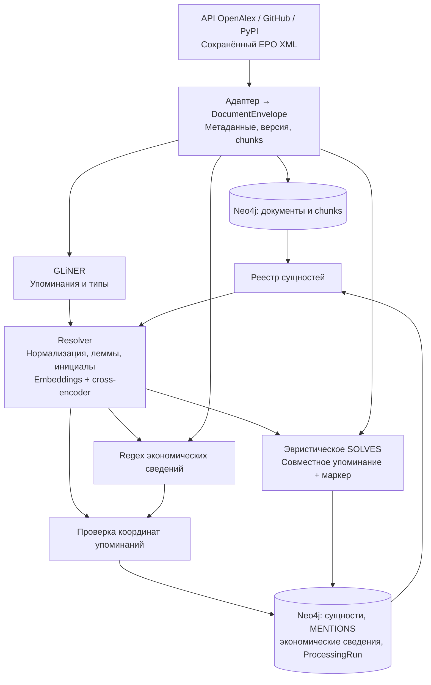
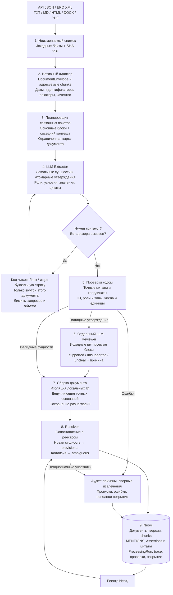

# Парсеры: как было и как стало

Основа — многоэтапная схема обработки материалов из нашего исследовательского прототипа (в этот репозиторий не входит). Здесь реализованы обработка материалов и публикация в Neo4j. Аналитика и ранжирование трендов в эту часть не входят.

## Было: исходный LCTrendSearch, commit 39f0a43

| Этап | Поведение и ограничение |
| --- | --- |
| Получение | Адаптеры разбирали отдельные ответы источников. Не было общего пути файлов и неизменяемых снимков входа. |
| Извлечение | GLiNER извлекал упоминания. Связанные пакеты, запрос контекста и LLM-проверяющий отсутствовали. |
| Идентичность | Инициалы и модельное сходство могли давать ошибочное объединение. |
| Связи | SOLVES строилось эвристически. Наличие технологии и задачи рядом ещё не подтверждает отношение между ними. |
| Хранение | Neo4j уже был основным хранилищем. Модель Assertion существовала, но полный многоэтапный путь её формирования отсутствовал. |

## Стало: перенос нашей схемы обработки

| Этап | Что именно происходит |
| --- | --- |
| 1. Снимок | Байты входного файла или сериализованной записи коннектора сохраняются по хешу в `artifacts/raw`. Для API это разобранная/собранная запись, а не архив всех исходных HTTP-ответов. Артефакт ссылается на снимок, а источник сохраняет исходный адрес. Повторная загрузка не меняет прежние байты. |
| 2. Разбор | Код получает структурные метаданные из API или файла. LLM не определяет DOI, SHA и дату публикации. Публикация локального файла без данных остаётся неизвестной. Ошибки PDF/OCR и неполнота DOCX/HTML отмечаются. |
| 3. Пакеты | До 6 основных блоков, до 12 вместе с контекстом. Границы разделов и независимых потоков учитываются. Источники не заменяются пересказом. Блоки, не помещающиеся в бюджет, отмечаются пропущенными. |
| 4. Extractor | Модель получает допустимые предикаты и роли из JSON. Выдаёт только локальные ID и предложения утверждений. Права назначать глобальные ID, подтверждение или писать в граф у неё нет. |
| Контекст | До 2 раундов, до 4 запросов за раунд, до 3 буквальных совпадений для запроса. Добавленные блоки поступают извлекателю; новый ответ полностью заменяет прежний ответ этого пакета. |
| 5. Проверки | Цитата должна точно совпадать с видимым оригиналом. При наличии source_segments проверяется непрерывное отображение в источник: искусственные заголовки и разделители не проходят. Отвергнутые при разборе блоки не используются. При повторении цитаты нужны координаты. Проверяются уникальность ID, ссылки, обязательные роли, совместимость типов и буквальные числовые значения. Ошибочное утверждение не отправляется проверяющему и не публикуется как факт. |
| 6. Reviewer | Второй вызов проверяет смысл по оригинальным блокам, включая отрицание, планы, ограничения и сравнения. Каждый claim требует ровно одного решения. `supported` означает поддержку текстом, а не доказанную истинность исследования. |
| 7. Сборка | Упоминания с теми же исходными координатами объединяются, включая повторы в перекрывающихся chunks. Точные одинаковые утверждения объединяются с учётом ролей, условий, значений и модальности; независимые текстовые потоки не объединяются по похожей цитате. Разные условия и противоречия сохраняются. Полноценная семантическая кореференция между пакетами пока не реализована. |
| 8. Resolver | Используется реестр Neo4j и детерминированное сопоставление: нормализация, леммы, явные синонимы. Эмбеддинги в этом пути не используются (они есть только у `--extractor gliner`). Новое название остаётся provisional. Неоднозначность не превращается в определённого участника связи: сырой claim и причина остаются в аудите. Автоматическое объединение по инициалам удалено. |
| 9. Публикация | CLI и веб-API одной транзакцией пишут документ и результат в Neo4j. `accepted/supported` задаёт координатор после проверок. Неподдержанный claim — rejected, неопределённый — needs_review. SOLVES создаётся только для поддержанного положительного solves_task с reported/observed модальностью. ProcessingRun связан с использованными chunks; прежние цитируемые chunks сохраняются при повторном разборе. |

Общий бюджет — 8 попыток вызова модели на документ, включая повторы. Перед извлечением оставляется вызов проверяющему. Общий payload до 30 000 символов учитывает контракт, метаданные, карту, блоки и обратную связь; исходный текст — до 24 000 символов. Это ограничения символов и вызовов, не гарантия фиксированной стоимости или размера токенного окна.

При ошибке отдельного пакета уже полученные результаты сохраняются. Итог `succeeded / partial / failed`, неохваченные блоки и история стадий записываются в ProcessingRun. Неполная или неудачная обработка сохраняет извлечения в staged_result аудита и не заменяет активную проекцию прежнего успешного разбора. Полный успешный разбор публикует структурные данные. Кэш ответов выключен по умолчанию; при включении учитывает вход, промпт, модель и схему, а ответ повторно валидируется.

По умолчанию (`hybrid`) перед шагом 3 работает GLiNER: его spans попадают в payload извлекателя как `ner_hints` (навигация, не доказательство), после сборки подтверждают сущности LLM, а сильные пропущенные технологии добавляются как `ner_candidate` без утверждений. `--extractor llm` отключает GLiNER.

GLiNER сохранён и как альтернативный извлекатель `--extractor gliner`: GLiNER → resolver с эмбеддингами → локальные кандидаты Assertions → проверка → Neo4j. Это отдельный базовый путь, без LLM Reviewer.

Извлечение можно проверить на фиктивном провайдере без базы. Публикация и реестр сущностей штатного CLI по-прежнему требуют Neo4j. Замены Neo4j файловым корпусом нет.

## Где этапы в коде

CLI и веб-API сходятся в одной функции `process_material` — извлечение и публикация у них одинаковые.

| Этап | Код |
| --- | --- |
| Приём файла по HTTP | `frontend/server/app.py` — `POST /api/ingest/uploads`: проверка расширения и размера, сохранение в `artifacts/ingestion/uploads/<uuid>/` |
| Тематический обход | `frontend/server/crawl.py` — `CrawlManager`: поиск в OpenAlex/GitHub (`src/lctrend/ingest/discovery.py`), реестр повторов в SQLite, передача пачек в `JobManager.create_payloads` |
| Очередь заданий | `frontend/server/jobs.py` — `JobManager._run`: проверка Neo4j → Docling → LLM → загрузка GLiNER; затем `_process_document` для каждого документа |
| 1–2. Снимок и разбор файла | `src/lctrend/ingest/file_adapters.py` — `parse_file` (PDF → `_pdf` через Docling); `src/lctrend/ingest/snapshots.py` — `snapshot_bytes` |
| 1–2. Снимок и разбор API | `src/lctrend/ingest/adapters.py` — `parse_openalex` / `parse_github` / `parse_pypi`; `snapshots.persist_snapshot`; PDF OpenAlex — `src/lctrend/ingest/fulltext.py` |
| Выбор режима | `src/lctrend/extraction/processing.py` — `process_material`: `hybrid`/`llm` → LLM-конвейер, `gliner` → GLiNER + resolver с эмбеддингами, `none` → без извлечения |
| 3. Пакеты и контекст | `src/lctrend/llm/context.py` — `plan_packets`, `build_payload`, `expand_packet`, `review_payload` |
| GLiNER-подсказки | `src/lctrend/llm/pipeline.py` — `_machine_mentions`, `_hints`, `_combine`; модель — `extraction/ner.py` |
| 4, 6. LLM-вызовы | `src/lctrend/llm/client.py` — `JsonLLM` (`/chat/completions`, лестница моделей, OAuth GigaChat); промпты — `resources/prompts/` |
| 5. Проверки кодом | `src/lctrend/llm/validation.py` — `validate_local_extraction`, `validate_review`; контракты ответа — `llm/contracts.py` |
| 7–8. Сборка и resolver | `src/lctrend/llm/pipeline.py` — `process_document`; `src/lctrend/extraction/resolver.py` — `resolve_mentions` |
| 9. Публикация | `src/lctrend/graph/store.py` — `GraphStore.write_processed`; неполный результат уходит в `staged_result` у `ProcessingRun` |
