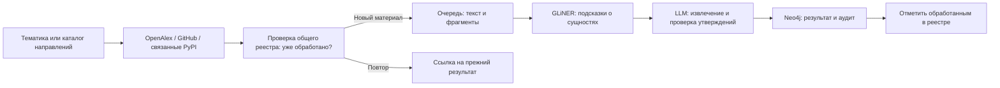

# Веб-интерфейс

React + Vite, два экрана в одном приложении:

- «Демо поиска» (`#`) — поиск и отчёт по сигналу на демонстрационных данных из `src/mock.js`. Бэкенд-эндпоинтов `/api/search` и `/api/graph` пока нет; контракт описан в `src/api.js`, `VITE_MOCK=0` переключит экран на них.
- «Сбор материалов» (`#view=ingest`) — реальный API загрузки, описан ниже.

## Сбор материалов по тематике

Из корня `LCTrendSearch`:

```powershell
if (-not (Test-Path .env)) { Copy-Item .env.example .env }
# Заполните OPENALEX_API_KEY и NEO4J_* перед запуском.
docker compose up -d --build --remove-orphans --wait
```

Открыть [Сбор материалов](http://localhost:5188/#view=ingest).
Экран встроен в основной React-интерфейс и доступен из его навигации.
Если порт PostgreSQL 5432 уже занят другой базой, задайте свободный
`POSTGRES_PORT` в `.env`, например `55432`, и повторите запуск Compose.
Бэкенд продолжает обращаться к PostgreSQL на внутреннем порту 5432.
Ввести тему и нажать «Собирать». Compose запускает фронтенд, API и
PostgreSQL; Neo4j подключается по внешнему адресу `NEO4J_URI` из `.env`.
Получите бесплатный ключ на [странице настроек OpenAlex](https://openalex.org/settings/api) и задайте `OPENALEX_API_KEY` в `.env` либо сохраните его через «Настройки источников». `OPENALEX_MAILTO` — необязательный контактный email. Для первого запуска задайте тему `edge computing` и лимит 10. Пустой лимит запускает полный обход доступной выдачи. Для быстрой загрузки аннотаций без PDF и моделей используйте [команды quick start](../README.md#быстрый-старт-openalex).

Исходные ключи также задаются в `.env`. В Docker настройки LLM и источников, сохранённые
через форму, лежат в `artifacts/ingestion/settings.env` и переживают
перезапуск. При запуске Python вне Docker форма сохраняет их в `.env`.
Пустая тема запускает обход всех настроенных направлений из
`src/lctrend/resources/sources.json`, а не всего OpenAlex.
Подключение LLM можно настроить в форме
на странице. При первом запуске
GLiNER и обработчик PDF могут загружать модели.

### Небольшой реальный прогон в Neo4j

1. Дождитесь статусов «База: подключена» и «LLM: настроена» на странице сбора.
2. Укажите тему, например `homomorphic encryption credit scoring`, и лимит `1`.
3. Нажмите «Собирать». Это до одной статьи OpenAlex и одного репозитория GitHub;
   связанные пакеты PyPI могут добавить материалы. Первый запуск может загружать модели.
4. Откройте «Ожидают обработки», чтобы видеть текущие стадии. После завершения
   откройте «Обработанные материалы» и карточку документа: там доступны исходные
   фрагменты, сущности, утверждения и скачивание результата JSON. Частичные результаты
   также находятся в этом списке; ошибки источников показываются рядом с их статусом.
5. Для проверки записи откройте свою Neo4j и выполните запрос ниже. Вставьте
   `document.document_version_id` из JSON нужного результата.

```cypher
MATCH (d:Document)-[:HAS_VERSION]->(v:DocumentVersion)
WHERE v.document_version_id = 'VERSION_ID_FROM_RESULT'
OPTIONAL MATCH (v)-[:HAS_CHUNK]->(chunk:Chunk)
WITH d, v, count(DISTINCT chunk) AS chunks
OPTIONAL MATCH (run:ProcessingRun)-[:PROCESSED]->(v)
OPTIONAL MATCH (run)-[:CREATED]->(claim:Assertion)
RETURN d.title, v.document_version_id, chunks, run.status,
       run.published, count(DISTINCT claim) AS assertions;
```

Карта на экране «Демо поиска» использует отдельные демонстрационные данные.
Реальная загрузка и проверка результатов выполняются на экране «Сбор материалов».

## Что означает каждое поле и кнопка

| Элемент | Значение |
|---|---|
| «Тематика» | Поисковая строка OpenAlex и GitHub, например `edge computing`. Это не DOI, PDF-ссылка или путь к файлу |
| «Собирать» | Создать обход и очередь материалов. Требует готовности Neo4j, LLM и Docling и отсутствия другого активного обхода |
| Пустая тема | Обойти направления из `crawl_directions` в `sources.json` (сейчас: Artificial intelligence, Robotics, Edge computing, Fintech); не весь интернет и не весь OpenAlex |
| «Лимит на направление и источник» | Не более N статей OpenAlex и N репозиториев GitHub на каждое направление, общий бюджет для всех алиасов направления. Уже обработанные ранее материалы входят в лимит, но LLM повторно не вызывается. PyPI-пакеты из README в лимит не входят. Пустое поле — вся выдача |
| «Настройки LLM» | Выбрать провайдера и сохранить параметры в `.env` локально или в `settings.env` внутри Docker |
| «Настройки источников» | Сохранить API key OpenAlex и необязательный контактный email. Пустое поле ключа сохраняет прежний ключ |
| Статус OpenAlex | Показывает наличие ключа, без раскрытия значения; доступность API и лимиты выясняются при запросе |
| Провайдер | `gigachat` использует ключ авторизации GigaChat; `openai_compatible` — совместимый API `/chat/completions` |
| Модель | Общее стартовое имя для извлечения и проверки; у GigaChat пустое имя использует настроенную лестницу |
| «Адрес API» | Обязательный в форме корень API с версией, например `https://api.giga.chat/v1`, без `/chat/completions` |
| Ключ | Для GigaChat — ключ авторизации из кабинета, для совместимого API — API key. Пустое поле сохраняет прежний ключ |
| «Остановить» | Завершить текущий документ, затем прекратить запуск новых |
| «Продолжить» | Возобновить сохранённую очередь и позиции источников |
| «Повторить ошибки» | Вернуть ошибочные материалы в очередь; сохранённое извлечение можно использовать для повтора записи в граф |
| «Обработано / ожидают / ошибки» | Состояния уже найденных материалов; количество ещё не найденных может быть неизвестно |
| Таблица направлений | «обработано / найдено» по каждому направлению и источнику |
| «Что получено» у документа | Покрытие (карточка / аннотация / полный текст), статус PDF и причины неудач, число фрагментов и символов, сколько фрагментов прочитала LLM, сам текст фрагментов |

Все переменные окружения и параметры CLI подробно разобраны в [основном README](../README.md#что-означает-каждая-настройка-env). Статус «LLM настроена» означает корректную локальную конфигурацию; доступность модели и остаток токенов выясняются при обращении к провайдеру.

Настройки источника доступны через `POST /api/ingest/sources/settings` с JSON `{"openalex_api_key":"YOUR_KEY","openalex_mailto":"you@example.org"}`. `null` или пустая строка ключа сохраняет прежнее значение. `GET /api/ingest/status` возвращает `sources.openalex` с полями `configured`, `has_key`, `mailto`, `message`; ключ не возвращается и не передаётся в сборку React. Compose читает настройки из backend `.env` и `LCTREND_SETTINGS_FILE`; не задавайте секрет в `VITE_*`.

### Быстрая загрузка OpenAlex через HTTP API

Для сохранения аннотаций без PDF и извлечения создайте отдельное задание. Neo4j должна быть настроена; LLM, GLiNER и Docling для этого режима не нужны:

```powershell
$body = @{query="edge computing"; limit=10; mode="none"; fulltext=$false; filter="has_abstract:true,type:article"} | ConvertTo-Json
$job = Invoke-RestMethod -Method Post -Uri http://localhost:5188/api/ingest/jobs -ContentType "application/json" -Body $body
Invoke-RestMethod "http://localhost:5188/api/ingest/jobs/$($job.job_id)"
```

`mode=none` отключает извлечение, `fulltext=false` — загрузку PDF. Проверьте статус и список документов задания: ответ 202 означает только постановку в очередь. Такие задания доступны через `/api/ingest/jobs`; тематическая форма «Собирать» по-прежнему использует PDF и режим `hybrid`.

## Как передать одну статью, а не тему

**В текущей форме нет загрузки PDF по ссылке и выбора локального файла.** Ссылка в «Тематику» уйдёт как поисковая строка и не загрузит именно этот PDF. Используйте [варианты CLI в основном README](../README.md#как-передать-конкретную-статью): локальный PDF или `fetch openalex` с DOI/ID.

HTTP API поддерживает загрузку локального файла. При запущенном сервере из PowerShell, из корня `LCTrendSearch`:

```powershell
curl.exe -F "files=@research/Литература/2311.01235v2.pdf" -F "mode=hybrid" http://localhost:5188/api/ingest/uploads
```

Путь после `@` должен указывать на существующий файл. При другом `FRONTEND_PORT` замените порт в URL. API принимает от 1 до 100 файлов, до 50 МиБ каждый по штатной конфигурации. Поля multipart-формы:

| Поле | Значение |
|---|---|
| `files` | Локальный файл; для нескольких документов повторяйте поле |
| `mode` | `hybrid` / `llm` / `gliner` / `none`, по умолчанию `hybrid`; `none` сохраняет документ без извлечения |
| `workers` | Сколько документов задания обрабатывать одновременно, 1–16; по умолчанию `LCTREND_WORKERS` или `runtime.json` → `ingestion.workers` (4) |
| `direction` | Необязательная тематическая пометка до 1000 символов, а не запрос поиска |

Ответ 202 с `job_id` означает постановку в очередь. Завершение проверяется отдельно:

```powershell
# Подставьте job_id из ответа загрузки.
Invoke-RestMethod http://localhost:5188/api/ingest/jobs/JOB_ID
```

Результат: `GET /api/ingest/jobs/JOB_ID/documents/DOC_ID/result`; `doc_id` берётся из списка документов задания. Проверяйте `document.chunks`, `document.coverage` и `extraction.run.status`. Загрузка локального PDF не восстанавливает библиографическую карточку OpenAlex. Файловые задания API не входят в историю тематических обходов страницы; их статус доступен по `/api/ingest/jobs`.

## Что поступает и что получается

| Источник | Что передаём | Что получаем |
|---|---|---|
| OpenAlex | Тему в параметре API `search`; страницы выдачи через `cursor` | Карточки публикаций: название, ссылка, аннотация и доступные ссылки на PDF |
| GitHub | Тему в API выдачи репозиториев | Репозитории; затем сведения, README на конкретном commit и релизы |
| PyPI | Имена пакетов из явных ссылок в README GitHub | Описание пакета, версии и метаданные |

У публикаций из OpenAlex загружаем доступный PDF. Если ссылки нет или
загрузка/разбор не удались, используем доступную аннотацию и фиксируем
ограничение в результате. Сбор идёт до конца доступной тематической
выдачи; ограничения источников видны рядом с прогрессом.

GitHub ограничивает один запрос 1000 результатами и может вернуть
неполную выдачу. PyPI здесь обходится по ссылкам из репозиториев: полного
тематического поиска по реестру нет. EPO требует отдельного подключения
и не обозначается как уже обойдённый источник.
[Ограничения GitHub API](https://docs.github.com/en/rest/search/search).



Документы обрабатываются параллельно в пределах `LCTREND_WORKERS`. CLI (`python -m lctrend`) и веб вызывают
один `process_material` из `src/lctrend/extraction/processing.py`.
Режимы API: `hybrid` (по умолчанию), `llm`, `gliner`, `none`.
В `hybrid` используется штатный `llm.pipeline.process_document`:
GLiNER даёт `ner_hints`, LLM извлекает и проверяет утверждения.
Сводка GLiNER — `extraction.run.metadata.ner`; отдельного результата
`parallel_gliner` нет. Если GLiNER недоступен, обработка продолжается
через LLM, как в CLI. Частичный или ошибочный запуск не заменяет прежний
успешно опубликованный граф.

HTTP-результат содержит `document` (`DocumentEnvelope`) и `extraction`
(`ExtractionResult`) из `core.models`. Веб добавляет только состояние
очереди и прогресс; схемы сущностей и утверждений не переопределяет.

## Где лежит код

```text
frontend/
  src/App.jsx       общий интерфейс и маршрут #view=ingest
  src/ingest/        сбор, проверка и отображение результата
  nginx.conf        выдача React и проксирование /api в Docker
  server/app.py     HTTP API и выдача страницы при запуске вне Docker
  server/jobs.py    очередь и сохранение прогресса
  server/crawl.py   обход тем и источников, учёт повторов
src/lctrend/        парсеры (ingest), извлечение (extraction, llm),
                    модели (core) и работа с Neo4j (graph)
```

JSON заданий и результатов — `artifacts/ingestion/`.
Общий реестр материалов и позиции обхода хранятся в SQLite: при запуске
Python — в `artifacts/ingestion/crawl`, в Docker — в отдельном томе
`ingestion_ledger`, смонтированном на этот путь внутри контейнера.
Это позволяет использовать WAL на Linux без ошибок файловой системы
Windows. Реестр — служебный учёт очереди, граф хранится в Neo4j.
DOI/идентификатор OpenAlex, адрес репозитория и нормализованное имя
пакета помогают не разбирать один материал повторно между темами и
запусками. Репозиторий и статья о нём остаются разными материалами.
При первом обходе реестр учитывает успешные и частичные результаты,
которые уже есть в Neo4j. Получение связанных пакетов из README не
требует повторного анализа самого репозитория.
Остановка прекращает запуск следующих документов; текущий документ
заканчивает обработку. «Продолжить» возобновляет сохранённую очередь и
позицию источника. После перезапуска продолжение требует нажатия кнопки.
На странице отдельно видны обработанные, ожидающие и ошибочные материалы.
Если анализ готов, а запись в Neo4j не удалась, повтор использует
сохранённый JSON и повторяет запись; LLM заново не вызывается.
Число оставшихся ещё не найденных записей неизвестно до окончания обхода;
счётчик очереди относится к уже обнаруженным материалам.

Для разработки сначала запустите Python API из корня проекта, затем
Vite из `frontend` (Docker-фронтенд на 5188 нужно остановить):

```powershell
.venv\Scripts\python.exe -m pip install -e ".[gui,llm,ner,pdf]"
.venv\Scripts\python.exe -m frontend.server --port 5188
# В другом терминале:
cd frontend
$env:BACKEND_URL = "http://127.0.0.1:5188"
npm run dev
```

Страница разработки — `http://127.0.0.1:5173/#view=ingest`.

Поиск трендов в основном интерфейсе пока использует исходные моковые
данные и обозначен как «Демо поиска». Экран сбора использует реальный API;
он не добавляет ранжирование кандидатов.
